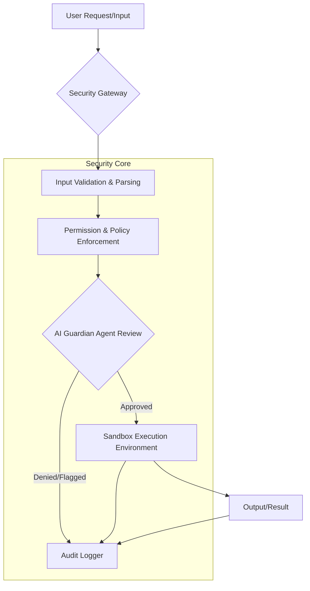
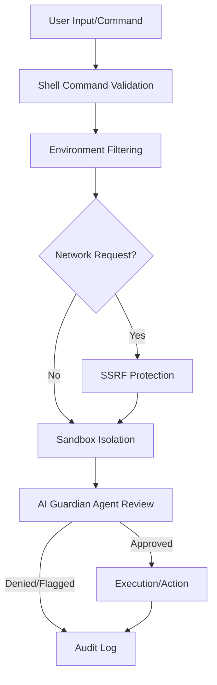

# Security Architecture

The security architecture is a foundational aspect of this project, designed to ensure the integrity, confidentiality, and availability of all operations, particularly those involving sensitive code generation and execution. This section provides a comprehensive overview of the system's robust security posture, detailing the modules and features that mitigate potential risks throughout the application lifecycle. Understanding these components is crucial for developing and maintaining a secure and reliable environment.

The core of the system's security implementation resides within a dedicated suite of modules. This section enumerates these modules, primarily located in the `src/security/` directory, explaining their individual roles in enforcing security policies and protecting against common vulnerabilities. Each module contributes to a multi-layered defense strategy, ensuring comprehensive protection across the application.

The project has **30** security modules, primarily located within the `src/security/` directory. This comprehensive suite of modules addresses various facets of application security, from input validation and permission management to sandboxed execution and AI-powered threat detection. Each module plays a specific role in enforcing security policies and protecting against common vulnerabilities.

| Module | Purpose |
|--------|---------|
| `src/security/approval-modes.ts` | Three-Tier Approval Modes System |
| `src/security/audit-logger.ts` | Audit Logger for Code Generation Operations |
| `src/security/bash-parser.ts` | Bash Command Parser (Vibe-inspired) |
| `src/security/code-validator.ts` | Generated Code Validator |
| `src/security/credential-manager.ts` | Secure Credential Manager |
| `src/security/csrf-protection.ts` | CSRF Protection Module |
| `src/security/dangerous-patterns.ts` | Centralized Dangerous Patterns Registry |
| `src/security/data-redaction.ts` | Data Redaction Engine |
| `src/security/guardian-agent.ts` | Guardian Sub-Agent — AI-powered automatic approval reviewer |
| `src/security/index.ts` | Security Module |
| `src/security/permission-config.ts` | Permission Configuration System |
| `src/security/permission-modes.ts` | Permission Modes |
| `src/security/permission-patterns.ts` | Pattern-based Permissions |
| `src/security/policy-amendments.ts` | Policy Amendment Suggestions |
| `src/security/remote-approval.ts` | Remote Approval Forwarding |
| `src/security/safe-binaries.ts` | Safe Binaries System |
| `src/security/sandbox.ts` | Execution sandboxing |
| `src/security/sandboxed-terminal.ts` | Sandboxed Terminal |
| `src/security/security-audit.ts` | Security Audit Tool |
| `src/security/security-modes.ts` | Security Modes - Inspired by OpenAI Codex CLI |
| `src/security/sender-policies.ts` | Per-Sender Policies & Agents List |
| `src/security/session-encryption.ts` | Session Encryption for secure storage of chat sessions |
| `src/security/shell-env-policy.ts` | Shell Environment Policy — Codex-inspired subprocess env control |
| `src/security/skill-scanner.ts` | Skill Code Scanner (OpenClaw-inspired) |
| `src/security/ssrf-guard.ts` | SSRF Guard — OpenClaw-inspired server-side request forgery protection |
| `src/security/syntax-validator.ts` | Pre-Write Syntax Validator |
| `src/security/tool-permissions.ts` | Tool Permissions System |
| `src/security/tool-policy.ts` | OpenClaw-inspired Tool Policy System |
| `src/security/trust-folders.ts` | Trust Folder Manager |
| `src/security/write-policy.ts` | WritePolicy — enforces diff-first writes at the tool-handler level. |

## Security Features

Building upon the foundational security modules, this section details the key security features implemented across the system. These features provide multi-layered protection, ensuring that all operations are performed securely and in compliance with defined policies, which is critical for preventing unauthorized access, data breaches, and system compromise.

-   **AI Guardian Agent**: This feature, powered by the `src/security/guardian-agent.ts` module, provides an automatic approval reviewer with risk scoring capabilities. It intelligently assesses proposed actions or generated code for potential security risks before execution, acting as an intelligent gatekeeper.
    *See also: [AI Guardian Agent Key Methods](#ai-guardian-agent-key-methods)*

-   **Sandbox Isolation**: Critical for executing untrusted or generated code, the `src/security/sandbox.ts` and `src/security/sandboxed-terminal.ts` modules provide a secure, isolated execution environment. This prevents malicious code from accessing sensitive system resources or impacting the host system.

-   **SSRF Protection**: Implemented via the `src/security/ssrf-guard.ts` module, this feature actively blocks server-side requests to private IP ranges and other restricted destinations, mitigating Server-Side Request Forgery (SSRF) attacks.

-   **Shell Command Validation**: The system employs robust validation for shell commands using `src/security/bash-parser.ts` and `src/security/dangerous-patterns.ts`. This involves detecting and preventing the execution of commands that match known dangerous patterns or exhibit suspicious behavior.

-   **Environment Filtering**: Managed by `src/security/shell-env-policy.ts`, this feature ensures that sensitive environment variables are stripped or filtered before subprocess execution, preventing their exposure to potentially untrusted code.

### AI Guardian Agent Key Methods

The `AI Guardian Agent` is a critical component for proactive threat detection and policy enforcement. This section details the key public methods of the `GuardianAgent` class, located in `src/security/guardian-agent.ts`, which enable its intelligent assessment and approval capabilities. Understanding these methods is essential for interacting with and extending the agent's functionality.

The `GuardianAgent` class in `src/security/guardian-agent.ts` provides the core functionality for AI-powered security reviews.

| Method | Purpose |
|---|---|
| `reviewAction(action: Action): Promise<ApprovalResult>` | Evaluates a proposed action (e.g., file write, command execution) for security risks and returns an approval decision with a risk score. |
| `analyzeCode(code: string, context: CodeContext): Promise<CodeAnalysisResult>` | Analyzes a block of generated code for vulnerabilities, dangerous patterns, or policy violations. |
| `suggestPolicyAmendment(violation: PolicyViolation): Promise<PolicyAmendmentSuggestion>` | Based on detected violations, suggests potential amendments to security policies to prevent future occurrences. |
| `getRiskScore(action: Action | CodeContext): number` | Calculates a numerical risk score for a given action or code context, indicating its potential danger. |

---

**See also:** [Overview](./1-overview.md) · [Architecture](./2-architecture.md) · [Subsystems](./3-subsystems.md) · [Tool System](./5-tools.md)

**Key source files:** `src/security/`