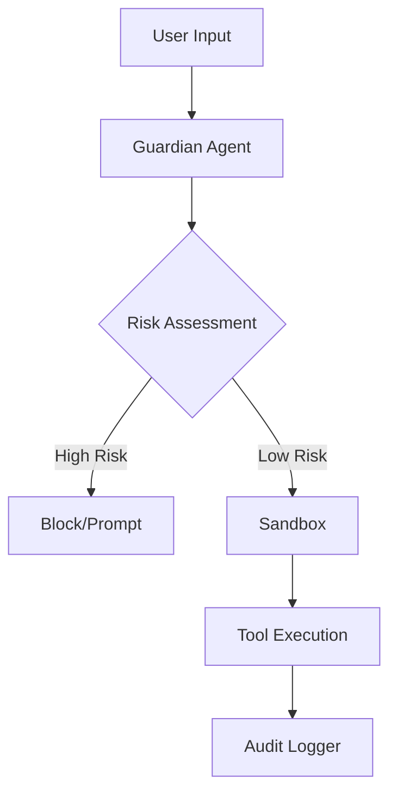

# Security Architecture

The security architecture of this project is designed around the principle of "Zero Trust Execution." This document serves as the definitive guide for engineers and security auditors who need to understand how the system mitigates risks associated with AI-driven code generation and autonomous tool execution.

Security in an autonomous agent environment cannot rely on a single firewall. Instead, we employ a modular, defense-in-depth strategy comprising 30 distinct security modules located within `src/security/`. These modules handle everything from input sanitization to post-execution auditing, ensuring that every interaction is validated against strict policy definitions.

| Module | Purpose |
|--------|---------|
| `approval-modes` | Three-Tier Approval Modes System |
| `audit-logger` | Audit Logger for Code Generation Operations |
| `bash-parser` | Bash Command Parser (Vibe-inspired) |
| `code-validator` | Generated Code Validator |
| `credential-manager` | Secure Credential Manager |
| `csrf-protection` | CSRF Protection Module |
| `dangerous-patterns` | Centralized Dangerous Patterns Registry |
| `data-redaction` | Data Redaction Engine |
| `guardian-agent` | Guardian Sub-Agent — AI-powered automatic approval reviewer |
| `index` | Security Module |
| `permission-config` | Permission Configuration System |
| `permission-modes` | Permission Modes |
| `permission-patterns` | Pattern-based Permissions |
| `policy-amendments` | Policy Amendment Suggestions |
| `remote-approval` | Remote Approval Forwarding |
| `safe-binaries` | Safe Binaries System |
| `sandbox` | Execution sandboxing |
| `sandboxed-terminal` | Sandboxed Terminal |
| `security-audit` | Security Audit Tool |
| `security-modes` | Security Modes - Inspired by OpenAI Codex CLI |
| `sender-policies` | Per-Sender Policies & Agents List |
| `session-encryption` | Session Encryption for secure storage of chat sessions |
| `shell-env-policy` | Shell Environment Policy — Codex-inspired subprocess env control |
| `skill-scanner` | Skill Code Scanner (OpenClaw-inspired) |
| `ssrf-guard` | SSRF Guard — OpenClaw-inspired server-side request forgery protection |
| `syntax-validator` | Pre-Write Syntax Validator |
| `tool-permissions` | Tool Permissions System |
| `tool-policy` | OpenClaw-inspired Tool Policy System |
| `trust-folders` | Trust Folder Manager |
| `write-policy` | WritePolicy — enforces diff-first writes at the tool-handler level. |

> **Developer tip:** When integrating new communication channels, always verify the sender's authorization status using `DMPairingManager.isBlocked()` before allowing the `SessionStore.saveSession()` method to persist any incoming data.

Now that we have established the modular foundation of the security layer, we must visualize how these components orchestrate data flow during a standard agent request.

Beyond the structural modules, the system implements high-level features that actively monitor and constrain agent behavior. These features act as the "immune system" of the agent, intercepting dangerous operations before they reach the host environment.

- **AI Guardian Agent**: Automatic approval reviewer with risk scoring
- **Sandbox Isolation**: Sandboxed execution environment
- **SSRF Protection**: Blocks requests to private IP ranges
- **Shell Command Validation**: Dangerous pattern detection
- **Environment Filtering**: Sensitive variable stripping

> **Key concept:** The Guardian Agent acts as an automated risk-scoring layer. By intercepting tool calls before execution, it reduces the attack surface by filtering out potentially destructive commands that bypass standard syntax validation.

> **Developer tip:** When working with the `ScreenshotTool` or other sensitive I/O operations, ensure the `GuardianAgent` has been initialized to prevent unauthorized data exfiltration from the host machine.

---

**See also:** [Overview](./1-overview.md) · [Architecture](./2-architecture.md) · [Subsystems](./3a-core-agent-system-cli-and-slash-commands.md) · [Tool System](./5-tools.md)

**Key source files:** `src/security/.ts`