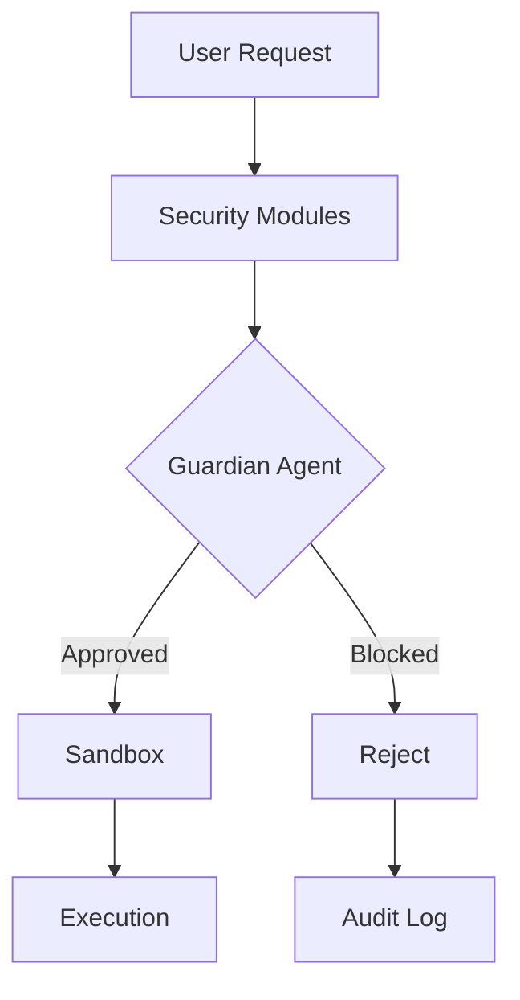

# Security Architecture

The security architecture implements a defense-in-depth strategy across 30 specialized modules within the `src/security/` directory. This system is designed to mitigate risks associated with AI-driven code generation, sandboxed execution, and external tool integration, ensuring that all operations adhere to strict safety policies before execution.

The project maintains a modular security infrastructure, where each component is responsible for a specific aspect of system hardening, ranging from input validation to environment isolation.

| Module | Purpose |
|--------|---------|
| `approval-modes` | Three-Tier Approval Modes System |
| `audit-logger` | Audit Logger for Code Generation Operations |
| `bash-parser` | Bash Command Parser (Vibe-inspired) |
| `code-validator` | Generated Code Validator |
| `credential-manager` | Secure Credential Manager |
| `csrf-protection` | CSRF Protection Module |
| `dangerous-patterns` | Centralized Dangerous Patterns Registry |
| `data-redaction` | Data Redaction Engine |
| `guardian-agent` | Guardian Sub-Agent — AI-powered automatic approval reviewer |
| `index` | Security Module |
| `permission-config` | Permission Configuration System |
| `permission-modes` | Permission Modes |
| `permission-patterns` | Pattern-based Permissions |
| `policy-amendments` | Policy Amendment Suggestions |
| `remote-approval` | Remote Approval Forwarding |
| `safe-binaries` | Safe Binaries System |
| `sandbox` | Execution sandboxing |
| `sandboxed-terminal` | Sandboxed Terminal |
| `security-audit` | Security Audit Tool |
| `security-modes` | Security Modes - Inspired by OpenAI Codex CLI |
| `sender-policies` | Per-Sender Policies & Agents List |
| `session-encryption` | Session Encryption for secure storage of chat sessions |
| `shell-env-policy` | Shell Environment Policy — Codex-inspired subprocess env control |
| `skill-scanner` | Skill Code Scanner (OpenClaw-inspired) |
| `ssrf-guard` | SSRF Guard — OpenClaw-inspired server-side request forgery protection |
| `syntax-validator` | Pre-Write Syntax Validator |
| `tool-permissions` | Tool Permissions System |
| `tool-policy` | OpenClaw-inspired Tool Policy System |
| `trust-folders` | Trust Folder Manager |
| `write-policy` | WritePolicy — enforces diff-first writes at the tool-handler level. |

These modules function as a cohesive security layer, intercepting operations at the tool-handler level to enforce granular control. The following diagram illustrates the high-level flow of a request through the security validation pipeline.

## Security Features

The system employs several automated mechanisms to ensure that code execution remains within defined safety parameters.

- **AI Guardian Agent**: Automatic approval reviewer with risk scoring
- **Sandbox Isolation**: Sandboxed execution environment
- **SSRF Protection**: Blocks requests to private IP ranges
- **Shell Command Validation**: Dangerous pattern detection
- **Environment Filtering**: Sensitive variable stripping

> **Key concept:** The `Guardian Agent` acts as the primary gatekeeper, utilizing risk scoring to automate approval decisions. This significantly reduces the cognitive load on users while maintaining strict adherence to the `WritePolicy` for all diff-first operations.

## Integration with Agent Logic

The security layer is tightly coupled with the agent's operational logic to ensure that authorization checks are performed before any tool execution. For instance, the `DMPairingManager.isBlocked` and `DMPairingManager.isApproved` methods are utilized to verify sender authorization, ensuring that only trusted sources can trigger sensitive operations within the `sender-policies` framework.

Furthermore, when the `CodeBuddyAgent` initializes, it leverages these security modules to establish a baseline for safe execution, ensuring that the environment is filtered and policies are loaded before the agent begins processing tasks.

---

**See also:** [Overview](./1-overview.md) · [Architecture](./2-architecture.md) · [Subsystems](./3a-core-agent-system-cli-and-slash-commands.md) · [Tool System](./5-tools.md)

**Key source files:** `src/security/.ts`

--- END ---