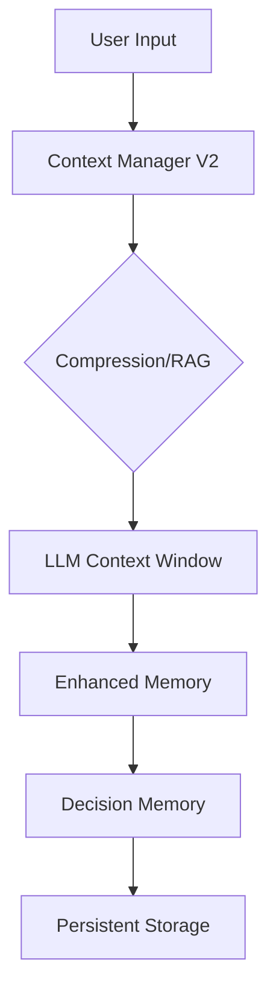

# Context & Memory Management

This documentation outlines the architectural foundation for how the agent perceives, retains, and retrieves information across sessions. Developers working on state persistence, context window optimization, or long-term recall should read this to understand how the system balances token efficiency with the need for deep, semantic understanding of the codebase.

## Context Management (28 modules)

When the agent interacts with a codebase, it cannot simply dump every file into the prompt; doing so would exhaust the context window and degrade performance. Instead, the system employs a multi-layered approach to context, where `context-manager-v2` acts as the primary orchestrator, determining which files, git diffs, or search results are relevant to the current task. By utilizing specialized modules like `dependency-aware-rag` and `repository-map`, the agent constructs a high-fidelity representation of the workspace that fits within the LLM's constraints.

> **Key concept:** The `context-manager-v2` orchestrates the injection of context, utilizing `compression` and `smart-compaction` to reduce token usage by up to 60% without losing critical semantic markers.

| Module | Purpose |
|--------|---------|
| `bootstrap-loader` | Bootstrap File Injection |
| `codebase-map` | codebase map |
| `compression` | Context Compression |
| `context-files` | Context Files - Automatic Project Context (Gemini CLI inspired) |
| `context-loader` | context loader |
| `context-manager-v2` | Advanced Context Manager for LLM conversations (Primary) |
| `context-manager-v3` | Context Manager V3 |
| `cross-encoder-reranker` | Cross-Encoder Reranker for RAG |
| `dependency-aware-rag` | Dependency-Aware RAG System |
| `enhanced-compression` | Enhanced Context Compression |
| `git-context` | Git Context Utility |
| `importance-scorer` | Importance Scorer for Context Compression |
| `index` | Context module - RAG, compression, context management, and web search |
| `jit-context` | JIT (Just-In-Time) Context Discovery |
| `multi-path-retrieval` | Multi-Path Code Retrieval System |
| `observation-masking` | Observation Masking System |
| `observation-variator` | Observation Variator — Manus AI anti-repetition pattern |
| `partial-summarizer` | Partial Summarizer |
| `precompaction-flush` | Pre-compaction Memory Flush — OpenClaw-inspired NO_REPLY pattern |
| `repository-map` | Repository Map - Aider-inspired code context system |
| `restorable-compression` | Restorable Compression — Manus AI context engineering pattern |
| `smart-compaction` | OpenClaw-inspired Smart Context Compaction System |
| `smart-preloader` | Smart Context Preloader |
| `token-counter` | Token Counter |
| `tool-output-masking` | Tool Output Masking Service |
| `types` | Context Types |
| `web-search-grounding` | Web Search Grounding |
| `workspace-context` | Workspace Context Builder |

> **Developer tip:** When debugging context injection issues, verify the state of `SessionStore.convertChatEntryToMessage` to ensure that the context being passed to the LLM is correctly serialized and formatted.

Now that we understand how the agent orchestrates immediate tool calls and file context, we need to examine the memory layer that governs how the agent retains information across long-running sessions.

## Memory System (15 modules)

While context management handles the "now," the memory system provides the "then," allowing the agent to recall architectural decisions, user preferences, and past coding styles. The core of this system is `EnhancedMemory`, which manages the lifecycle of stored data, from initial capture to consolidation. By using `DecisionMemory`, the agent can extract and persist high-level design choices, ensuring that future interactions are informed by the history of the project rather than just the current file state.

> **Key concept:** The memory system uses a two-phase pipeline: `memory-consolidation` first captures raw interactions, and then `EnhancedMemory.calculateImportance` determines which memories are worth persisting to long-term storage.

| Module | Purpose |
|--------|---------|
| `auto-capture` | Auto-Capture Memory System |
| `auto-memory` | Auto-Memory System |
| `coding-style-analyzer` | Coding Style Analyzer |
| `decision-memory` | Decision Memory — Extracts, persists, and retrieves architectural/design |
| `enhanced-memory` | Enhanced Memory Persistence System |
| `hybrid-search` | Hybrid Memory Search |
| `icm-bridge` | ICM (Infinite Context Memory) Bridge |
| `index` | Memory System Exports |
| `memory-consolidation` | Session Memory Consolidation — Two-Phase Pipeline |
| `memory-flush` | Pre-Threshold Memory Flush + Plugin Memory Backends |
| `memory-lifecycle-hooks` | Memory Lifecycle Hooks |
| `persistent-memory` | persistent memory |
| `prospective-memory` | Prospective Memory System |
| `semantic-memory-search` | OpenClaw-inspired 2-Step Memory Search System |
| `subagent-memory` | Subagent Persistent Memory |

> **Developer tip:** When implementing new memory hooks, ensure you call `EnhancedMemory.loadMemories` before attempting to access historical context, as failing to initialize the memory store will result in empty retrieval sets.

---

**See also:** [Overview](./1-overview.md) · [Architecture](./2-architecture.md) · [Subsystems](./3a-core-agent-system-cli-and-slash-commands.md) · [Tool System](./5-tools.md)