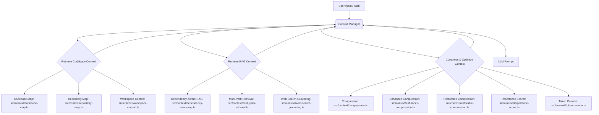

# Context & Memory Management

This section details the core mechanisms responsible for providing the Language Model (LLM) with relevant information and maintaining a persistent understanding across interactions. Effective context management ensures the LLM receives precise, up-to-date data for its current task, while a robust memory system allows it to learn, adapt, and maintain continuity over time, preventing repetitive or inconsistent behavior.

## Context Management (28 modules)

The Context Management subsystem is critical for dynamically assembling and optimizing the information presented to the LLM for each turn or task. This involves gathering data from various sources, such as the codebase, user input, and web searches, then compressing and ranking it to fit within token limits while maximizing relevance. This sophisticated process ensures the LLM always operates with the most pertinent and concise context available, which is vital for generating accurate and helpful responses.

The primary orchestrator for this process is `src/context/context-manager-v2.ts`, which integrates various specialized modules for tasks like codebase mapping, context compression, and RAG (Retrieval-Augmented Generation).

**Key Methods for `src/context/context-manager-v2.ts`**

The `ContextManagerV2` class in `src/context/context-manager-v2.ts` provides the core API for interacting with the context management system. Its methods allow for dynamic context addition, retrieval, and optimization, ensuring the LLM always has access to the most relevant information within its token window.

| Method | Purpose |
|:-------|:--------|
| `addContext(contextItem: ContextItem)` | Adds a new item to the current context buffer, managing its type and priority. |
| `getContext(options?: ContextOptions)` | Retrieves the current aggregated context, applying compression and relevance filtering as needed. |
| `compressContext(context: string[], tokenLimit: number)` | Compresses a given set of context strings to fit within a specified token limit using various strategies. |
| `retrieveRelevantContext(query: string, limit: number)` | Performs RAG-style retrieval to fetch context relevant to a specific query from indexed sources. |
| `flushPreCompactionMemory()` | Triggers the `src/context/precompaction-flush.ts` mechanism to clear less important context before a major compaction. |

The following modules contribute to the comprehensive context management capabilities, ranging from codebase analysis to advanced compression techniques and external data retrieval.

| Module | Purpose |
|--------|---------|
| `src/context/bootstrap-loader.ts` | Bootstrap File Injection |
| `src/context/codebase-map.ts` | Dynamically builds and maintains a map of the codebase structure and relationships. |
| `src/context/compression.ts` | Implements basic context compression strategies to fit information within token limits. |
| `src/context/context-files.ts` | Manages automatic project context files, inspired by the Gemini CLI. |
| `src/context/context-loader.ts` | Handles loading and parsing of various context sources. |
| `src/context/context-manager-v2.ts` | The primary advanced context manager for LLM conversations. |
| `src/context/context-manager-v3.ts` | An experimental or next-generation context manager. |
| `src/context/cross-encoder-reranker.ts` | Reranks retrieved context items using a cross-encoder model for improved relevance in RAG. |
| `src/context/dependency-aware-rag.ts` | Enhances RAG by considering code dependencies when retrieving relevant information. |
| `src/context/enhanced-compression.ts` | Provides more sophisticated and efficient context compression algorithms. |
| `src/context/git-context.ts` | Extracts and manages context related to Git repository status and history. |
| `src/context/importance-scorer.ts` | Assigns importance scores to context items to guide compression and prioritization. |
| `src/context/index.ts` | The main entry point for the Context module, exporting RAG, compression, and context management functionalities. |
| `src/context/jit-context.ts` | Implements Just-In-Time (JIT) context discovery, fetching information only when needed. |
| `src/context/multi-path-retrieval.ts` | Utilizes multiple retrieval paths to gather comprehensive code context. |
| `src/context/observation-masking.ts` | Masks sensitive or irrelevant observations to streamline context. |
| `src/context/observation-variator.ts` | Applies the Manus AI anti-repetition pattern to vary observations and prevent stale context. |
| `src/context/partial-summarizer.ts` | Generates partial summaries of lengthy context items to save tokens. |
| `src/context/precompaction-flush.ts` | Implements an OpenClaw-inspired NO_REPLY pattern for pre-compaction memory flushing. |
| `src/context/repository-map.ts` | Builds a repository map for code context, inspired by Aider. |
| `src/context/restorable-compression.ts` | Enables restorable compression, a Manus AI context engineering pattern. |
| `src/context/smart-compaction.ts` | Provides an OpenClaw-inspired smart context compaction system. |
| `src/context/smart-preloader.ts` | Intelligently preloads context to anticipate LLM needs. |
| `src/context/token-counter.ts` | Accurately counts tokens in context items to manage LLM input limits. |
| `src/context/tool-output-masking.ts` | Masks or filters irrelevant parts of tool outputs before adding to context. |
| `src/context/types.ts` | Defines the TypeScript types and interfaces used across the context management system. |
| `src/context/web-search-grounding.ts` | Integrates web search results to ground LLM responses with up-to-date external information. |
| `src/context/workspace-context.ts` | Builds and manages context specific to the current workspace. |

See also: [Memory System](#memory-system)

## Memory System (15 modules)

The Memory System provides the LLM with the ability to retain and recall information beyond the immediate context window, enabling long-term learning, consistent behavior, and the avoidance of repetitive actions. This is crucial for maintaining conversational coherence, understanding project history, and making informed decisions over extended interactions. Modules like `src/memory/decision-memory.ts` and `src/memory/semantic-memory-search.ts` are central to extracting