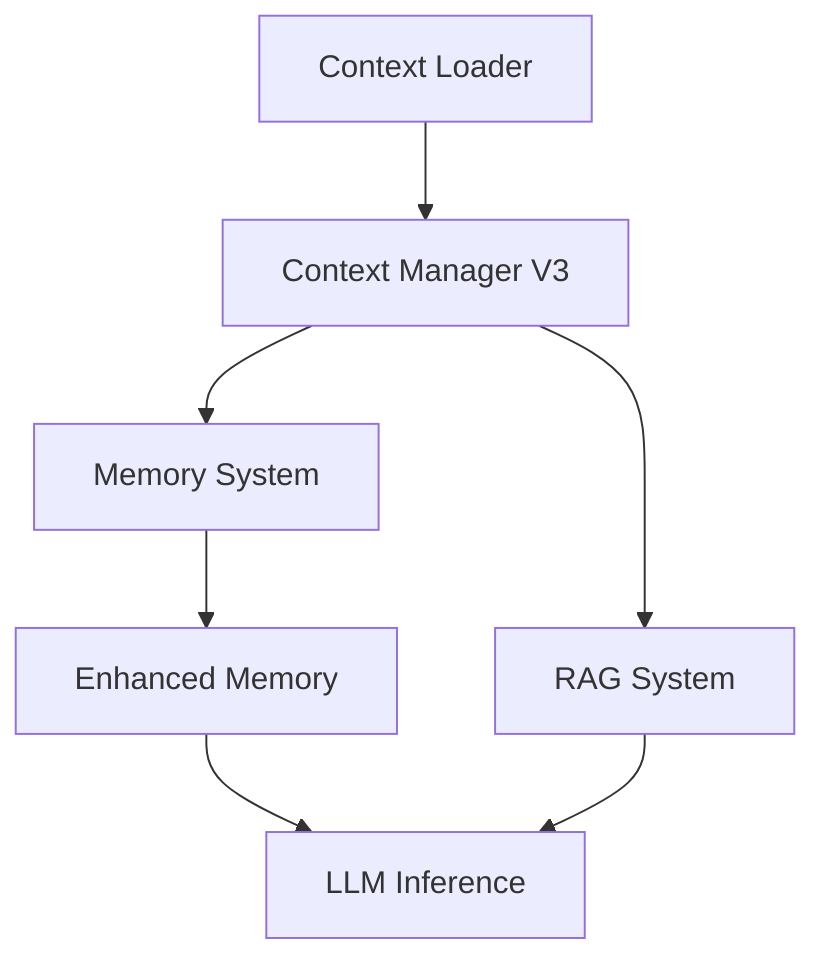

# Context & Memory Management

This section details the architecture of the system's context management and memory persistence layers. These modules are critical for maintaining state across long-running sessions, ensuring the agent retains architectural decisions, coding styles, and repository-specific knowledge. Developers working on agent state or retrieval-augmented generation (RAG) pipelines should familiarize themselves with these components to ensure efficient token utilization and state consistency.

## Context Management (28 modules)

The context management layer is responsible for the dynamic assembly of LLM prompts. It handles everything from repository mapping and dependency-aware RAG to token-efficient compression techniques, ensuring the model receives only the most relevant information for the current task.

| Module | Purpose |
|--------|---------|
| `bootstrap-loader` | Bootstrap File Injection |
| `codebase-map` | codebase map |
| `compression` | Context Compression |
| `context-files` | Context Files - Automatic Project Context (Gemini CLI inspired) |
| `context-loader` | context loader |
| `context-manager-v2` | Advanced Context Manager for LLM conversations (Primary) |
| `context-manager-v3` | Context Manager V3 |
| `cross-encoder-reranker` | Cross-Encoder Reranker for RAG |
| `dependency-aware-rag` | Dependency-Aware RAG System |
| `enhanced-compression` | Enhanced Context Compression |
| `git-context` | Git Context Utility |
| `importance-scorer` | Importance Scorer for Context Compression |
| `index` | Context module - RAG, compression, context management, and web search |
| `jit-context` | JIT (Just-In-Time) Context Discovery |
| `multi-path-retrieval` | Multi-Path Code Retrieval System |
| `observation-masking` | Observation Masking System |
| `observation-variator` | Observation Variator — Manus AI anti-repetition pattern |
| `partial-summarizer` | Partial Summarizer |
| `precompaction-flush` | Pre-compaction Memory Flush — OpenClaw-inspired NO_REPLY pattern |
| `repository-map` | Repository Map - Aider-inspired code context system |
| `restorable-compression` | Restorable Compression — Manus AI context engineering pattern |
| `smart-compaction` | OpenClaw-inspired Smart Context Compaction System |
| `smart-preloader` | Smart Context Preloader |
| `token-counter` | Token Counter |
| `tool-output-masking` | Tool Output Masking Service |
| `types` | Context Types |
| `web-search-grounding` | Web Search Grounding |
| `workspace-context` | Workspace Context Builder |

While context management handles the immediate, transient state of a conversation, the memory system provides the long-term persistence required for continuity across sessions.

## Memory System (15 modules)

The memory system facilitates the storage and retrieval of historical interactions, architectural decisions, and user preferences. By utilizing `EnhancedMemory.store()` and `EnhancedMemory.loadMemories()`, the system ensures that subagents and primary agents can access a consistent state, effectively bridging the gap between stateless LLM calls and stateful application requirements.

> **Key concept:** The `EnhancedMemory` module implements a two-phase consolidation pipeline. By invoking `EnhancedMemory.calculateImportance()`, the system filters transient noise from critical architectural decisions before persistence, optimizing token usage for future context windows.

| Module | Purpose |
|--------|---------|
| `auto-capture` | Auto-Capture Memory System |
| `auto-memory` | Auto-Memory System |
| `coding-style-analyzer` | Coding Style Analyzer |
| `decision-memory` | Decision Memory — Extracts, persists, and retrieves architectural/design |
| `enhanced-memory` | Enhanced Memory Persistence System |
| `hybrid-search` | Hybrid Memory Search |
| `icm-bridge` | ICM (Infinite Context Memory) Bridge |
| `index` | Memory System Exports |
| `memory-consolidation` | Session Memory Consolidation — Two-Phase Pipeline |
| `memory-flush` | Pre-Threshold Memory Flush + Plugin Memory Backends |
| `memory-lifecycle-hooks` | Memory Lifecycle Hooks |
| `persistent-memory` | persistent memory |
| `prospective-memory` | Prospective Memory System |
| `semantic-memory-search` | OpenClaw-inspired 2-Step Memory Search System |
| `subagent-memory` | Subagent Persistent Memory |

To maintain session integrity, the system relies on the `SessionStore` module. When a new interaction begins, the system calls `SessionStore.createSession()` to initialize the workspace, and subsequently uses `SessionStore.addMessageToCurrentSession()` to append data to the active state. Before closing, `SessionStore.saveSession()` ensures all volatile memory is flushed to disk.

---

**See also:** [Overview](./1-overview.md) · [Architecture](./2-architecture.md) · [Subsystems](./3a-core-agent-system-cli-and-slash-commands.md) · [Tool System](./5-tools.md)

--- END ---