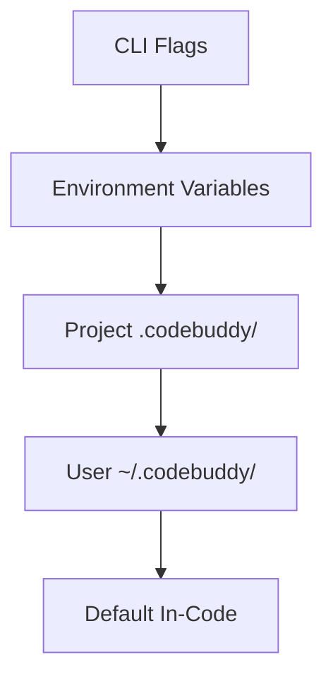

# Configuration System

The configuration system acts as the central nervous system for Code Buddy, dictating how the agent perceives its environment and interacts with external services. By implementing a multi-layered hierarchy, the system ensures that developers can maintain global defaults while retaining the flexibility to override behaviors on a per-project or per-session basis. This documentation is essential for engineers looking to tune agent performance, secure API credentials, or customize model behavior.

## Configuration Hierarchy

The architecture follows a strict cascading priority model. When the agent initializes, it resolves settings from the bottom up, allowing specific overrides to supersede general defaults. This ensures that a project-specific `.codebuddy/` directory always takes precedence over global user settings, preventing accidental leakage of project-specific configurations into global environments.

Now that we understand the precedence of these layers, we must examine the specific files that govern these configurations.

## Key Configuration Files

These files serve as the persistent state and configuration manifest for the agent. They are primarily located within the `.codebuddy/` directory, which acts as the local source of truth for the agent's operational parameters.

| File | Location |
|------|----------|
| `tsconfig.json` | project root |
| `.prettierrc` | project root |
| `vitest.config.ts` | project root |
| `.env.example` | project root |
| `AUDIT-REPORT.md` | .codebuddy/ |
| `autonomy.json` | .codebuddy/ |
| `CODEBUDDY.md` | .codebuddy/ |
| `CODEBUDDY_MEMORY.md` | .codebuddy/ |
| `CONTEXT.md` | .codebuddy/ |
| `GROK.md` | .codebuddy/ |
| `HEARTBEAT.md` | .codebuddy/ |
| `hooks.json` | .codebuddy/ |
| `lessons.md` | .codebuddy/ |
| `mcp.json` | .codebuddy/ |
| `settings.local.json` | .claude/ |

> **Developer tip:** `settings.local.json` is ignored by git, making it the ideal place for sensitive local overrides that shouldn't be committed to the repository.

## Environment Variables

Environment variables provide the runtime bridge between the host operating system and the agent's internal logic. They are critical for injecting secrets and toggling high-level features like autonomy modes or performance profiling without modifying the codebase.

| Variable | Description |
|----------|-------------|
| `GROK_API_KEY` | Required API key from x.ai |
| `CODEBUDDY_MAX_TOKENS` | Override response token limit |
| `MORPH_API_KEY` | Enables fast file editing |
| `YOLO_MODE` | Full autonomy mode (requires `/yolo on`) |
| `MAX_COST` | Session cost limit in dollars |
| `GROK_BASE_URL` | Custom API endpoint |
| `GROK_MODEL` | Default model to use |
| `JWT_SECRET` | Secret for API server auth |
| `PICOVOICE_ACCESS_KEY` | Porcupine wake word (text-match fallback if absent) |
| `BRAVE_API_KEY` | Brave Search for MCP web search |
| `EXA_API_KEY` | Exa neural search for MCP |
| `PERPLEXITY_API_KEY` | Perplexity AI (or via OpenRouter) |
| `OPENROUTER_API_KEY` | OpenRouter key |
| `CACHE_TRACE` | Debug prompt construction |
| `PERF_TIMING` | Startup phase profiling |
| `VERBOSE` | Verbose output |
| `SENTRY_DSN` | Sentry error reporting DSN |
| `OTEL_EXPORTER_OTLP_ENDPOINT` | OpenTelemetry OTLP endpoint for distributed tracing |

> **Key concept:** The configuration loader uses a lazy-loading strategy for environment variables, ensuring that sensitive keys like `GROK_API_KEY` are only accessed when the specific provider is initialized, reducing the risk of accidental exposure in logs.

## Model Configuration

Model behavior is governed by `src/config/model-tools.ts`, which acts as the registry for supported LLMs. When the agent prepares to execute a task, it calls `CodeBuddyClient.validateModel()` to ensure the selected model is compatible with the required toolset.

If the agent detects a specific provider, such as when `CodeBuddyAgent.isGrokModel()` returns true, it adjusts its internal prompt engineering and token budgeting accordingly. Furthermore, the system performs runtime checks using `CodeBuddyClient.isGeminiModelName()` to apply specific formatting rules required by different model architectures.

- Per-model: `contextWindow`, `maxOutputTokens`, `patchFormat`
- Provider auto-detection from model name or base URL
- Supports: Grok, Claude, GPT, Gemini, Ollama, LM Studio

With the configuration and model settings defined, the agent is ready to initialize its memory and tool registries.

**See also:** [Overview](./1-overview.md) · [Tool System](./5-tools.md) · [Context & Memory](./7-context-memory.md) · [API Reference](./9-api-reference.md)

**Key source files:** `src/config/model-tools.ts`