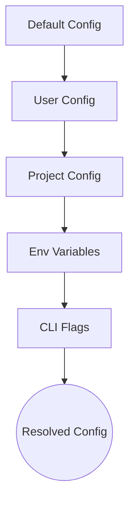

# Configuration System

The configuration system manages the operational parameters of the CodeBuddy environment through a multi-layered hierarchy. This architecture ensures that system behavior remains predictable across diverse deployment environments, from local development to production, and is critical for developers configuring model providers or agent autonomy levels.

## Configuration Hierarchy

The system resolves settings using a strict precedence order, where higher-level definitions override lower-level defaults. This allows for granular control, enabling developers to set global defaults while maintaining project-specific overrides.



The hierarchy dictates how settings are resolved at runtime, with specific precedence rules ensuring that user-defined preferences override default behaviors.

```
1. Default (in-code)     — Base behavior
2. User (~/.codebuddy/)  — Personal preferences
3. Project (.codebuddy/) — Project-specific settings
4. Environment variables — Runtime overrides
5. CLI flags             — Highest priority
```

## Key Configuration Files

The following files define the static configuration state. These files are parsed during the initialization phase to establish the baseline environment for the agent.

| File | Location |
|------|----------|
| `tsconfig.json` | project root |
| `.prettierrc` | project root |
| `vitest.config.ts` | project root |
| `.env.example` | project root |
| `AUDIT-REPORT.md` | .codebuddy/ |
| `autonomy.json` | .codebuddy/ |
| `CODEBUDDY.md` | .codebuddy/ |
| `CODEBUDDY_MEMORY.md` | .codebuddy/ |
| `CONTEXT.md` | .codebuddy/ |
| `GROK.md` | .codebuddy/ |
| `HEARTBEAT.md` | .codebuddy/ |
| `hooks.json` | .codebuddy/ |
| `lessons.md` | .codebuddy/ |
| `mcp.json` | .codebuddy/ |
| `settings.local.json` | .claude/ |

Beyond static configuration files, the system relies on environment variables to inject sensitive credentials and runtime toggles that influence agent behavior.

## Environment Variables

Environment variables provide the mechanism for runtime configuration, particularly for sensitive data like API keys and operational toggles.

| Variable | Description |
|----------|-------------|
| `GROK_API_KEY` | Required API key from x.ai |
| `CODEBUDDY_MAX_TOKENS` | Override response token limit |
| `MORPH_API_KEY` | Enables fast file editing |
| `YOLO_MODE` | Full autonomy mode (requires `/yolo on`) |
| `MAX_COST` | Session cost limit in dollars |
| `GROK_BASE_URL` | Custom API endpoint |
| `GROK_MODEL` | Default model to use |
| `JWT_SECRET` | Secret for API server auth |
| `PICOVOICE_ACCESS_KEY` | Porcupine wake word (text-match fallback if absent) |
| `BRAVE_API_KEY` | Brave Search for MCP web search |
| `EXA_API_KEY` | Exa neural search for MCP |
| `PERPLEXITY_API_KEY` | Perplexity AI (or via OpenRouter) |
| `OPENROUTER_API_KEY` | OpenRouter key |
| `CACHE_TRACE` | Debug prompt construction |
| `PERF_TIMING` | Startup phase profiling |
| `VERBOSE` | Verbose output |
| `SENTRY_DSN` | Sentry error reporting DSN |
| `OTEL_EXPORTER_OTLP_ENDPOINT` | OpenTelemetry OTLP endpoint for distributed tracing |

Model-specific behavior is further refined through the model configuration layer, which maps provider-specific capabilities to the internal agent architecture.

## Model Configuration

Models are configured via `src/config/model-tools.ts` using glob matching patterns to determine capabilities. During the initialization sequence, the system invokes `CodeBuddyClient.validateModel()` to ensure the selected model is compatible with the current environment.

> **Key concept:** The configuration resolution engine implements a "last-write-wins" strategy. CLI flags and environment variables are evaluated last, allowing for ephemeral overrides without modifying persistent configuration files in `~/.codebuddy/` or the project root.

For specific providers, such as Gemini, the system utilizes `CodeBuddyClient.isGeminiModelName()` to apply provider-specific optimizations. Furthermore, `CodeBuddyAgent.initializeAgentSystemPrompt()` is called to inject the appropriate system instructions based on the resolved model configuration.

- Per-model: `contextWindow`, `maxOutputTokens`, `patchFormat`
- Provider auto-detection from model name or base URL
- Supports: Grok, Claude, GPT, Gemini, Ollama, LM Studio

---

**See also:** [Overview](./1-overview.md) · [Tool System](./5-tools.md) · [Context & Memory](./7-context-memory.md) · [API Reference](./9-api-reference.md)

**Key source files:** `src/config/model-tools.ts`