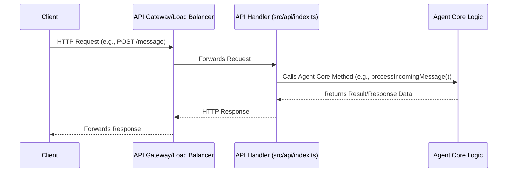

# CLI & API Reference

This document provides a comprehensive reference for the agent's command-line interface (CLI) and its external HTTP API. Understanding these interfaces is crucial for both direct user interaction and programmatic integration with the agent, enabling control, data exchange, and extensibility.

## Slash Commands

The Slash Commands section details the various user-facing commands available through the CLI, enabling direct interaction with the agent and execution of specific functionalities. These commands are crucial for controlling agent behavior, accessing information, and initiating complex workflows directly from the command line interface, providing a powerful way for users to leverage the agent's capabilities. The core logic for parsing and executing these commands resides in `src/cli/slash-commands/index.ts`.
See also: [Tool System](./5-tools.md) (for commands that invoke tools), [Context & Memory](./7-context-memory.md) (for commands that interact with agent memory).

### Slash Command Flow

The following diagram illustrates the typical flow when a user invokes a slash command through the CLI.

```mermaid
graph TD
    User[User Input] --> CLI[CLI Interface]
    CLI --> SlashCommandParser[Slash Command Parser]
    SlashCommandParser --> SlashCommandRegistry[Slash Command Registry (src/cli/slash-commands/index.ts)]
    SlashCommandRegistry -- Registers --> SpecificCommandDef[Specific Command Definition (e.g., src/cli/slash-commands/docs.ts)]
    SlashCommandRegistry -- Executes --> SpecificCommandDef
    SpecificCommandDef --> AgentCore[Agent Core Logic]
```

### Key Methods: Slash Command Module

The primary module for managing slash commands is `src/cli/slash-commands/index.ts`. It provides the necessary utilities for command registration and execution, acting as the central hub for all CLI command operations.

| Method | Purpose |
|---|---|
| `registerCommand(command: SlashCommand)` | Registers a new slash command with the system, making it available for execution. |
| `parseAndExecute(input: string)` | Parses a user's input string, identifies the command, and executes its associated handler. |
| `getAvailableCommands()` | Returns a list of all currently registered slash commands. |

### Slash Command Files

This table lists the key files involved in defining and managing slash commands, providing insight into the structure and organization of the CLI command system.

| File | Purpose |
|------|---------|
| `src/cli/slash-commands/builtins/` | Built-in Slash Commands, containing core commands essential for agent operation. |
| `src/cli/slash-commands/docs.ts` | `/docs` slash command — Generates DeepWiki-style documentation based on agent knowledge. |
| `src/cli/slash-commands/index.ts` | Slash Command Module, the main entry point for command handling and registration. |
| `src/cli/slash-commands/prompts/` | `/prompt` Slash Commands, used for interacting with and managing agent prompts. |
| `src/cli/slash-commands/types.ts` | Slash Command Types, defining the data structures and interfaces for all slash commands. |

## HTTP API Routes

The HTTP API Routes define the external interface for the agent, allowing for programmatic interaction from other applications or services. This API is critical for integrating the agent into larger systems, enabling headless operation, and facilitating automated workflows without direct user CLI interaction. The core routing and request handling logic typically resides within `src/api/index.ts` or a similar entry point.
See also: [Slash Commands](#slash-commands) (for direct user interaction via CLI).

### HTTP API Flow

The following diagram illustrates a typical interaction flow with the agent's HTTP API.



### Key Methods: HTTP API Handler

The primary module for managing HTTP API requests is typically found in `src/api/index.ts` or a dedicated API controller. It provides the necessary utilities for routing, request validation, and invoking the agent's core functionalities.

| Method | Purpose |
|---|---|
| `handleMessage(request: Request)` | Processes incoming user messages or commands via HTTP, forwarding them to the agent's core. |
| `getStatus(request: Request)` | Provides the current operational status and health of the agent. |
| `executeTool(request: Request)` | Allows external systems to directly invoke specific tools registered with the agent. |
| `getAgentMemory(request: Request)` | Retrieves specific pieces of information from the agent's memory or context. |

### HTTP API Route Definitions

This section outlines the primary HTTP API routes exposed by the agent, detailing their purpose and expected interactions.

| Route | Method | Purpose |
|---|---|---|
| `/api/v1/message` | `POST` | Sends a message to the agent for processing. Expects a JSON payload with `text` and optional `context`. |
| `/api/v1/status` | `GET` | Retrieves the current operational status and health of the agent. |
| `/api/v1/tools/{toolName}/execute` | `POST` | Executes a specific named tool with provided parameters. |
| `/api/v1/memory/{key}` | `GET` | Fetches the value associated with a specific key from the agent's memory. |
| `/api/v1/config` | `GET` | Returns the agent's current configuration settings (non-sensitive). |