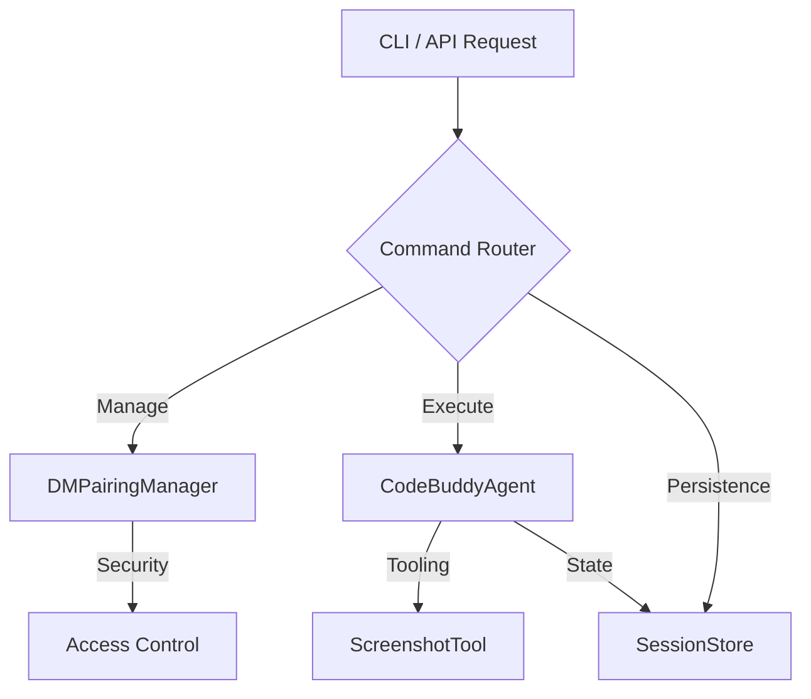

# CLI & API Reference

This reference provides a comprehensive overview of the Code Buddy command-line interface (CLI) and HTTP API endpoints. It is intended for developers, system administrators, and contributors who need to integrate, automate, or extend the Code Buddy agent environment.

## CLI Subcommands

The CLI serves as the primary entry point for interacting with the agent, managing infrastructure, and configuring runtime behavior. These commands map directly to internal management modules, such as `DMPairingManager.approve` for security pairing or `DeviceNodeManager.pairDevice` for hardware integration.

| Command | Description |
|---------|-------------|
| `buddy git` | Git operations with AI assistance |
| `buddy commit-and-push` | Generate AI commit message and push to remote |
| `buddy channels` | Manage channel connections (Telegram, Discord, Slack, etc.) |
| `buddy server` | Start the Code Buddy HTTP/WebSocket API server |
| `buddy mcp-server` | Start Code Buddy as an MCP server over stdio (for VS Code, Cursor, etc.) |
| `buddy provider` | Manage AI providers (Claude, ChatGPT, Grok, Gemini) |
| `buddy mcp` | Manage MCP (Model Context Protocol) servers |
| `buddy pipeline` | Manage and run pipeline workflows |
| `buddy pairing` | Manage DM pairing security (allowlist for messaging channel senders) |
| `buddy knowledge` | Manage agent knowledge bases (Knowledge.md files injected as context) |
| `buddy research` | Wide Research: spawn parallel agent workers to research a topic (Manus AI-inspired) |
| `buddy flow` | Execute a multi-agent planning flow (OpenManus-compatible): plan → execute → synthesize |
| `buddy todo` | Manage persistent task list (todo.md) — injected at end of every agent turn for focus |
| `buddy execpolicy` | Manage execution policy rules (allow/deny/ask/sandbox) for shell commands |
| `buddy lessons` | Manage lessons learned — self-improvement loop for recurring patterns (injected every turn) |
| `buddy update` | Update Code Buddy (switch channels: stable, beta, dev) |
| `buddy daemon` | Manage the Code Buddy daemon (background process) |
| `buddy trigger` | Manage event triggers for automated agent responses |
| `buddy speak` | Synthesize speech using AudioReader TTS |
| `buddy heartbeat` | Manage the heartbeat engine (periodic agent wake) |
| `buddy hub` | Skills marketplace (search, install, publish) |
| `buddy device` | Manage paired device nodes (SSH, ADB, local) |
| `buddy identity` | Manage agent identity files (SOUL.md, USER.md, etc.) |
| `buddy groups` | Manage group chat security |
| `buddy auth-profile` | Manage authentication profiles (API key rotation) |
| `buddy config` | Show environment variable configuration and validation |
| `buddy dev` | Golden-path developer workflows (plan, run, pr, fix-ci, explain) |
| `buddy run` | Inspect and replay agent runs (observability) |
| `buddy nodes` | Manage companion app nodes (macOS, iOS, Android) |
| `buddy secrets` | Manage API keys and credentials (encrypted vault) |
| `buddy approvals` | Manage tool/action approval requests |
| `buddy deploy` | Generate cloud deployment configurations (Fly, Railway, Render, Nix) |

The following diagram illustrates the high-level interaction flow between the CLI entry points, the core agent system, and the persistence layer.

## CLI Options

Beyond subcommands, the CLI supports granular configuration flags that modify execution parameters, security posture, and output formatting. These flags allow for fine-tuning the agent's behavior without modifying the underlying configuration files.

> **Key concept:** The `--probe-tools` flag triggers `CodeBuddyClient.probeToolSupport()` at startup, ensuring the model's function-calling capabilities are verified before the agent attempts to execute complex tool chains.

| Flag | Description |
|------|-------------|
| `-d, --directory <dir>` | set working directory |
| `-k, --api-key <key>` | CodeBuddy API key (or set GROK_API_KEY env var) |
| `-u, --base-url <url>` | CodeBuddy API base URL (or set GROK_BASE_URL env var) |
| `-m, --model <model>` | AI model to use (e.g., grok-code-fast-1, grok-4-latest) (or set GROK_MODEL env var) |
| `-p, --prompt <prompt>` | process a single prompt and exit (headless mode, alias: --print) |
| `--print <prompt>` | alias for --prompt: process a single prompt and exit (headless mode) |
| `-b, --browser` | launch browser UI instead of terminal interface |
| `--max-tool-rounds <rounds>` | maximum number of tool execution rounds (default: 400) |
| `-s, --security-mode <mode>` | security mode: suggest (default), auto-edit, or full-auto |
| `-o, --output-format <format>` | output format for headless mode: json, stream-json, text, markdown |
| `--init` | initialize .codebuddy directory with templates and exit |
| `--dry-run` | preview changes without applying them (simulation mode) |
| `-c, --context <patterns>` | load specific files into context using glob patterns (e.g.,  |
| `--no-cache` | disable response caching |
| `--no-self-heal` | disable self-healing auto-correction |
| `--force-tools` | enable tools/function calling for local models (LM Studio) |
| `--probe-tools` | auto-detect tool support by testing the model at startup |
| `--plain` | use plain text output (minimal formatting) |
| `--no-color` | disable colored output |
| `--no-emoji` | disable emoji in output |

## Slash Commands

Slash commands provide in-chat control mechanisms, allowing users to trigger specific agent behaviors or documentation generation without leaving the conversation context. These commands are parsed by the agent's input handler to invoke internal routines.

| File | Purpose |
|------|---------|
| `/builtins` | Built-in Slash Commands |
| `/docs` | /docs slash command — Generate DeepWiki-style documentation |
| `/index` | Slash Command Module |
| `/prompts` | /prompt Slash Commands |
| `/types` | Slash Command Types |

## HTTP API Routes

For programmatic access and external integrations, the Code Buddy server exposes a RESTful API, enabling session management and metric tracking. These routes interface directly with the persistence layer, specifically utilizing `SessionStore.createSession` and `SessionStore.saveSession` to manage stateful interactions.

| Route File | Endpoints |
|------------|----------|
| `a2a-protocol.ts` | GET /.well-known/agent.json, GET /agents, POST /tasks/send, GET /tasks/:id |
| `canvas.ts` | N/A |
| `chat.ts` | POST / |
| `health.ts` | N/A |
| `index.ts` | N/A |
| `memory.ts` | GET /, POST / |
| `metrics.ts` | GET /, GET /json, GET /snapshot, GET /history, GET /dashboard |
| `sessions.ts` | GET / |
| `tools.ts` | GET /, GET /categories |
| `workflow-builder.ts` | N/A |

---

**See also:** [Architecture](./2-architecture.md) · [Subsystems](./3a-core-agent-system-cli-and-slash-commands.md) · [Tool System](./5-tools.md) · [Security](./6-security.md)

--- END ---