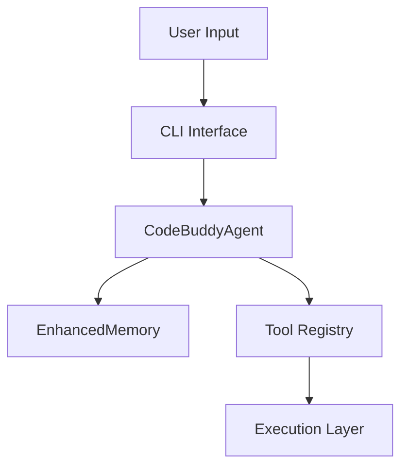

# CLI & API Reference

This reference guide serves as the definitive manual for interacting with the Code Buddy ecosystem. Whether you are a developer integrating the agent into a CI/CD pipeline or a power user optimizing local workflows, understanding these interfaces is essential for mastering the agent's capabilities and ensuring seamless communication between human intent and machine execution.

## CLI Subcommands

The Code Buddy CLI acts as the primary nervous system for the agent, translating human intent into actionable tasks. When you invoke a command like `buddy git`, the system does not simply execute a shell script; it orchestrates a series of agentic steps—planning, execution, and verification—to ensure the outcome aligns with your repository's state.

By utilizing these subcommands, you interface directly with the core logic modules. For instance, `buddy pairing` interacts with `DMPairingManager` to handle secure communication, while `buddy device` utilizes `DeviceNodeManager` to manage hardware connectivity.

| Command | Description |
|---------|-------------|
| `buddy git` | Git operations with AI assistance |
| `buddy commit-and-push` | Generate AI commit message and push to remote |
| `buddy channels` | Manage channel connections (Telegram, Discord, Slack, etc.) |
| `buddy server` | Start the Code Buddy HTTP/WebSocket API server |
| `buddy mcp-server` | Start Code Buddy as an MCP server over stdio (for VS Code, Cursor, etc.) |
| `buddy provider` | Manage AI providers (Claude, ChatGPT, Grok, Gemini) |
| `buddy mcp` | Manage MCP (Model Context Protocol) servers |
| `buddy pipeline` | Manage and run pipeline workflows |
| `buddy pairing` | Manage DM pairing security (allowlist for messaging channel senders) |
| `buddy knowledge` | Manage agent knowledge bases (Knowledge.md files injected as context) |
| `buddy research` | Wide Research: spawn parallel agent workers to research a topic (Manus AI-inspired) |
| `buddy flow` | Execute a multi-agent planning flow (OpenManus-compatible): plan → execute → synthesize |
| `buddy todo` | Manage persistent task list (todo.md) — injected at end of every agent turn for focus |
| `buddy execpolicy` | Manage execution policy rules (allow/deny/ask/sandbox) for shell commands |
| `buddy lessons` | Manage lessons learned — self-improvement loop for recurring patterns (injected every turn) |
| `buddy update` | Update Code Buddy (switch channels: stable, beta, dev) |
| `buddy daemon` | Manage the Code Buddy daemon (background process) |
| `buddy trigger` | Manage event triggers for automated agent responses |
| `buddy speak` | Synthesize speech using AudioReader TTS |
| `buddy heartbeat` | Manage the heartbeat engine (periodic agent wake) |
| `buddy hub` | Skills marketplace (search, install, publish) |
| `buddy device` | Manage paired device nodes (SSH, ADB, local) |
| `buddy identity` | Manage agent identity files (SOUL.md, USER.md, etc.) |
| `buddy groups` | Manage group chat security |
| `buddy auth-profile` | Manage authentication profiles (API key rotation) |
| `buddy config` | Show environment variable configuration and validation |
| `buddy dev` | Golden-path developer workflows (plan, run, pr, fix-ci, explain) |
| `buddy run` | Inspect and replay agent runs (observability) |
| `buddy nodes` | Manage companion app nodes (macOS, iOS, Android) |
| `buddy secrets` | Manage API keys and credentials (encrypted vault) |
| `buddy approvals` | Manage tool/action approval requests |
| `buddy deploy` | Generate cloud deployment configurations (Fly, Railway, Render, Nix) |

> **Developer tip:** When adding a new CLI command, ensure it is registered in the main entry point; failure to do so will result in the command being ignored by the argument parser, leading to silent failures during execution.

## CLI Options

Beyond simple command execution, the CLI offers granular control over the agent's runtime environment. These flags allow you to toggle security modes, adjust token budgets, or force specific model behaviors, effectively allowing you to tune the agent's "personality" for different tasks.

> **Key concept:** The `--probe-tools` flag is critical for local inference. By invoking `CodeBuddyClient.probeToolSupport()`, the agent dynamically verifies if the connected model can handle function calling, preventing runtime errors during complex tasks.

| Flag | Description |
|------|-------------|
| `-d, --directory <dir>` | set working directory |
| `-k, --api-key <key>` | CodeBuddy API key (or set GROK_API_KEY env var) |
| `-u, --base-url <url>` | CodeBuddy API base URL (or set GROK_BASE_URL env var) |
| `-m, --model <model>` | AI model to use (e.g., grok-code-fast-1, grok-4-latest) (or set GROK_MODEL env var) |
| `-p, --prompt <prompt>` | process a single prompt and exit (headless mode, alias: --print) |
| `--print <prompt>` | alias for --prompt: process a single prompt and exit (headless mode) |
| `-b, --browser` | launch browser UI instead of terminal interface |
| `--max-tool-rounds <rounds>` | maximum number of tool execution rounds (default: 400) |
| `-s, --security-mode <mode>` | security mode: suggest (default), auto-edit, or full-auto |
| `-o, --output-format <format>` | output format for headless mode: json, stream-json, text, markdown |
| `--init` | initialize .codebuddy directory with templates and exit |
| `--dry-run` | preview changes without applying them (simulation mode) |
| `-c, --context <patterns>` | load specific files into context using glob patterns (e.g.,  |
| `--no-cache` | disable response caching |
| `--no-self-heal` | disable self-healing auto-correction |
| `--force-tools` | enable tools/function calling for local models (LM Studio) |
| `--probe-tools` | auto-detect tool support by testing the model at startup |
| `--plain` | use plain text output (minimal formatting) |
| `--no-color` | disable colored output |
| `--no-emoji` | disable emoji in output |

Having configured the runtime environment, we can now shift our focus to the interactive session layer, where slash commands provide immediate control over the agent's active state.

## Slash Commands

Slash commands provide a shorthand interface for manipulating the agent's internal state during active sessions. These commands bypass the standard conversational flow, allowing for immediate access to system-level functions like documentation generation or prompt injection.

> **Developer tip:** Slash commands are processed by the agent's command parser. Always validate input arguments before passing them to the underlying service to prevent injection vulnerabilities or unexpected state transitions.

| File | Purpose |
|------|---------|
| `/builtins` | Built-in Slash Commands |
| `/docs` | /docs slash command — Generate DeepWiki-style documentation |
| `/index` | Slash Command Module |
| `/prompts` | /prompt Slash Commands |
| `/types` | Slash Command Types |

With the slash commands established as the primary interaction method for active sessions, we must now examine the HTTP API, which provides the necessary hooks for headless deployments and external integrations.

## HTTP API Routes

For headless deployments or integration with external IDEs like Cursor or VS Code, the HTTP API provides a robust interface for programmatic access. This layer exposes the same functionality as the CLI but via standard RESTful endpoints, enabling seamless interoperability with the `SessionStore` and other persistence layers.

| Route File | Endpoints |
|------------|----------|
| `a2a-protocol.ts` | GET /.well-known/agent.json, GET /agents, POST /tasks/send, GET /tasks/:id |
| `canvas.ts` | N/A |
| `chat.ts` | POST / |
| `health.ts` | N/A |
| `index.ts` | N/A |
| `memory.ts` | GET /, POST / |
| `metrics.ts` | GET /, GET /json, GET /snapshot, GET /history, GET /dashboard |
| `sessions.ts` | GET / |
| `tools.ts` | GET /, GET /categories |
| `workflow-builder.ts` | N/A |

---

**See also:** [Architecture](./2-architecture.md) · [Subsystems](./3a-core-agent-system-cli-and-slash-commands.md) · [Tool System](./5-tools.md) · [Security](./6-security.md)