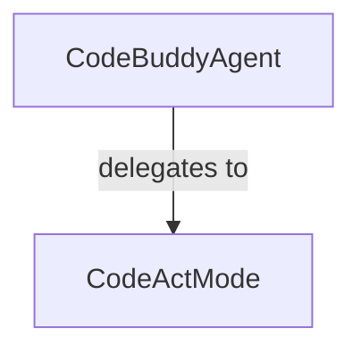

# Agent Orchestration

Relevant source files

- `src/agent/codebuddy-agent.ts.ts`
- `src/agent/modes/codeact-mode.ts.ts`

For [configuration](./getting-started.md#configuration), see Configuration.
For CLI integration, see CLI.

The Agent Orchestration layer serves as the central nervous system of `@phuetz/code-buddy`. It exists to decouple the high-level agent lifecycle management from the specific operational strategies (modes) used to interact with the codebase. By separating the core agent logic from its execution modes, the system allows for modular expansion, enabling the agent to switch between different behaviors—such as autonomous coding or interactive assistance—without modifying the core orchestration engine.

## [Architecture](./tool-development.md#architecture)

The architecture follows a strategy-like pattern where the `CodeBuddyAgent` acts as the orchestrator, delegating specific execution tasks to registered modes like `CodeActMode`.

**Sources:** [src/agent/codebuddy-agent.ts:L1-L1](local)
**Sources:** [src/agent/modes/codeact-mode.ts:L1-L1](local)

## Core Agent Logic

The `CodeBuddyAgent` module is the primary entry point for agent operations. Its purpose is to maintain the state of the agent's session and manage the transition between different operational states. By centralizing this logic, the system ensures that regardless of the active mode, the agent maintains a consistent context and lifecycle management.

> **Developer Tip:** When extending the agent, ensure that new modes are registered within the orchestration layer rather than hardcoding logic into the agent core to maintain separation of concerns.

**Sources:** [src/agent/codebuddy-agent.ts:L1-L1](local)

## Execution Modes

The `CodeActMode` module defines a specific operational strategy for the agent. This modular approach allows the agent to adapt its decision-making process based on the current task requirements. By encapsulating mode-specific logic within dedicated files, the codebase remains maintainable even as the number of supported agent behaviors grows.

**Sources:** [src/agent/modes/codeact-mode.ts:L1-L1](local)

## Summary

1. **Separation of Concerns:** The orchestration layer separates the agent's lifecycle management (`CodeBuddyAgent`) from its operational strategies (`CodeActMode`).
2. **Extensibility:** The architecture is designed to support new execution modes without requiring modifications to the core agent logic.
3. **Modular Design:** By isolating mode-specific logic, the system reduces complexity and improves maintainability as the agent's capabilities evolve.