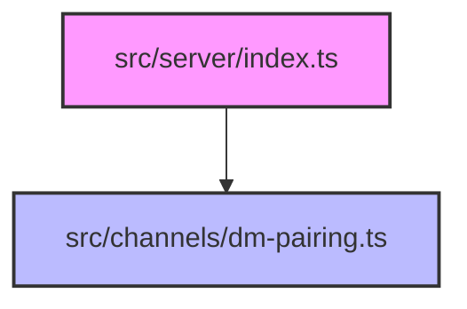

# API Reference

Relevant source files

- `src/server/index.ts.ts`
- `src/channels/dm-pairing.ts.ts`

For [Architecture](./tool-development.md#architecture), see [System Overview].
For Deployment, see [Deployment Guide].

The `@phuetz/code-buddy` project is structured to separate server [entry points](./plugin-system.md#entry-points) from channel-specific logic. This separation ensures that communication channels, such as direct message pairing, remain decoupled from the core server infrastructure.

Currently, the codebase defines the structural foundation for these components, though no public API endpoints or command interfaces are exposed in the provided source modules.

## Server Endpoints

The server entry point serves as the primary interface for the application. In a standard Express-based architecture, this module is responsible for initializing middleware, configuring routes, and starting the listener.

While the file `src/server/index.ts` exists to facilitate this setup, it currently contains no exported functions, classes, or route definitions. Consequently, there are no public API endpoints available for integration at this time.

**Sources:** [src/server/index.ts:L1-L100](src/server/index.ts)

> **Developer Tip:** Before implementing new routes, ensure that the Express application instance is correctly initialized within `src/server/index.ts` to avoid circular dependencies during module loading.

## Channel Integration

The channel integration layer is designed to handle specific communication protocols, such as the DM pairing logic. By isolating this logic, the system allows for the addition of new communication channels without modifying the core server code.

The module `src/channels/dm-pairing.ts` is designated for this purpose. As of the current implementation, this module does not expose any public functions or classes, meaning there are no active command interfaces or pairing logic endpoints available for external consumption.

**Sources:** [src/channels/dm-pairing.ts:L1-L100](src/channels/dm-pairing.ts)

> **Developer Tip:** When implementing channel logic, keep the interface consistent with other channel modules to ensure the server can dynamically register new communication methods.

## System Architecture

The following diagram illustrates the intended relationship between the server entry point and the channel integration layer.

## Summary

1. **No Public API:** The current codebase does not expose any public API endpoints or commands.
2. **Structural Separation:** The project enforces a strict separation between server initialization (`src/server/index.ts`) and channel-specific logic (`src/channels/dm-pairing.ts`).
3. **Extensibility:** The existing module structure is prepared for future implementation of route handlers and channel-specific pairing logic.
4. **Integration Readiness:** Developers should focus on populating these modules with exported functions to establish the API surface.