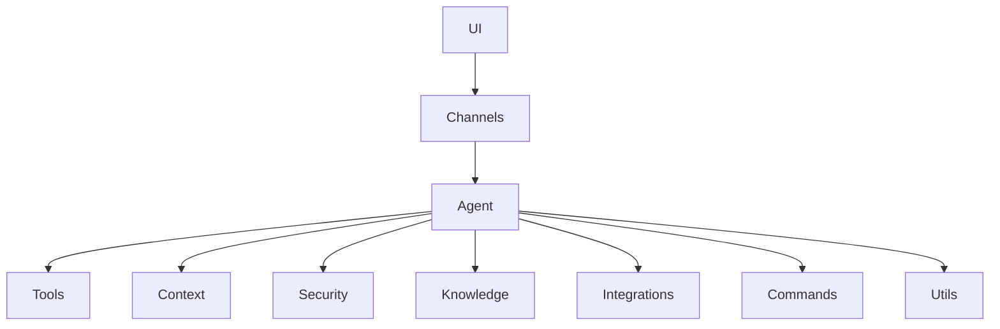

# [Architecture](./tool-development.md#architecture) Overview

Relevant source files

- `src/agent/codebuddy-agent.ts.ts`
- `src/server/index.ts.ts`

For [Plugin System], see [Plugin Architecture].
For [Agent Lifecycle], see [Agent Orchestration].

## System Overview
The `@phuetz/code-buddy` architecture is designed around a highly modular, plugin-based system. By decoupling core logic from specific capabilities, the system allows for independent scaling of features across ten distinct layers. This separation of concerns ensures that the core agent remains lightweight while delegating specialized tasks to specific modules.

The system is structured to facilitate extensibility, where the `agent` acts as the central orchestrator, and layers like `tools`, `commands`, and `integrations` provide the functional surface area.

**Sources:** [src/server/index.ts:L1-L100](src/server/index.ts)

> **Developer Tip:** When extending the system, always verify which layer your new functionality belongs to before implementation to maintain the integrity of the plugin-based architecture.

## How It Works
The system operates as a request-response pipeline. When a user initiates an action through the `ui` or `channels` layer, the request is routed to the `agent`. The `agent` acts as the central brain, determining which `tools` or `commands` are required to fulfill the request. 

Throughout this process, the agent consults the `context` and `knowledge` layers to ensure the response is grounded in the current state. Security checks are performed via the `security` layer before any external `integrations` are invoked.

**Sources:** [src/agent/codebuddy-agent.ts:L1-L100](src/agent/codebuddy-agent.ts)

## Layered Architecture
The following diagram illustrates the relationship between the core agent and the supporting functional layers.

**Sources:** [src/agent/codebuddy-agent.ts:L1-L100](src/agent/codebuddy-agent.ts)

## Core Flow
1. **Ingestion:** The `server` receives an incoming request, which is passed to the `channels` layer.
2. **Orchestration:** The `agent` receives the processed message. It evaluates the intent and identifies the necessary `tools` or `commands`.
3. **Validation:** Before execution, the `security` layer validates permissions and constraints.
4. **Execution:** The `agent` executes the logic, utilizing `utils` for helper functions and `integrations` for external communication.
5. **Response:** The result is returned through the `channels` layer back to the `ui`.

**Sources:** [src/server/index.ts:L1-L100](src/server/index.ts)

> **Developer Tip:** Use the `agent` as the single point of entry for all cross-layer communication to prevent circular dependencies between modules.

## Design Decisions and Trade-offs
The architecture relies heavily on the Singleton pattern for critical infrastructure components (e.g., `auth-monitoring`, `message-preprocessing`, `send-policy`). 

*   **Why Singletons:** We use Singletons to ensure consistent state management across the application lifecycle, particularly for security and channel policies.
*   **Trade-off:** While this simplifies state synchronization, it requires careful management of global state to avoid side effects during testing.
*   **Plugin-based approach:** This allows us to add new capabilities (like new `integrations`) without modifying the core `agent` logic, though it increases the complexity of dependency injection.

**Sources:** [src/agent/codebuddy-agent.ts:L1-L100](src/agent/codebuddy-agent.ts)

> **Developer Tip:** If you find yourself needing to share state between modules, prefer passing context through the `agent` rather than creating new Singletons.

## Data Flow
Data flows unidirectionally from the `channels` into the `agent`. The `agent` acts as a mediator, pulling data from `context` and `knowledge` to enrich the request. Once processed, the output flows back through the `channels` to the user. This unidirectional flow ensures that the `agent` maintains a predictable state throughout the request lifecycle.

**Sources:** [src/server/index.ts:L1-L100](src/server/index.ts)

## Summary
1. The system utilizes a plugin-based architecture to maintain a clean separation between the core `agent` and functional layers.
2. The `agent` serves as the central orchestrator, managing the lifecycle of requests across ten distinct layers.
3. Singleton patterns are employed for critical infrastructure to ensure consistency in security and channel policies.
4. Data flow is strictly managed to ensure the `agent` remains the source of truth for all operations.