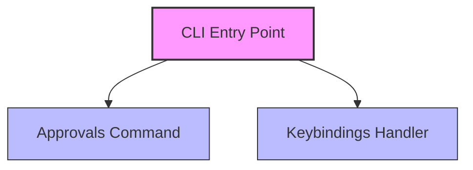

# CLI Reference

Relevant source files

- `src/commands/cli/approvals-command.ts.ts`
- `src/commands/handlers/keybindings-handler.ts.ts`

For [configuration](./getting-started.md#configuration), see [Configuration Guide]. For [architecture](./tool-development.md#architecture), see [System Overview].

The `@phuetz/code-buddy` CLI is structured around modular command definitions and event handlers. By separating the CLI [entry points](./plugin-system.md#entry-points) from the underlying logic, the system maintains a clean separation of concerns, allowing for independent testing and maintenance of approval workflows and keybinding configurations.

## Approvals Command

The approvals command module serves as the primary interface for managing approval workflows within the CLI. It acts as the entry point for users to interact with the approval system, ensuring that all approval-related operations are routed through a centralized command structure.

**Developer Tip:** When extending the CLI, ensure that new approval logic is encapsulated within this module to maintain a consistent command-line interface.

**Sources:** [src/commands/cli/approvals-command.ts:L1-L100](src/commands/cli/approvals-command.ts)

## Keybindings Handler

The keybindings handler module is responsible for processing keybinding events. Rather than executing logic directly within the CLI command, the system delegates the interpretation and execution of keybinding-related tasks to this handler. This ensures that keybinding logic remains decoupled from the command-line parsing layer.

**Developer Tip:** Always validate the input context before passing data to the keybindings handler to prevent unexpected behavior during event processing.

**Sources:** [src/commands/handlers/keybindings-handler.ts:L1-L100](src/commands/handlers/keybindings-handler.ts)

## [Architecture Overview](./architecture.md)

The following diagram illustrates the relationship between the CLI command modules and the event handlers within the system.

## Summary

1. The CLI is modularized to separate command definitions from execution logic.
2. `approvals-command.ts` provides the structural foundation for all approval-related CLI interactions.
3. `keybindings-handler.ts` encapsulates the logic required to process and manage keybinding events.
4. Decoupling command entry points from handlers allows for cleaner testing and future extensibility.