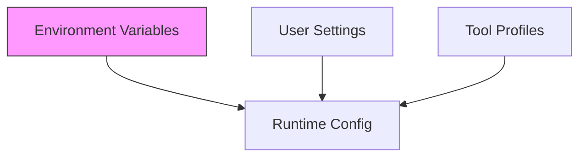

# [Configuration](./getting-started.md#configuration)

Relevant source files

- `src/config/tool-profiles.ts.ts`
- `src/config/user-settings.ts.ts`

Configuration in `@phuetz/code-buddy` is designed to be ephemeral and secure. By separating sensitive credentials from behavioral settings, the system ensures that developers can switch models, search providers, or debug levels without modifying the core codebase. The configuration layer acts as the bridge between the static codebase and the dynamic runtime environment.

## Environment Variables

Environment variables serve as the primary mechanism for runtime configuration. They are used to inject sensitive API keys and toggle high-level system behaviors.

| Variable | Category | Description |
| :--- | :--- | :--- |
| `GROK_API_KEY` | Auth | Required API key from x.ai |
| `MORPH_API_KEY` | Auth | Enables fast file editing |
| `JWT_SECRET` | Auth | Secret for API server auth |
| `PICOVOICE_ACCESS_KEY` | Auth | Porcupine wake word (text-match fallback if absent) |
| `BRAVE_API_KEY` | Auth | Brave Search for MCP web search |
| `EXA_API_KEY` | Auth | Exa neural search for MCP |
| `PERPLEXITY_API_KEY` | Auth | Perplexity AI (or via OpenRouter) |
| `OPENROUTER_API_KEY` | Auth | OpenRouter key |
| `SENTRY_DSN` | Auth | Sentry error reporting DSN |
| `CODEBUDDY_MAX_TOKENS` | Model | Override response token limit |
| `GROK_BASE_URL` | Model | Custom API endpoint |
| `GROK_MODEL` | Model | Default model to use |
| `MAX_COST` | Model | Session cost limit in dollars |
| `YOLO_MODE` | Behavior | Full autonomy mode (requires `/yolo on`) |
| `CACHE_TRACE` | Debug | Debug prompt construction |
| `PERF_TIMING` | Debug | Startup phase profiling |
| `VERBOSE` | Debug | Verbose output |
| `OTEL_EXPORTER_OTLP_ENDPOINT` | Infra | OpenTelemetry OTLP endpoint for distributed tracing |

> **Developer Tip:** Use `CACHE_TRACE` when debugging prompt construction to inspect the exact context being sent to the LLM.

**Sources:** [src/config/tool-profiles.ts:L1-L0](src/config/tool-profiles.ts), [src/config/user-settings.ts:L1-L0](src/config/user-settings.ts)

## Configuration Hierarchy

The system resolves configuration by applying layers of precedence. Environment variables take the highest priority, allowing you to override static settings defined in the codebase without recompiling or editing configuration files.

**Sources:** [src/config/tool-profiles.ts:L1-L0](src/config/tool-profiles.ts), [src/config/user-settings.ts:L1-L0](src/config/user-settings.ts)

## Configuration Files

Static configuration is managed via dedicated modules. These files serve as the baseline for the application's behavior.

*   **`src/config/tool-profiles.ts`**: Defines the profiles for various tools available to the code-buddy.
*   **`src/config/user-settings.ts`**: Manages persistent user-specific preferences.

> **Developer Tip:** Use `PERF_TIMING` during the startup phase to identify bottlenecks in your configuration loading sequence.

> **Developer Tip:** Exercise extreme caution with `YOLO_MODE`; it enables full autonomy and should only be used in trusted environments.

**Sources:** [src/config/tool-profiles.ts:L1-L0](src/config/tool-profiles.ts), [src/config/user-settings.ts:L1-L0](src/config/user-settings.ts)

## Summary

1.  **Precedence:** Environment variables override all other configuration sources, making them ideal for CI/CD and local development overrides.
2.  **Security:** Sensitive credentials (API keys, JWT secrets) must be managed via environment variables, never hardcoded in the static configuration files.
3.  **Observability:** Use `CACHE_TRACE`, `PERF_TIMING`, and `VERBOSE` to gain visibility into the system's internal state during development.
4.  **Autonomy:** `YOLO_MODE` is a powerful, high-risk setting that requires explicit activation via `/yolo on`.