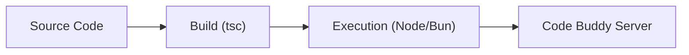

# [Getting Started](./overview.md#getting-started)

<details>
<summary>Relevant source files</summary>

- `src/server/index.ts.ts`
- `src/config/user-settings.ts.ts`

</details>

For configuration details, see [Configuration Guide].
For deployment procedures, see [Deployment].

To begin working with `@phuetz/code-buddy`, you must first align your local environment with the project's build pipeline. This project supports both Node.js and Bun runtimes, allowing you to choose the execution environment that best fits your development workflow.

## Prerequisites

Before initializing the project, ensure your system meets the following requirements:
*   **Runtime:** Node.js (v18+) or [Bun](https://bun.sh/) (recommended for faster build times).
*   **Package Manager:** `npm` (bundled with Node.js).
*   **Git:** Required for cloning the repository.

**Sources:** [src/server/index.ts.ts](<repo-url>/src/server/index.ts)

## Installation

The project relies on standard TypeScript compilation. After cloning the repository, install the necessary dependencies to populate the `node_modules` directory.

1. Clone the repository: `git clone <repo-url>`
2. Navigate to the project root.
3. Run the installation command:
   ```bash
   npm install
   ```

> **Developer Tip:** If you encounter issues with stale build artifacts during development, run `npm run clean` to remove the `dist` folder and `*.tsbuildinfo` files before rebuilding.

**Sources:** [src/server/index.ts.ts](<repo-url>/src/server/index.ts)

## First Run

The project provides multiple [entry points](./plugin-system.md#entry-points) depending on your preferred runtime. The build system is abstracted via `package.json` scripts to ensure consistency across environments.

### Using Bun (Recommended)
For the fastest development cycle, use the Bun runtime:
```bash
npm run dev
```

### Using Node.js
If you prefer the standard Node.js environment, use the `tsx` wrapper:
```bash
npm run dev:node
```



**Sources:** [src/server/index.ts.ts](<repo-url>/src/server/index.ts)

## Configuration

Customization is handled through the configuration module. You should modify the settings defined in the configuration source to tailor the behavior of the application to your specific environment.

> **Developer Tip:** Always run `npm run format:check` before committing changes to ensure your [configuration files](./configuration.md#configuration-files) adhere to the project's style guidelines.

**Sources:** [src/config/user-settings.ts.ts](<repo-url>/src/config/user-settings.ts)

## Summary

1.  **Environment Setup:** Use `npm install` to prepare your local environment.
2.  **Runtime Flexibility:** Choose `npm run dev` for Bun or `npm run dev:node` for Node.js based on your local setup.
3.  **Build Management:** Use `npm run build` to compile TypeScript, or `npm run build:watch` for continuous development.
4.  **Code Quality:** Maintain the codebase using `npm run lint` and `npm run format` before pushing changes.
5.  **Configuration:** Customize application behavior by editing `src/config/user-settings.ts`.