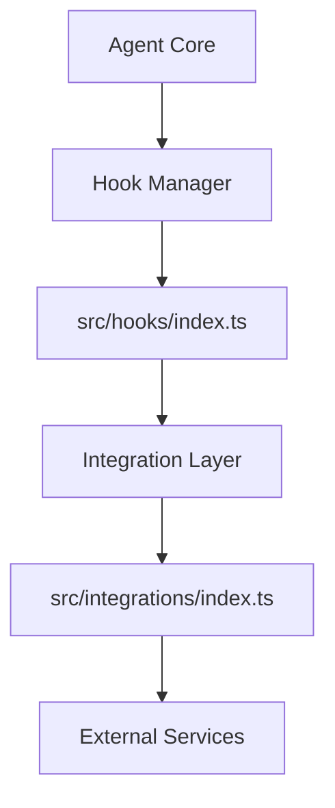

# Integration Hooks

Relevant source files

- `src/hooks/index.ts.ts`
- `src/integrations/index.ts.ts`

For core agent lifecycle, see [Agent Lifecycle]. For plugin [architecture](./tool-development.md#architecture), see [Plugin System].

The `Integration Hooks` system in `@phuetz/code-buddy` serves as the architectural backbone for extending the agent's capabilities without modifying the core codebase. By centralizing [entry points](./plugin-system.md#entry-points) within `src/hooks` and `src/integrations`, the system enforces a separation of concerns, ensuring that external services and custom logic remain decoupled from the primary execution loop.

These modules exist to provide a stable interface for future extensibility. By routing interactions through these specific directories, developers can maintain a clean dependency graph and ensure that integration logic is isolated from the agent's core decision-making processes.

## [Architecture Overview](./architecture.md)

The following diagram illustrates the intended relationship between the core agent and the integration hooks.

**Sources:** [src/hooks/index.ts:L1-L1](local/src/hooks/index.ts), [src/integrations/index.ts:L1-L1](local/src/integrations/index.ts)

## Implementation Status

Currently, `src/hooks/index.ts` and `src/integrations/index.ts` serve as structural entry points for the application. They are designed to act as the primary interface for registering new behaviors or external service connections.

| Category | Status | Description |
| :--- | :--- | :--- |
| Hook Registration | Placeholder | Reserved for future lifecycle event listeners. |
| Integration Setup | Placeholder | Reserved for external service initialization. |

**Sources:** [src/hooks/index.ts:L1-L1](local/src/hooks/index.ts), [src/integrations/index.ts:L1-L1](local/src/integrations/index.ts)

## Architectural Patterns

The system is designed to utilize the **Facade Pattern**. By exposing only the necessary hooks through `src/hooks/index.ts` and `src/integrations/index.ts`, the complexity of the underlying integration logic is hidden from the rest of the application. This allows the internal implementation of these hooks to change (e.g., switching from a local service to a remote API) without requiring changes to the consuming code.

> **Developer Tip:** When extending these modules, avoid importing [core agent logic](./agent-orchestration.md#core-agent-logic) directly into your integration files. This prevents circular dependencies and keeps the integration layer portable.

**Sources:** [src/hooks/index.ts:L1-L1](local/src/hooks/index.ts), [src/integrations/index.ts:L1-L1](local/src/integrations/index.ts)

## Summary

1.  **Centralized Entry Points:** `src/hooks` and `src/integrations` are the designated locations for all extension logic.
2.  **Decoupling:** The architecture uses these modules to separate core agent functionality from external service requirements.
3.  **Future-Proofing:** The current structural implementation allows for the addition of new hooks without refactoring the existing agent lifecycle.
4.  **Facade Pattern:** These modules act as a facade, shielding the core application from the complexities of external integrations.