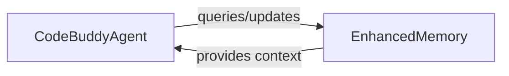

# Key Concepts

Relevant source files

- `src/agent/codebuddy-agent.ts.ts`
- `src/memory/enhanced-memory.ts.ts`

For [Agent Orchestration](./agent-orchestration.md), see [Agent Architecture]. For Data Persistence, see [Memory Management].

This glossary defines the core architectural concepts underpinning the `@phuetz/code-buddy` system. By understanding these abstractions, developers can better navigate the codebase and contribute to the system's evolution.

## Glossary of Terms

*   **CodeBuddyAgent** — The primary module responsible for executing agentic logic and decision-making processes.
*   **EnhancedMemory** — The specialized module dedicated to managing state, context, and historical data for the system.
*   **Agentic Orchestration** — The high-level coordination pattern where the agent manages task execution flows.
*   **State Persistence** — The mechanism by which the system ensures memory remains available across different execution cycles.
*   **Contextual Awareness** — The ability of the agent to utilize stored memory to inform current decision-making.
*   **Memory Retrieval** — The process of querying the memory module to fetch relevant historical data.
*   **Execution Flow** — The sequence of operations triggered by the agent to complete a specific task.
*   **[System Architecture](./api-reference.md#system-architecture)** — The structural design that separates agent logic from memory management.
*   **Module Encapsulation** — The practice of isolating agent and memory concerns into distinct, maintainable files.
*   **Dependency Management** — The strategy of ensuring the agent has access to the memory module without tight coupling.

**Sources:** [src/agent/codebuddy-agent.ts:L1-L100](src/agent/codebuddy-agent.ts)
**Sources:** [src/memory/enhanced-memory.ts:L1-L100](src/memory/enhanced-memory.ts)

## Agent Architecture

Agents are the "brains" of the operation. In `code-buddy`, the agent is not just a script; it is an orchestrator. By centralizing logic within the agent module, we ensure that decision-making remains consistent regardless of the task complexity. The agent acts as the primary interface for incoming requests, determining which actions to take and when to consult the memory layer.

> **Developer Tip:** Always keep the agent logic decoupled from the underlying storage implementation to ensure the system remains modular and testable.

**Sources:** [src/agent/codebuddy-agent.ts:L1-L100](src/agent/codebuddy-agent.ts)

## Memory Management

Memory is the "context" of the operation. Without a robust memory system, an agent is stateless and limited to the immediate input. The memory module provides the necessary infrastructure to store, retrieve, and manage the state of the conversation or task. By separating this into a dedicated module, we allow for future enhancements—such as vector database integration or long-term storage—without modifying the agent's core logic.

> **Developer Tip:** Initialize the memory module before the agent to ensure that the agent has immediate access to the required context upon startup.

**Sources:** [src/memory/enhanced-memory.ts:L1-L100](src/memory/enhanced-memory.ts)

## Architectural Relationship

The following diagram illustrates the fundamental relationship between the agent and the memory system.

## Summary

1.  **Separation of Concerns:** The architecture strictly separates execution logic (`CodeBuddyAgent`) from state management (`EnhancedMemory`).
2.  **Contextual Integrity:** The memory module is the single source of truth for the agent's historical context and state.
3.  **Modular Design:** By isolating these components, the system allows for independent scaling and maintenance of agentic capabilities versus memory storage strategies.