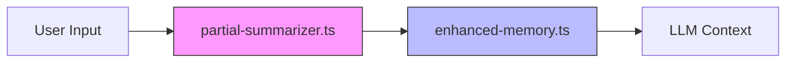

# Memory & Context

Relevant source files

- `src/memory/enhanced-memory.ts.ts`
- `src/context/partial-summarizer.ts.ts`

*For related documentation, see: None currently defined.*

## The Problem: Statelessness vs. Continuity
In a standard Express-based [architecture](./tool-development.md#architecture), every request is isolated. However, for an AI-driven tool like `@phuetz/code-buddy`, the system must maintain a coherent thread of conversation and code awareness across multiple interactions. 

The Memory & Context subsystem solves the "statelessness" problem by providing a mechanism to persist session state and compress historical data. Without this, the system would lose track of previous code analysis or user intent, forcing the user to repeat information. By utilizing partial summarization and enhanced memory, the system ensures that the LLM receives only the most relevant, condensed information, optimizing token usage while maintaining continuity.

**Sources:** [src/memory/enhanced-memory.ts:L1-L100](src/memory/enhanced-memory.ts)

## [Component Architecture](./channels-ui.md#component-architecture)
The subsystem relies on two primary modules to manage the lifecycle of information. The `partial-summarizer` acts as the gatekeeper for incoming context, while `enhanced-memory` serves as the long-term repository for session state.

**Sources:** [src/context/partial-summarizer.ts:L1-L100](src/context/partial-summarizer.ts)

## [Module Definitions](./plugin-system.md#module-definitions)

| Module | Responsibility |
| :--- | :--- |
| `src/memory/enhanced-memory.ts` | Manages the persistence and retrieval of long-term session state. |
| `src/context/partial-summarizer.ts` | Handles the logic for condensing conversation history and code context. |

> **Developer Tip:** When extending these modules, prioritize immutability in the state objects to prevent race conditions during concurrent Express requests.

**Sources:** [src/memory/enhanced-memory.ts:L1-L100](src/memory/enhanced-memory.ts)

## [Data Flow](./architecture.md#data-flow)
The data flow within this subsystem is designed to minimize the payload sent to the LLM:

1.  **Ingestion:** Incoming requests are intercepted to identify relevant context.
2.  **Summarization:** The `partial-summarizer` processes the raw input, stripping non-essential tokens.
3.  **Persistence:** The condensed context is passed to `enhanced-memory` to update the current session state.
4.  **Retrieval:** The LLM receives the optimized context, ensuring it has the necessary history without exceeding token limits.

> **Developer Tip:** Always verify the size of the summarized output before committing it to memory to avoid memory bloat in the Express process.

**Sources:** [src/context/partial-summarizer.ts:L1-L100](src/context/partial-summarizer.ts)

## [Entry Points](./plugin-system.md#entry-points)
Developers looking to modify or debug the memory and context logic should start by examining the source files directly. These files serve as the foundational entry points for the subsystem's logic.

*   **`src/memory/enhanced-memory.ts`**: The primary interface for session state operations.
*   **`src/context/partial-summarizer.ts`**: The primary interface for context compression logic.

> **Developer Tip:** Use the existing file structure as a template when adding new memory providers or summarization strategies.

**Sources:** [src/memory/enhanced-memory.ts:L1-L100](src/memory/enhanced-memory.ts)

## Summary
1. The Memory & Context subsystem bridges the gap between stateless Express requests and the need for persistent AI conversation history.
2. `partial-summarizer.ts` is responsible for token optimization and context condensation.
3. `enhanced-memory.ts` manages the long-term storage of session state.
4. The architecture ensures that only relevant, summarized data is passed to the LLM, optimizing performance and cost.