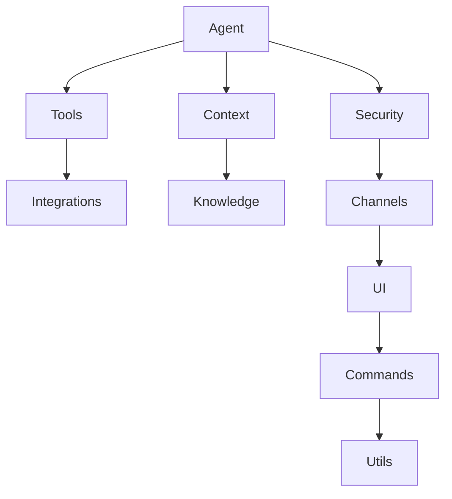

# Project Overview

Relevant source files

- `src/server/index.ts.ts`
- `package.json.ts`
- `README.md.ts`

For [architectural patterns](./integration-hooks.md#architectural-patterns), see [Architecture Overview].
For plugin development, see [Plugin Guide].

Modern software development often suffers from fragmented workflows where context switching between IDEs, terminals, and documentation kills productivity. `@phuetz/code-buddy` addresses this by providing a robust, plugin-based agentic framework designed to unify these disparate tasks into a single, intelligent coding assistant. It is built for developers who need to extend their coding environment with custom automation, intelligent agents, and seamless tool integration.

## The Problem and Solution
Developers frequently face the "context gap"—the space between writing code, searching documentation, and executing terminal commands. `@phuetz/code-buddy` solves this by offering a modular architecture that treats every capability as a pluggable component. By leveraging a centralized agentic core, the system orchestrates complex workflows, allowing developers to automate repetitive tasks without leaving their flow.

**Sources:** [README.md:L1-L20](README.md)

> **Developer Tip:** When extending the framework, prioritize the `Agent` layer for core logic to ensure your custom plugins benefit from the existing orchestration patterns.

## Key Capabilities
The framework is built on a modular foundation, enabling five core capabilities:
1. **Agentic Orchestration:** Centralized control via the `agent` layer (127 modules) to manage complex task execution.
2. **Extensible Tooling:** A rich `tools` layer (117 modules) that allows for dynamic capability injection.
3. **Context Awareness:** Deep integration with the `context` layer (45 modules) to maintain state across sessions.
4. **Secure Execution:** Built-in `security` layer (40 modules) to handle authentication and sensitive operations.
5. **Multi-Channel Support:** Flexible `channels` layer (47 modules) for interacting with various UI and integration endpoints.

**Sources:** [README.md:L21-L50](README.md)

## High-Level Architecture
The system follows a [layered architecture](./architecture.md#layered-architecture), utilizing Singleton patterns for critical services like `codeact-mode` and `auth-monitoring`. This ensures that state is consistent across the 1,083 modules that power the framework.

**Sources:** [src/server/index.ts:L1-L30](src/server/index.ts)

> **Developer Tip:** Use the Singleton patterns found in `src/automation/auth-monitoring` when implementing new security-sensitive plugins to avoid state collisions.

## Tech Stack
The project is built on a TypeScript-first foundation, leveraging Express for the server-side infrastructure. This choice provides a type-safe environment for the 14,352 functions that comprise the system, ensuring reliability as the plugin ecosystem grows.

**Sources:** [package.json:L1-L15](package.json)

> **Developer Tip:** Always verify your `package.json` dependencies before adding new integrations to ensure compatibility with the existing Express server [configuration](./getting-started.md#configuration).

## Getting Started
To begin building with `@phuetz/code-buddy`, follow these three steps:

1. **Initialize:** Clone the repository and run `npm install` to resolve the dependencies defined in `package.json`.
2. **Configure:** Review the `src/server/index.ts` file to understand the server entry point and initialization sequence.
3. **Extend:** Create your first plugin by hooking into the `agent` or `tools` layers, utilizing the existing utility modules.

**Sources:** [README.md:L51-L65](README.md)

## Summary
1. `@phuetz/code-buddy` is a plugin-based agentic framework designed to reduce developer context switching.
2. The architecture is highly modular, consisting of 10 distinct layers including Agent, Tools, and Security.
3. It leverages TypeScript and Express to provide a scalable, type-safe environment for building intelligent coding assistants.
4. Core functionality is managed through Singleton patterns, ensuring consistent state across complex agentic workflows.