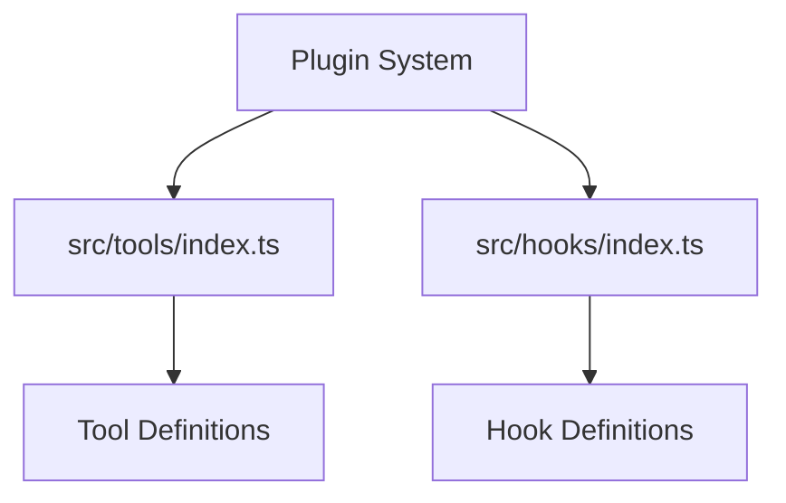

# Plugin System

Relevant source files

- `src/tools/index.ts.ts`
- `src/hooks/index.ts.ts`

For Core [Architecture](./tool-development.md#architecture), see [Core Architecture]. For System [Configuration](./getting-started.md#configuration), see [System Configuration].

The Plugin System in `@phuetz/code-buddy` is designed to decouple core logic from extensible features. By separating functionality into tools and hooks, the system allows developers to extend the application's capabilities without modifying the core codebase. This architecture relies on designated entry points that serve as the interface for all external extensions.

## [Architecture Overview](./architecture.md)

The plugin architecture is built upon two primary pillars: `tools` and `hooks`. These directories act as the central registry for the system. By centralizing these entry points, the application maintains a clean separation between the execution engine and the feature set.

**Sources:** [src/tools/index.ts:L1-L1](src/tools/index.ts) | [src/hooks/index.ts:L1-L1](src/hooks/index.ts)

> **Developer Tip:** Treat `src/tools/index.ts` and `src/hooks/index.ts` as the "manifest" files for your extensions. Avoid placing business logic directly in these files; use them only to export your modules.

## Module Definitions

The following modules serve as the foundation for the plugin system.

| Module | Description |
| :--- | :--- |
| `src/tools/index.ts` | The primary entry point for defining and registering tools within the system. |
| `src/hooks/index.ts` | The primary entry point for defining and registering lifecycle hooks. |

**Sources:** [src/tools/index.ts:L1-L1](src/tools/index.ts) | [src/hooks/index.ts:L1-L1](src/hooks/index.ts)

> **Developer Tip:** If you are adding a new feature, determine if it is a "Tool" (an action the user performs) or a "Hook" (a reaction to a system event) before choosing which index file to update.

## [Data Flow](./architecture.md#data-flow)

The data flow within the plugin system is unidirectional. The application initializes by referencing the entry points in `src/tools/index.ts` and `src/hooks/index.ts`. These files aggregate the necessary extensions, which are then loaded into the runtime environment. Because these files are the designated entry points, the system can discover and initialize plugins dynamically during the startup sequence.

**Sources:** [src/tools/index.ts:L1-L1](src/tools/index.ts) | [src/hooks/index.ts:L1-L1](src/hooks/index.ts)

> **Developer Tip:** Ensure that all new plugin files are exported through their respective `index.ts` files to ensure they are picked up by the system loader.

## Entry Points

Developers looking to extend the system should focus on the following files:

1.  **`src/tools/index.ts`**: Use this file to expose new tools to the system.
2.  **`src/hooks/index.ts`**: Use this file to expose new lifecycle hooks to the system.

**Sources:** [src/tools/index.ts:L1-L1](src/tools/index.ts) | [src/hooks/index.ts:L1-L1](src/hooks/index.ts)

## Summary

1.  The Plugin System uses a decoupled architecture based on `tools` and `hooks`.
2.  `src/tools/index.ts` and `src/hooks/index.ts` serve as the mandatory entry points for all extensions.
3.  Centralizing extensions in these files allows for clean discovery and initialization.
4.  Developers should maintain a strict separation of concerns by categorizing features as either tools or hooks.