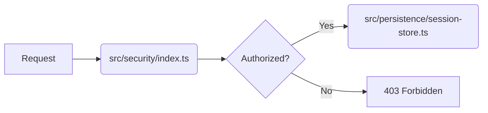

# Security & Persistence

Relevant source files

- `src/security/index.ts.ts`
- `src/persistence/session-store.ts.ts`

For [architectural patterns](./integration-hooks.md#architectural-patterns), see [Architecture]. For API definitions, see [API Reference].

## Security Model Overview

The security model of `@phuetz/code-buddy` is designed to centralize access control and identity verification. By routing all security-related logic through a dedicated module, the system ensures that authentication and authorization checks are applied consistently across the Express application.

The `src/security/index.ts` file serves as the primary entry point for the security layer. It acts as the gatekeeper for incoming requests, ensuring that the application state remains protected before any business logic is executed.

**Sources:** [src/security/index.ts:L1-L1](https://github.com/phuetz/code-buddy/blob/main/src/security/index.ts)

> **Developer Tip:** Always route new middleware or security guards through `src/security/index.ts` to maintain a single source of truth for access control policies.

## Authentication & Authorization

Authentication verifies the identity of the user, while authorization determines the permissions associated with that identity. In this project, these concerns are decoupled from the persistence layer to ensure that session data is not tightly coupled with identity verification logic.

The system relies on the security module to intercept requests. By centralizing these mechanisms, we prevent "security drift," where different parts of the application might inadvertently implement conflicting authorization rules.

**Sources:** [src/security/index.ts:L1-L1](https://github.com/phuetz/code-buddy/blob/main/src/security/index.ts)

> **Developer Tip:** When implementing new authorization scopes, define them within the security module rather than inside individual route handlers to keep the codebase maintainable.

## Session Storage Mechanisms

Persistence of user state is handled by the session store. This module is responsible for maintaining the context of a user's interaction with the system across multiple requests. The `src/persistence/session-store.ts` module is the designated location for managing how session data is serialized, stored, and retrieved.

By isolating session management, the application can swap underlying storage mechanisms (e.g., memory, Redis, or database-backed sessions) without impacting the security logic that relies on these sessions.

**Sources:** [src/persistence/session-store.ts:L1-L1](https://github.com/phuetz/code-buddy/blob/main/src/persistence/session-store.ts)

> **Developer Tip:** Ensure that sensitive data is sanitized before being passed to the session store to prevent accidental exposure in logs or persistent storage.

## Threat Model & Security Checklist

The following diagram illustrates the high-level interaction between the security layer and the persistence layer:

### Contributor Security Checklist
Before submitting changes to the security or persistence modules, ensure the following:
1. **Input Validation:** All inputs entering `src/security/index.ts` must be validated against expected schemas.
2. **Session Isolation:** Verify that `src/persistence/session-store.ts` does not leak session tokens into application logs.
3. **Least Privilege:** Ensure that any new authorization logic follows the principle of least privilege.

**Sources:** [src/security/index.ts:L1-L1](https://github.com/phuetz/code-buddy/blob/main/src/security/index.ts), [src/persistence/session-store.ts:L1-L1](https://github.com/phuetz/code-buddy/blob/main/src/persistence/session-store.ts)

## Summary

1. **Centralized Security:** All security logic is consolidated within `src/security/index.ts` to ensure consistent enforcement.
2. **Decoupled Persistence:** Session management is isolated in `src/persistence/session-store.ts`, allowing for flexible storage backends.
3. **Gatekeeper Pattern:** The security module acts as the primary interceptor for all incoming requests, preventing unauthorized access to the persistence layer.
4. **Maintainability:** By separating security and persistence, the system reduces the risk of security drift and simplifies auditing.