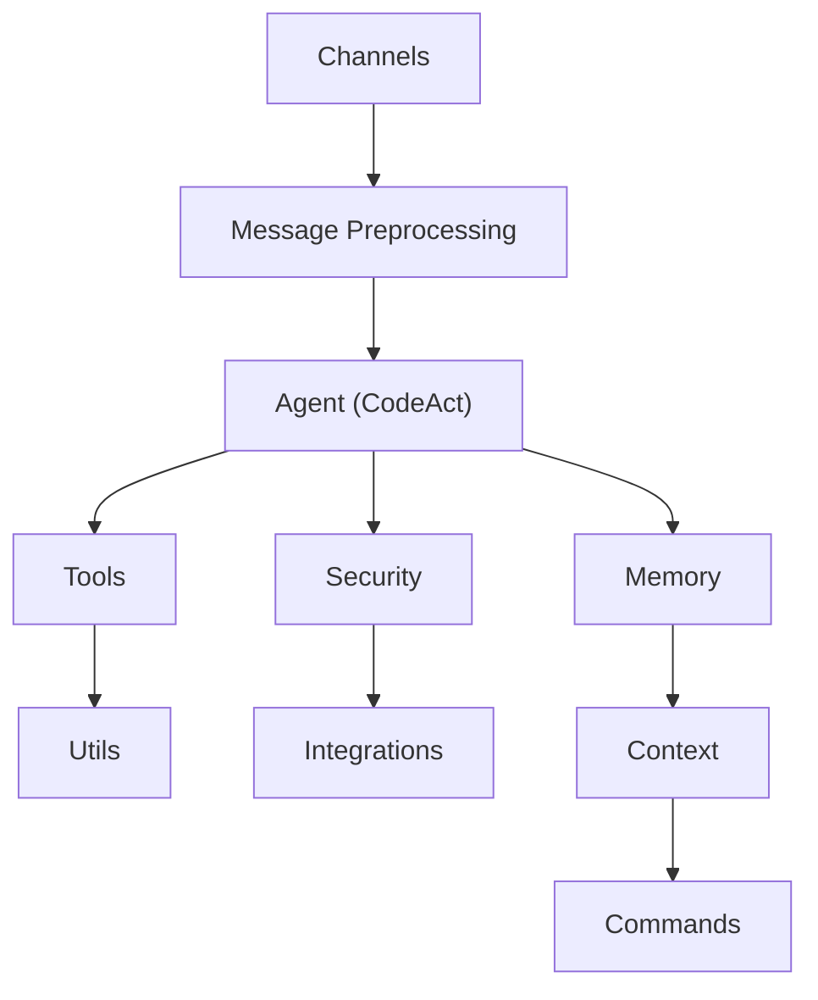

# Core Subsystems

Relevant source files

- `src/memory/enhanced-memory.ts.ts`
- `src/channels/index.ts.ts`

For Agent logic, see [Agent Layer].
For communication protocols, see [Channels].
For state persistence, see [Memory Management].

The `@phuetz/code-buddy` architecture is built on a plugin-based foundation. This design choice allows the system to scale across 10 distinct functional layers, ensuring that concerns like security, knowledge, and agent logic remain decoupled. By isolating these responsibilities, the system maintains high modularity, allowing developers to extend functionality without modifying the core execution loop.

## Architectural Layers

The system organizes its 10,000+ functions into a hierarchical layer structure. This separation of concerns ensures that the `Agent` layer acts as the orchestrator, while specialized layers handle specific domains like `Security` or `Integrations`.

**Sources:** [src/agent/modes/codeact-mode:L1-L100](src/agent/modes/codeact-mode)

> **Developer Tip:** When extending the system, always verify which layer your new module belongs to. Avoid cross-layer dependencies that violate the hierarchy (e.g., `Utils` should never import from `Agent`).

## Memory and Channel Subsystems

The core of the system relies on two primary subsystems: `Memory` and `Channels`. 

`src/channels/index.ts` serves as the gateway for all incoming and outgoing communication. It utilizes a message-preprocessing singleton to ensure that data is sanitized and formatted before reaching the agent. 

`src/memory/enhanced-memory.ts` provides the persistence layer. While the system is plugin-based, the memory subsystem ensures that context is maintained across sessions, allowing the agent to retain state even when specific plugins are swapped or reloaded.

**Sources:** [src/memory/enhanced-memory.ts:L1-L100](src/memory/enhanced-memory.ts), [src/channels/index.ts:L1-L100](src/channels/index.ts)

## System Flow

When a user initiates an action, the request enters through the `Channels` layer. The system flow follows this path:

1.  **Ingress:** The request is intercepted by `src/channels/index.ts`.
2.  **Preprocessing:** The `message-preprocessing` singleton cleans and validates the input.
3.  **Orchestration:** The `Agent` (specifically `codeact-mode`) determines the necessary tools.
4.  **Persistence:** The `enhanced-memory` module updates the current context.
5.  **Execution:** The system triggers the appropriate `Tools` or `Commands`.

> **Developer Tip:** Use the `Singleton` pattern for stateful services like `auth-monitoring` or `polls` to prevent race conditions during concurrent channel operations.

## [Data Flow](./architecture.md#data-flow) and Design Decisions

The architecture prioritizes a "Plugin-First" approach. By treating every major component as a plugin, the system achieves high availability and testability. 

*   **Trade-off:** The plugin-based architecture introduces a slight overhead in module resolution but significantly improves maintainability for a codebase of this size (1083 modules).
*   **Singleton Usage:** Critical services, such as `send-policy` and `auth-monitoring`, are implemented as Singletons. This ensures that global policies are enforced consistently across all channels without redundant initialization.

**Sources:** [src/channels/send-policy:L1-L100](src/channels/send-policy), [src/automation/auth-monitoring:L1-L100](src/automation/auth-monitoring)

> **Developer Tip:** If you need to share state between plugins, do not use global variables. Instead, leverage the `Context` layer to pass data through the defined pipeline.

## Summary

1.  **Plugin-Based Architecture:** The system is organized into 10 distinct layers, ranging from `Agent` (127 modules) to `Integrations` (22 modules), promoting modularity.
2.  **Core Subsystems:** `Memory` and `Channels` are the foundational pillars, responsible for state persistence and communication ingress/egress respectively.
3.  **Singleton Pattern:** Critical services like `auth-monitoring`, `polls`, and `send-policy` are implemented as Singletons to ensure consistent policy enforcement.
4.  **Orchestration:** The `Agent` layer, specifically `codeact-mode`, acts as the central hub for processing user requests and coordinating between tools and memory.