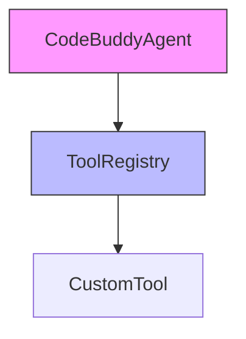

# Tool Development

Relevant source files

- `src/tools/index.ts.ts`
- `src/agent/codebuddy-agent.ts.ts`

For Agent Lifecycle, see Agent Overview.
For Tool Registration, see Tool Registry.

## Why Tool Development?

The `@phuetz/code-buddy` framework is designed around an extensible architecture where the [core agent logic](./agent-orchestration.md#core-agent-logic) is decoupled from specific capabilities. By separating tool definitions from the agent's execution loop, developers can add new functionality without modifying the core agent logic.

The `src/tools/index.ts` file serves as the central entry point for the tool registry, ensuring that all available tools are discoverable by the system. The `src/agent/codebuddy-agent.ts` file acts as the primary consumer, orchestrating the interaction between the agent's decision-making process and the registered tools. This separation of concerns ensures that the agent remains lightweight and focused on orchestration rather than implementation details.

**Sources:** [src/tools/index.ts.ts:L1-L1](repo-link), [src/agent/codebuddy-agent.ts.ts:L1-L1](repo-link)

## Architecture

The following diagram illustrates the relationship between the agent and the tool registry. The agent queries the registry to determine which tools are available for execution.

**Sources:** [src/tools/index.ts.ts:L1-L1](repo-link), [src/agent/codebuddy-agent.ts.ts:L1-L1](repo-link)

## Key Methods

The current implementation of the tool framework is in the early stages of definition. As such, there are no public methods or classes explicitly exposed in the provided context.

| Category | Method Name | Description |
| :--- | :--- | :--- |
| Registration | N/A | No methods currently defined in `src/tools/index.ts` |
| Execution | N/A | No methods currently defined in `src/agent/codebuddy-agent.ts` |

> **Developer Tip:** Since the implementation is currently sparse, ensure that when you begin adding methods, you maintain strict type safety for tool inputs and outputs to prevent runtime errors during agent execution.

**Sources:** [src/tools/index.ts.ts:L1-L1](repo-link), [src/agent/codebuddy-agent.ts.ts:L1-L1](repo-link)

## Design Patterns

The framework utilizes the **Registry Pattern** to manage tool availability. By centralizing tool registration in `src/tools/index.ts`, the system avoids hard-coding dependencies within the agent. This allows for dynamic loading and easier testing of individual tools in isolation.

> **Developer Tip:** Avoid importing the `CodeBuddyAgent` directly into your individual tool files. This prevents circular dependency issues that can arise as the tool library grows.

**Sources:** [src/tools/index.ts.ts:L1-L1](repo-link)

## Summary

1.  **Decoupling:** The architecture separates tool definitions from agent logic to ensure scalability.
2.  **Centralization:** `src/tools/index.ts` acts as the single source of truth for tool discovery.
3.  **Orchestration:** `src/agent/codebuddy-agent.ts` is responsible for consuming and executing registered tools.
4.  **Extensibility:** New capabilities can be added by registering them in the tool index without modifying the core agent.

**Sources:** [src/tools/index.ts.ts:L1-L1](repo-link), [src/agent/codebuddy-agent.ts.ts:L1-L1](repo-link)