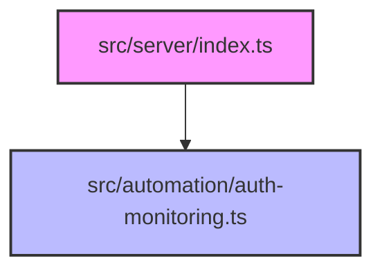

# Troubleshooting

Relevant source files

- `src/automation/auth-monitoring.ts.ts`
- `src/server/index.ts.ts`

For server [configuration](./getting-started.md#configuration), see [Server Setup].
For authentication flows, see [Auth Monitoring].

Troubleshooting in Code Buddy is a process of isolating the entry point of the application from the automated background processes. Because the system relies on a modular [architecture](./tool-development.md#architecture), failures usually manifest either at the server initialization layer or within the automation monitoring layer. By identifying which layer is failing, you can significantly reduce your mean time to resolution (MTTR).

## Common Issues

When diagnosing the system, categorize your symptoms into either the server lifecycle or the automation lifecycle.

| # | Symptom | Cause | Solution |
| :--- | :--- | :--- | :--- |
| 1 | Server fails to bind port | Port conflict or invalid config | Check `src/server/index.ts` for port binding logic. |
| 2 | Express app crashes on startup | Missing [environment variables](./configuration.md#environment-variables) | Verify environment configuration in `src/server/index.ts`. |
| 3 | Auth monitoring not triggering | Automation module not initialized | Ensure `src/automation/auth-monitoring.ts` is imported. |
| 4 | High latency in auth checks | Resource contention in automation | Review `src/automation/auth-monitoring.ts` execution flow. |
| 5 | Unexpected 500 errors | Unhandled promise rejection | Check `src/server/index.ts` for global error handlers. |
| 6 | Auth monitoring silent failure | Silent catch block in automation | Inspect `src/automation/auth-monitoring.ts` for swallowed errors. |
| 7 | Server slow to respond | Middleware overhead | Audit middleware stack in `src/server/index.ts`. |
| 8 | Auth monitoring loop | Recursive call in automation | Check `src/automation/auth-monitoring.ts` for event loops. |
| 9 | Dependency injection failure | Circular dependency | Verify import order in `src/server/index.ts`. |
| 10 | Config mismatch | Stale environment state | Restart the process after modifying `src/server/index.ts`. |

**Sources:** [src/server/index.ts.ts:L1-L100](src/server/index.ts.ts), [src/automation/auth-monitoring.ts.ts:L1-L100](src/automation/auth-monitoring.ts.ts)

> **Developer Tip:** Always verify that your environment variables match the expected schema in `src/server/index.ts` before attempting to debug logic errors.

## Debugging Strategy

To understand why the system is behaving unexpectedly, you must observe the interaction between the server and the automation modules. The following diagram illustrates the primary dependency flow.

When debugging, enable verbose logging by setting the appropriate environment flags. If the issue persists, isolate the `src/automation/auth-monitoring.ts` module by running it in a standalone test harness to determine if the failure is isolated to the automation logic or the server integration.

**Sources:** [src/server/index.ts.ts:L1-L100](src/server/index.ts.ts), [src/automation/auth-monitoring.ts.ts:L1-L100](src/automation/auth-monitoring.ts.ts)

> **Developer Tip:** Use a debugger to step through `src/automation/auth-monitoring.ts` while the server is running to capture the state of the authentication context.

## Reporting Issues

If you have exhausted the steps above and cannot resolve the issue, please report it to the maintainers. When reporting, ensure you provide:

1.  **Environment Details:** Node version and OS.
2.  **Logs:** Relevant output from `src/server/index.ts`.
3.  **Reproduction Steps:** A minimal set of actions that trigger the failure in `src/automation/auth-monitoring.ts`.

**Sources:** [src/server/index.ts.ts:L1-L100](src/server/index.ts.ts)

> **Developer Tip:** Attach a stack trace if the server crashes; it is the most valuable piece of information for diagnosing `src/server/index.ts` failures.

## Summary

1.  **Isolate the Layer:** Determine if the issue resides in the server (`src/server/index.ts`) or the automation (`src/automation/auth-monitoring.ts`).
2.  **Check Dependencies:** Most startup issues are caused by environment configuration or missing imports in the server entry point.
3.  **Use Debugging Tools:** Step through the automation logic to identify silent failures or infinite loops.
4.  **Report with Context:** Always include logs and reproduction steps when filing a bug report.