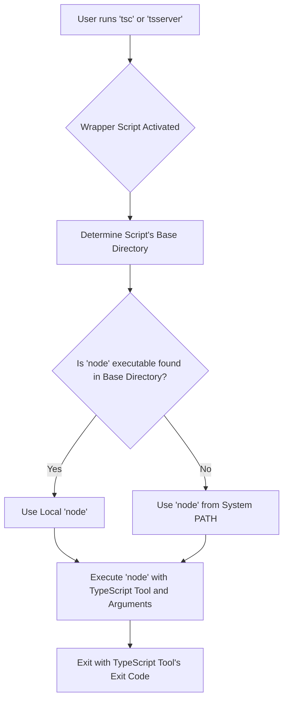

# ${APPDATA}

This document describes the **TypeScript CLI Wrapper Module**, which consists of a set of cross-platform shell scripts designed to launch the TypeScript compiler (`tsc`) and TypeScript language server (`tsserver`). These scripts act as entry points, abstracting away the details of locating and invoking the `node` executable required to run the actual TypeScript binaries.

## Purpose

The primary purpose of this module is to provide robust and platform-agnostic command-line interfaces for `tsc` and `tsserver`. When a user types `tsc` or `tsserver` in their terminal, these wrapper scripts are executed first. Their job is to:

1.  **Locate the `node` runtime**: Determine the correct `node` executable to use, prioritizing a `node` installation bundled alongside the scripts (e.g., in `npm/node`) or falling back to a `node` found in the system's `PATH`.
2.  **Invoke the TypeScript tool**: Execute the located `node` runtime, passing it the path to the actual TypeScript binary (e.g., `node_modules/typescript/bin/tsc.js`) and any arguments provided by the user.
3.  **Handle platform specifics**: Account for differences in shell environments (Bash, CMD, PowerShell), path formats, and executable naming conventions across Windows, macOS, and Linux.

This design ensures that TypeScript tools can be reliably executed regardless of how `node` was installed or where it resides on the user's system, as long as a compatible `node` is available.

## Architecture Overview

The module consists of six distinct scripts, two for each target tool (`tsc`, `tsserver`) and three for each major platform/shell environment:

*   **Unix-like systems (Bash/Zsh/etc.)**: `.sh` scripts
*   **Windows Command Prompt**: `.cmd` batch scripts
*   **Windows PowerShell (and cross-platform PowerShell)**: `.ps1` scripts

Each set of scripts (`tsc.*` and `tsserver.*`) implements the same core logic:

1.  **Determine `basedir`**: Identify the directory where the wrapper script itself resides. This is crucial for locating a potentially bundled `node` executable and the `typescript` package.
2.  **Find `node`**:
    *   First, check for a `node` executable directly within the `basedir` (e.g., `${APPDATA}/npm/node` or `${APPDATA}/npm/node.exe`). This is common for `npm` global installations where `node` might be symlinked or copied alongside the package executables.
    *   If a local `node` is not found, fall back to searching for `node` in the system's `PATH` environment variable.
3.  **Execute TypeScript binary**: Once `node` is identified, execute it with the full path to the TypeScript tool's main JavaScript file (e.g., `node_modules/typescript/bin/tsc` or `node_modules/typescript/bin/tsserver`) and forward all command-line arguments.

The following diagram illustrates this general execution flow:



## Key Components and Implementation Details

### 1. Unix-like Shell Scripts (`tsc`, `tsserver`)

These scripts (`${APPDATA}/npm/tsc` and `${APPDATA}/npm/tsserver`) are designed for environments like Linux, macOS, and WSL.

*   **`basedir` determination**:
    ```bash
    basedir=$(dirname "$(echo "$0" | sed -e 's,\\,/,g')")
    ```
    This line robustly determines the script's directory, handling potential backslashes in the path that `dirname` might produce on some systems (e.g., when run under Cygwin/MinGW).
*   **Cygwin/MinGW/MSYS path conversion**:
    ```bash
    case `uname` in
        *CYGWIN*|*MINGW*|*MSYS*)
            if command -v cygpath > /dev/null 2>&1; then
                basedir=`cygpath -w "$basedir"`
            fi
        ;;
    esac
    ```
    On Windows-like Unix environments, `cygpath -w` is used to convert the `basedir` to a Windows-style path, which might be necessary if the `node` executable expects it or if subsequent paths are Windows-native.
*   **`node` lookup and execution**:
    ```bash
    if [ -x "$basedir/node" ]; then
      exec "$basedir/node"  "$basedir/node_modules/typescript/bin/tsc" "$@"
    else 
      exec node  "$basedir/node_modules/typescript/bin/tsc" "$@"
    fi
    ```
    The script checks if an executable named `node` exists and is executable directly within the `basedir`. If so, it uses that. Otherwise, it relies on `node` being available in the system's `PATH`. The `exec` command is used to replace the current shell process with the `node` process, which is an efficient way to hand off control. `"$@"` ensures all original arguments are passed correctly.

### 2. Windows Batch Scripts (`tsc.cmd`, `tsserver.cmd`)

These scripts (`${APPDATA}/npm/tsc.cmd` and `${APPDATA}/npm/tsserver.cmd`) are for the traditional Windows Command Prompt.

*   **`dp0` determination**:
    ```batch
    :find_dp0
    SET dp0=%~dp0
    EXIT /b
    ```
    The `%~dp0` variable provides the drive letter and path of the batch script itself. This is the Windows equivalent of `basedir`.
*   **`node` lookup and execution**:
    ```batch
    IF EXIST "%dp0%\node.exe" (
      SET "_prog=%dp0%\node.exe"
    ) ELSE (
      SET "_prog=node"
      SET PATHEXT=%PATHEXT:;.JS;=;%
    )
    ...
    "%_prog%"  "%dp0%\node_modules\typescript/bin/tsc" %*
    ```
    It checks for `node.exe` in the script's directory. If found, `_prog` is set to its full path. Otherwise, `_prog` is set to `node`, relying on `PATH` lookup. A crucial step is `SET PATHEXT=%PATHEXT:;.JS;=;%`, which temporarily removes `.JS` from `PATHEXT`. This prevents `cmd.exe` from trying to execute a `.js` file directly if `node` is found via `PATH` and happens to be a `.js` script itself (which is rare but possible). `%*` passes all arguments.

### 3. PowerShell Scripts (`tsc.ps1`, `tsserver.ps1`)

These scripts (`${APPDATA}/npm/tsc.ps1` and `${APPDATA}/npm/tsserver.ps1`) are for PowerShell environments, including PowerShell Core (pwsh) and Windows PowerShell.

*   **`basedir` determination**:
    ```powershell
    $basedir=Split-Path $MyInvocation.MyCommand.Definition -Parent
    ```
    `$MyInvocation.MyCommand.Definition` provides the full path to the script, and `Split-Path -Parent` extracts its directory.
*   **Executable suffix handling**:
    ```powershell
    $exe=""
    if ($PSVersionTable.PSVersion -lt "6.0" -or $IsWindows) {
      $exe=".exe"
    }
    ```
    This logic adds the `.exe` suffix to `node` if running on Windows or an older PowerShell version (pre-6.0). This ensures that the correct `node.exe` binary is targeted, especially when both Windows and Linux builds of Node might be present in the same directory (e.g., in WSL scenarios).
*   **`node` lookup and execution with pipeline support**:
    ```powershell
    if (Test-Path "$basedir/node$exe") {
      if ($MyInvocation.ExpectingInput) {
        $input | & "$basedir/node$exe"  "$basedir/node_modules/typescript/bin/tsc" $args
      } else {
        & "$basedir/node$exe"  "$basedir/node_modules/typescript/bin/tsc" $args
      }
      $ret=$LASTEXITCODE
    } else {
      # ... similar logic for 'node$exe' from PATH ...
    }
    exit $ret
    ```
    PowerShell's `Test-Path` is used to check for the local `node` executable. The `&` operator is used to execute external commands. A key feature here is the explicit handling of pipeline input (`$input | & ...`). If the script is receiving input from a pipeline, that input is piped directly to the `node` process. `$args` passes all command-line arguments. The `$LASTEXITCODE` variable captures the exit code of the executed `node` process, which is then used to exit the PowerShell script itself.

## Integration and Dependencies

This module has a direct dependency on:

*   **Node.js runtime**: A `node` executable must be available either alongside the wrapper scripts or in the system's `PATH`.
*   **`typescript` npm package**: The actual `tsc` and `tsserver` binaries are JavaScript files located within the `node_modules/typescript/bin` directory relative to the wrapper scripts' `basedir`.

These scripts are typically installed by `npm` (or `yarn`, `pnpm`) when the `typescript` package is installed globally, placing them in a directory like `${APPDATA}/npm` on Windows or `/usr/local/bin` on Unix-like systems, which is usually part of the user's `PATH`.

## Contribution and Maintenance

When contributing to or maintaining these scripts, consider the following:

*   **Cross-platform compatibility**: Any changes must be carefully tested across Windows (CMD, PowerShell), macOS, and Linux to ensure consistent behavior.
*   **Path handling**: Be mindful of path separators (`/` vs `\`) and how different shells interpret them. The existing `sed` and `cygpath` calls in the `.sh` scripts, and `%~dp0` in `.cmd`, and `Split-Path` in `.ps1` are there for a reason.
*   **`node` discovery logic**: The priority of finding a local `node` before falling back to `PATH` is a core design principle. Any modifications to this logic should be thoroughly justified and tested.
*   **Argument passing**: Ensure that all user-provided arguments (`"$@"`, `%*`, `$args`) are correctly forwarded to the underlying TypeScript binaries.
*   **Exit codes**: The wrapper scripts should always propagate the exit code of the executed `node` process to reflect the success or failure of the TypeScript tool itself.
*   **Pipeline input (PowerShell)**: If modifying the PowerShell scripts, ensure that pipeline input handling remains correct, as it's a common pattern for tools like `tsc` (e.g., `cat file.ts | tsc`).