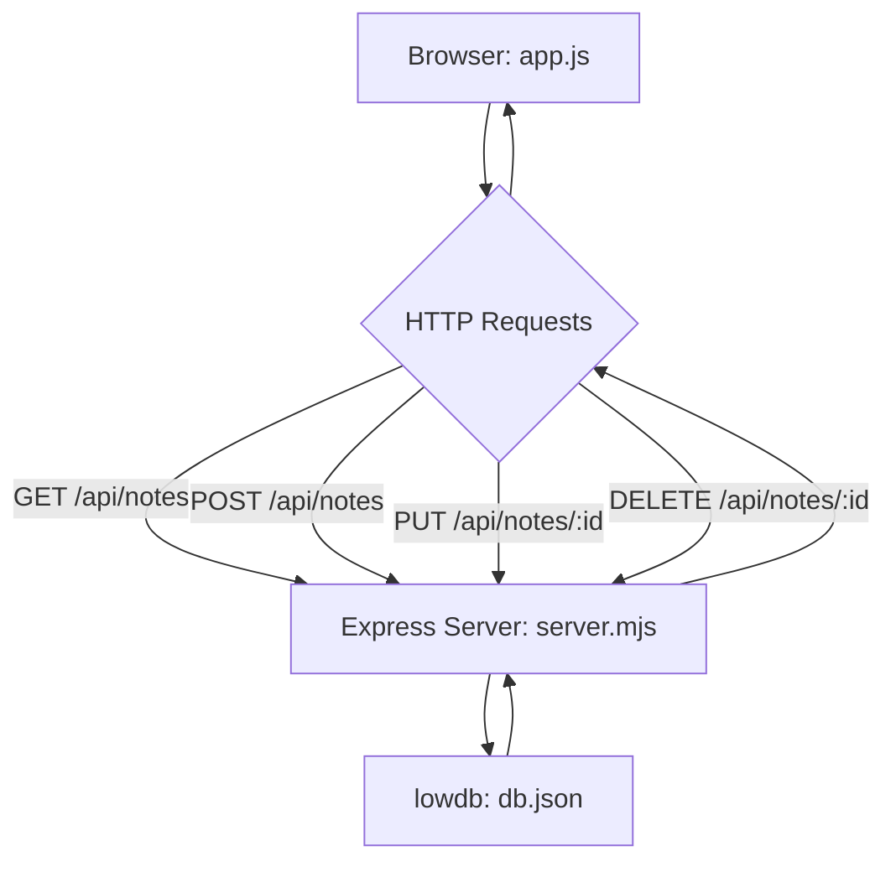
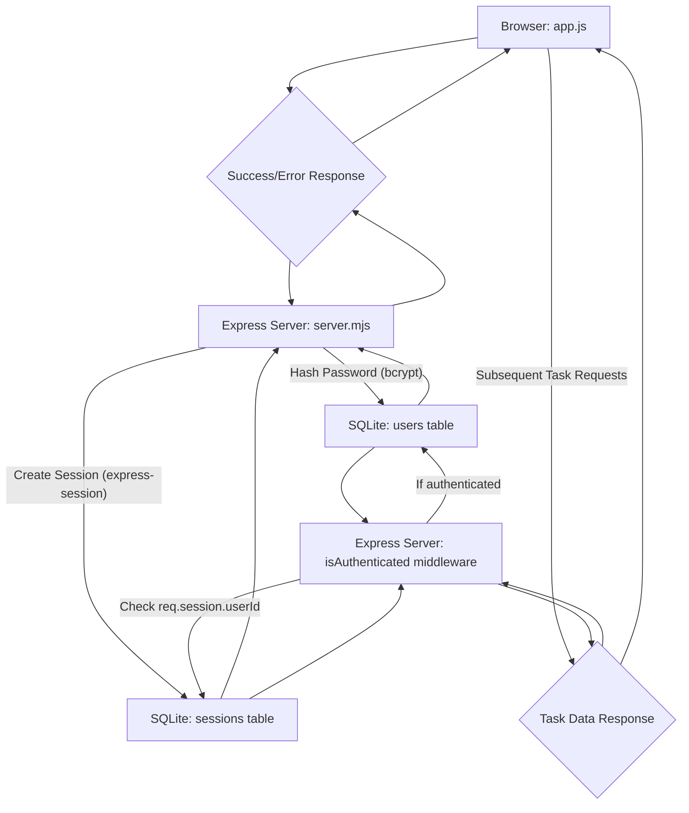

# apps — codebuddy-real-campaign

The `apps/codebuddy-real-campaign` directory serves as a collection of distinct, self-contained Node.js application projects, each representing a "level" or challenge solution within a coding campaign. These projects demonstrate various full-stack development patterns, from simple CLI tools to authenticated web applications and AI integrations.

This document provides an overview and detailed breakdown of each project within this campaign, focusing on their purpose, architecture, key components, and how they function.

## Campaign Overview

The `apps/codebuddy-real-campaign` module contains the following levels:

*   **Level 1: CLI Task Tracker** - A command-line interface for managing tasks.
*   **Level 2: Notes Board Web Application (v2)** - A full-stack web application for creating and managing notes.
*   **Level 3: AI Support Desk (v2)** - An AI-powered chat application integrated with the Google Gemini API.
*   **Level 4: Authenticated Task Manager (SQLite)** - A full-stack task manager with user authentication and session management.

Note that for Levels 2 and 3, `v2` versions of the projects are provided. The `campaign-report.json` indicates that the initial (non-v2) submissions for these levels had validation issues, and the `v2` directories contain the corrected or improved implementations. This documentation will focus on the `v2` implementations where available.

## 1. Level 1: CLI Task Tracker

This project implements a basic command-line interface (CLI) for managing a list of tasks.

### Purpose

To provide a simple, dependency-free Node.js CLI application that allows users to add, list, mark as complete, and remove tasks, with local JSON persistence.

### Architecture & Key Components

The application is a single-file Node.js script (`index.js`) that parses command-line arguments and performs operations on a local `tasks.json` file.

*   **`index.js`**: The main entry point for the CLI. It contains all the logic for task management and command parsing.
*   **`tasks.json`**: A JSON file used for storing task data. This acts as the application's database.
*   **`package.json`**: Defines the project metadata and includes a `test` script.
*   **`test.js`**: Unit tests for the core task management functions using Node.js's native `assert` module.
*   **`smoke-test.mjs`**: An end-to-end smoke test script that simulates CLI interactions and verifies outputs.

### Core Functionality

The `index.js` script exposes the following functions:

*   `loadTasks()`: Reads and parses `tasks.json`. If the file doesn't exist, it returns an empty array.
*   `saveTasks(tasks)`: Writes the current array of tasks to `tasks.json`.
*   `addTask(description)`: Creates a new task with a unique ID, description, and `completed: false`, then saves the tasks.
*   `listTasks()`: Prints all tasks to the console, indicating their completion status.
*   `completeTask(id)`: Marks a task as completed based on its ID.
*   `removeTask(id)`: Deletes a task based on its ID.

The CLI commands are handled via a `switch` statement on `process.argv[2]`: `add`, `list`, `complete`, `remove`.

#### CLI Command Flow

```mermaid
graph TD
    A[Start: node index.js <command> <args>] --> B{Parse process.argv[2]};
    B -- "add" --> C[addTask(args.join(' '))];
    B -- "list" --> D[listTasks()];
    B -- "complete" --> E[completeTask(parseInt(args[0]))];
    B -- "remove" --> F[removeTask(parseInt(args[0]))];
    C --> G[saveTasks()];
    E --> G;
    F --> G;
    G --> H[End];
    D --> H;
```

### Data Persistence

Tasks are stored in a `tasks.json` file in the same directory as `index.js`. The `fs` module is used for reading (`fs.readFileSync`) and writing (`fs.writeFileSync`) this file.

### Testing

*   **Unit Tests (`test.js`)**: Uses Node.js's built-in `assert` module to test individual functions like `addTask`, `listTasks`, `completeTask`, and `removeTask`. It mocks `console.log` to capture output for assertions.
*   **Smoke Tests (`smoke-test.mjs`)**: Uses `child_process.execSync` to run the `index.js` script with various arguments and asserts the console output. It also cleans up the `tasks.json` file before and after tests.
*   **Running Tests**: `npm test` executes `node test.js`. The `smoke-test.mjs` is run separately.

### Usage

To run the CLI, navigate to `apps/codebuddy-real-campaign/level-1-cli/task-tracker` and use `node index.js <command> [arguments]`.

Examples:

*   `node index.js add "Buy groceries"`
*   `node index.js list`
*   `node index.js complete 1`
*   `node index.js remove 1`

## 2. Level 2: Notes Board Web Application (v2)

This project implements a full-stack web application for managing notes, featuring an Express.js backend and a vanilla JavaScript frontend.

### Purpose

To build a web application that allows users to create, read, update, and delete notes, with local JSON file persistence.

### Architecture & Key Components

The application follows a classic client-server architecture.

*   **`server.mjs`**: The Express.js backend. It serves static frontend files and provides a RESTful API for notes.
*   **`public/`**: Contains the frontend assets:
    *   `index.html`: The main HTML structure for the notes board.
    *   `app.js`: Vanilla JavaScript for client-side logic, interacting with the backend API.
    *   `style.css`: Styling for the web application.
*   **`db.json`**: A JSON file used by `lowdb` for storing notes data.
*   **`package.json`**: Defines dependencies (`express`, `lowdb`, `nanoid`) and scripts (`start`, `dev`, `test`).
*   **`smoke-test.mjs`**: An end-to-end smoke test script that starts the server and performs API calls to verify functionality.

### Backend API (`server.mjs`)

The Express server uses `lowdb` for simple JSON file-based persistence. It defines the following API endpoints:

*   `GET /api/notes`: Retrieves all notes.
*   `GET /api/notes/:id`: Retrieves a single note by ID.
*   `POST /api/notes`: Adds a new note. Expects `{ content: "Note content" }` in the request body.
*   `PUT /api/notes/:id`: Updates an existing note. Expects `{ content: "Updated content" }` in the request body.
*   `DELETE /api/notes/:id`: Deletes a note by ID.

The `nanoid` library is used to generate unique IDs for new notes.

### Frontend (`public/app.js`)

The `app.js` script handles all client-side interactions:

*   `fetchNotes()`: Fetches all notes from `/api/notes` and renders them in the `notes-container`.
*   **Add Note**: Listens for `submit` events on `note-form`, sends a `POST` request to `/api/notes`.
*   **Edit Note**: Listens for `click` events on `.edit-btn`, prompts the user for new content, and sends a `PUT` request to `/api/notes/:id`.
*   **Delete Note**: Listens for `click` events on `.delete-btn`, sends a `DELETE` request to `/api/notes/:id`.

### Data Persistence

Notes are stored in `db.json` using `lowdb`. The `db.read()` and `db.write()` methods manage the file operations.

#### Client-Server Interaction



### Testing

*   **Smoke Tests (`smoke-test.mjs`)**: This script starts the `server.mjs` as a child process, waits for it to become ready, and then performs a series of `http` requests to test all CRUD operations on the API. It uses `assert` for verification.
*   **Running Tests**: `npm test` executes `node smoke-test.mjs`.

### Usage

1.  Navigate to `apps/codebuddy-real-campaign/level-2-webapp-v2`.
2.  Install dependencies: `npm install`.
3.  Start the server: `npm start` (or `npm run dev` for development with nodemon).
4.  Open your browser to `http://localhost:3001`.

## 3. Level 3: AI Support Desk (v2)

This project implements an AI-powered chat application that leverages the Google Gemini API for conversational responses.

### Purpose

To build a full-stack web application that provides a multi-turn conversational AI support desk, demonstrating integration with an external AI service.

### Architecture & Key Components

The application consists of an Express.js backend handling AI interactions and a vanilla JavaScript frontend for the chat interface.

*   **`server.mjs`**: The Express.js backend. It exposes API endpoints for health checks and chat interactions, integrating with the Google Gemini API.
*   **`public/`**: Contains the frontend assets:
    *   `index.html`: The main HTML structure for the chat interface.
    *   `app.js`: Vanilla JavaScript for client-side chat logic, managing history, and communicating with the backend.
    *   `style.css`: Styling for the chat application.
*   **`package.json`**: Defines dependencies (`express`, `@google/generative-ai`, `dotenv`) and scripts (`start`, `smoke-test`).
*   **`.env` (implied)**: Used to store the `GOOGLE_API_KEY` or `GEMINI_API_KEY` environment variable.
*   **`smoke-test.mjs`**: An end-to-end smoke test script that starts the server and tests the `/health` and `/api/chat` endpoints.

### Backend API (`server.mjs`)

The Express server handles API requests and integrates with the Google Gemini API:

*   **`/health` (GET)**: A simple health check endpoint that returns `200 OK`.
*   **`/api/chat` (POST)**:
    *   Accepts a `message` (string) and an optional `history` (array of chat turns) in the request body.
    *   Performs input validation: `message` is required, non-empty, and has a maximum length of 1000 characters.
    *   Initializes a chat session with `model.startChat({ history })`.
    *   Sends the user's `message` to the Gemini API using `chat.sendMessage()`.
    *   Extracts the AI's response text and returns it to the frontend.
    *   Includes robust error handling for API communication failures, returning a 500 status with a user-friendly fallback message.

The `GoogleGenerativeAI` client is initialized with the API key from environment variables (`GOOGLE_API_KEY` or `GEMINI_API_KEY`).

### Frontend (`public/app.js`)

The `app.js` script manages the chat interface:

*   `history` array: Stores the conversation history (user and AI messages) to maintain context for multi-turn conversations.
*   `appendMessage(sender, message)`: Adds a new message to the chat history display.
*   **Send Message**: Listens for `click` on `send-button` or `Enter` keypress on `user-input`.
    *   Appends the user's message to the display.
    *   Sends a `POST` request to `/api/chat` with the current `message` and `history`.
    *   On successful response, appends the AI's message to the display and updates the `history` array.
    *   Handles and displays errors from the backend or network issues.

#### Client-Server-AI API Flow

```mermaid
graph TD
    A[Browser: app.js] --> B{POST /api/chat (message, history)};
    B --> C[Express Server: server.mjs];
    C --> D{GoogleGenerativeAI: model.startChat()};
    D --> E[Gemini API];
    E --> D;
    D --> C;
    C --> B{JSON Response (response)};
    B --> A;
```

### AI Integration

The backend uses the `@google/generative-ai` library to interact with the Gemini API. The `model.startChat()` method is crucial for maintaining conversational context by passing the `history` array.

### Error Handling & Validation

*   **Backend**: Validates message presence and length. Catches errors from the Gemini API and returns a generic 500 error message to the client to prevent exposing internal details.
*   **Frontend**: Displays error messages received from the backend or network connection issues.

### Testing

*   **Smoke Tests (`smoke-test.mjs`)**: This script starts the `server.mjs` on a random port as a child process, waits for it to start, and then makes `fetch` requests to the `/health` and `/api/chat` endpoints. It asserts the HTTP status codes and the presence of a response from the chat API.
*   **Running Tests**: `npm run smoke-test` executes `node smoke-test.mjs`.

### Usage

1.  Navigate to `apps/codebuddy-real-campaign/level-3-ai-chat-v2`.
2.  Install dependencies: `npm install`.
3.  Set your Google Gemini API key as an environment variable (`GOOGLE_API_KEY` or `GEMINI_API_KEY`).
4.  Start the server: `npm start`.
5.  Open your browser to `http://localhost:3337` (or the port specified in `server.mjs`).

## 4. Level 4: Authenticated Task Manager (SQLite)

This project implements a full-stack task manager application with user authentication, session management, and task CRUD operations, using SQLite for data persistence.

### Purpose

To build a secure task management application where users can register, log in, and manage their personal tasks, with all operations protected by authentication.

### Architecture & Key Components

This application features an Express.js backend with authentication middleware and a vanilla JavaScript frontend.

*   **`server.mjs`**: The Express.js backend. It handles user authentication (registration, login, logout), session management, and task CRUD operations.
*   **`public/`**: Contains the frontend assets:
    *   `index.html`: The main HTML structure for the application, including login/registration forms and the task list.
    *   `app.js`: Vanilla JavaScript for client-side logic, handling user authentication and task interactions.
*   **`database.db`**: The SQLite database file where user and task data are stored.
*   **`package.json`**: Defines dependencies (`express`, `better-sqlite3`, `bcrypt`, `express-session`, `connect-session-sqlite`) and scripts (`start`, `smoke-test`).
*   **`smoke-test.mjs`**: An end-to-end smoke test script that covers user registration, login, task management, and logout.

### Backend API (`server.mjs`)

The Express server uses `better-sqlite3` for database interactions, `bcrypt` for password hashing, and `express-session` with `connect-session-sqlite` for session management.

#### Authentication Endpoints:

*   `POST /api/register`: Registers a new user. Expects `username` and `password`. Has input validation.
*   `POST /api/login`: Logs in an existing user. Expects `username` and `password`.
*   `POST /api/logout`: Logs out the current user.
*   `GET /api/session`: Checks if a user is currently authenticated and returns user info.

#### Task Management Endpoints (protected by `isAuthenticated` middleware):

*   `GET /api/tasks`: Retrieves all tasks for the authenticated user.
*   `POST /api/tasks`: Adds a new task for the authenticated user. Expects `title`.
*   `PUT /api/tasks/:id`: Updates an existing task for the authenticated user. Expects `title` and `completed`.
*   `DELETE /api/tasks/:id`: Deletes a task for the authenticated user.

#### Key Backend Logic:

*   **Database Initialization**: Creates `users`, `tasks`, and `sessions` tables if they don't exist.
*   **Password Hashing**: `bcrypt.hash()` is used during registration, and `bcrypt.compare()` during login.
*   **Session Management**: `express-session` creates and manages sessions, storing them in the SQLite `sessions` table. `req.session.userId` is used to track the logged-in user.
*   **`isAuthenticated` Middleware**: A custom middleware function that checks `req.session.userId`. If not present, it returns a 401 Unauthorized error.

### Frontend (`public/app.js`)

The `app.js` script handles client-side authentication and task management:

*   **Authentication**:
    *   `checkSession()`: Verifies if a user is logged in on page load.
    *   `registerUser()`, `loginUser()`, `logoutUser()`: Functions to interact with the respective backend authentication endpoints.
    *   Dynamically shows/hides login/registration forms and the task manager based on authentication status.
*   **Task Management**:
    *   `fetchTasks()`: Retrieves tasks for the logged-in user and renders them.
    *   `addTask()`, `updateTask()`, `deleteTask()`: Functions to interact with the backend task API.
    *   `addTaskToDOM()`: Helper to render a single task.

#### Authentication Flow (Simplified)



### Data Persistence

User accounts, tasks, and session data are all stored in a single SQLite database file, `database.db`. The `better-sqlite3` library provides synchronous and efficient access to the database.

### Testing

*   **Smoke Tests (`smoke-test.mjs`)**: This comprehensive script starts the `server.mjs` as a child process, then performs a full E2E test suite:
    1.  Registers a new user.
    2.  Logs in the user.
    3.  Adds multiple tasks.
    4.  Lists tasks to verify addition.
    5.  Updates a task.
    6.  Deletes a task.
    7.  Logs out the user.
    8.  Attempts task operations while logged out (expected to fail).
    It cleans up the database files (`database.db.json` and `database.db.json.tmp`) before and after execution.
*   **Running Tests**: `npm run smoke-test` executes `node smoke-test.mjs`.

### Usage

1.  Navigate to `apps/codebuddy-real-campaign/level-4-auth-sqlite`.
2.  Install dependencies: `npm install`.
3.  Start the server: `npm start`.
4.  Open your browser to `http://localhost:3000`.

## Campaign Report Summary (`campaign-report.json`)

The `campaign-report.json` file provides a snapshot of the validation results for each level at a specific point in time. It indicates whether the automated validation for each level passed (`validationOk: true`) or failed (`validationOk: false`), along with the detailed output of the validation command.

As observed in the provided report:

*   **`level-1-cli`**: Failed due to an `AssertionError` related to incorrect console output (a trailing space difference).
*   **`level-2-webapp`**: Failed because the `smoke-test.mjs` script could not be found, indicating an incomplete or incorrectly structured project. This is why `level-2-webapp-v2` exists.
*   **`level-3-ai-chat`**: Failed with a "Could not connect to server" error during its smoke test, suggesting issues with server startup or connectivity. This is why `level-3-ai-chat-v2` exists.

This report highlights the iterative nature of development and testing, where initial attempts might fail and require subsequent corrections (as seen with the `v2` versions).

## Contribution & Maintenance

Each "level" within `apps/codebuddy-real-campaign` is designed to be a standalone project. When contributing or maintaining:

*   **Focus on the specific level**: Changes to one level should generally not impact others.
*   **Adhere to existing patterns**: Maintain the established architecture, testing methodologies, and coding styles within each project.
*   **Run tests**: Always execute the provided `npm test` or `npm run smoke-test` scripts for the relevant level to ensure changes haven't introduced regressions.
*   **Review `prompt.txt`**: For each level, the `prompt.txt` file outlines the original requirements and constraints, which can be helpful for understanding the design decisions.