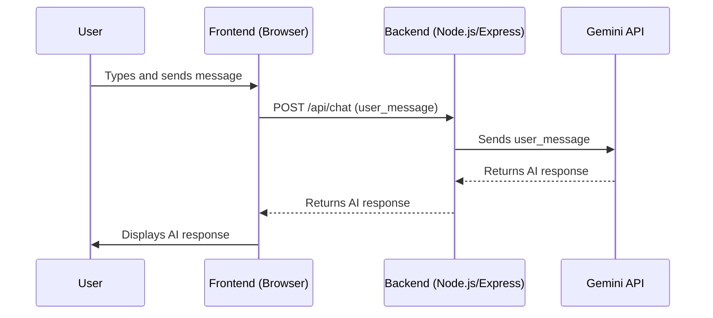

# apps — gemini-chatbox-codebuddy

This document provides a comprehensive overview of the `apps/gemini-chatbox-codebuddy` module, a self-contained AI chatbox application.

## Module Overview

The `gemini-chatbox-codebuddy` module represents a mini AI chatbox application, generated by an AI agent based on a specific prompt. Its primary purpose is to demonstrate a basic full-stack setup for interacting with the Google Gemini API, providing a simple web interface for users to chat with an AI.

This module serves as a functional example of:
*   A Node.js/Express backend for API handling.
*   A simple HTML/CSS/JS frontend for user interaction.
*   Real-time integration with the Google Gemini API.
*   Basic error handling and health checks.

Due to the nature of its generation, the source files for `server.js` and `script.js` are not provided in this context. Therefore, the documentation describes the *intended* functionality and API usage based on the `prompt.txt` and the declared dependencies.

## Architecture

The application follows a classic client-server architecture:

1.  **Frontend**: A simple web interface built with HTML, CSS, and vanilla JavaScript, running in the user's browser.
2.  **Backend**: A Node.js server using the Express framework, responsible for handling API requests and communicating with the Gemini API.
3.  **AI Service**: The Google Gemini API, which provides the conversational AI capabilities.



## Key Components

The module is structured into `backend` and `frontend` directories, along with a `prompt.txt` that defines its creation.

### `prompt.txt`

This file contains the original instruction given to the AI agent to generate this module. It specifies the requirements for the chatbox application, including:
*   A Node.js + Express backend with `/api/chat` (POST) and `/health` (GET) endpoints.
*   A simple HTML/CSS/JS frontend.
*   Real connection to the Gemini API using `GOOGLE_API_KEY` or `GEMINI_API_KEY`.
*   Clear error handling.
*   A `README` with launch instructions.

This prompt is the blueprint for the entire module's functionality.

### `chatbox-ai/backend/`

This directory contains the server-side logic for the chatbox.

*   **`package.json`**:
    Defines the backend's dependencies:
    *   `@google/generative-ai`: The official Google Generative AI SDK for interacting with the Gemini API.
    *   `express`: A fast, unopinionated, minimalist web framework for Node.js.
    *   `dotenv`: A module to load environment variables from a `.env` file.

    The `start` script is defined as `node server.js`, indicating `server.js` is the main entry point.

*   **`server.js` (Expected Implementation)**:
    This file is expected to contain the core backend logic:
    *   **Initialization**: Sets up an Express application and loads environment variables (e.g., `GEMINI_API_KEY`) using `dotenv`.
    *   **Gemini API Client**: Initializes the `@google/generative-ai` client with the API key.
    *   **`POST /api/chat` Endpoint**:
        *   Receives user messages from the frontend.
        *   Sends the message to the Gemini API using the initialized client.
        *   Processes the AI's response.
        *   Sends the AI's response back to the frontend.
        *   Includes robust error handling for API calls and server-side issues.
    *   **`GET /health` Endpoint**:
        *   A simple endpoint to check if the server is running and responsive. Typically returns a 200 OK status or a simple JSON message.
    *   **Static File Serving**: Likely configured to serve the frontend static files (HTML, CSS, JS) from the `frontend` directory.
    *   **Server Start**: Listens for incoming requests on a specified port.

### `chatbox-ai/frontend/`

This directory contains the client-side code for the chatbox user interface.

*   **`index.html` (Expected Implementation)**:
    The main HTML file that structures the chatbox interface. It is expected to include:
    *   A text input field for user messages.
    *   A display area for chat messages (both user and AI).
    *   A "Send" button.
    *   Links to `style.css` and `script.js`.

*   **`script.js` (Expected Implementation)**:
    This JavaScript file handles the interactive logic of the frontend:
    *   **DOM Manipulation**: Selects elements like the input field, send button, and chat display area.
    *   **Event Listeners**: Attaches an event listener to the "Send" button (or Enter key press) to capture user input.
    *   **API Calls**: Uses the `fetch` API to send user messages to the backend's `POST /api/chat` endpoint.
    *   **Response Handling**: Receives the AI's response from the backend and dynamically updates the chat display area.
    *   **UI Feedback**: May include loading indicators or error messages for a better user experience.

*   **`style.css` (Expected Implementation)**:
    Provides the styling for the `index.html` file, ensuring a clean and functional chat interface.

### `chatbox-ai/README.md` (Expected Implementation)

As requested by the prompt, this file is expected to contain instructions for setting up and launching the application, including:
*   Prerequisites (Node.js, npm).
*   Steps to install backend dependencies (`npm install` in `backend/`).
*   Instructions for setting up the `GEMINI_API_KEY` (e.g., via a `.env` file).
*   Commands to start the backend server (`npm start` or `node server.js`).
*   Instructions to open `index.html` in a browser.

## Setup and Usage

To run this chatbox application, you would typically follow these steps (as expected to be detailed in `chatbox-ai/README.md`):

1.  **Obtain a Gemini API Key**: Get your `GEMINI_API_KEY` from the Google AI Studio or Google Cloud Console.
2.  **Backend Setup**:
    *   Navigate to the `apps/gemini-chatbox-codebuddy/chatbox-ai/backend/` directory.
    *   Install dependencies: `npm install`
    *   Create a `.env` file in the `backend/` directory and add your API key:
        ```
        GEMINI_API_KEY=YOUR_GEMINI_API_KEY
        ```
    *   Start the backend server: `npm start` (or `node server.js`)
3.  **Frontend Access**:
    *   Open the `apps/gemini-chatbox-codebuddy/chatbox-ai/frontend/index.html` file in your web browser.

The chatbox should now be functional, allowing you to send messages and receive responses from the Gemini AI.

## Contribution Guidelines

Developers looking to contribute to or extend this module should consider:

*   **Backend Enhancements**:
    *   Adding more sophisticated error logging and monitoring.
    *   Implementing user authentication or session management if multiple users are intended.
    *   Integrating different Gemini models or parameters (e.g., temperature, top_k).
    *   Adding rate limiting to the API endpoints.
*   **Frontend Improvements**:
    *   Improving the UI/UX with more advanced styling or frameworks.
    *   Adding features like chat history, markdown rendering for AI responses, or typing indicators.
    *   Implementing client-side validation for user input.
*   **Prompt Engineering**: Experimenting with the system prompt given to the Gemini API to refine the AI's persona and response style.
*   **Testing**: Implementing unit and integration tests for both frontend and backend components.