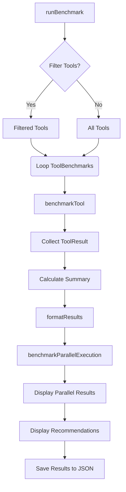

# benchmarks

The `benchmarks` module provides a suite of performance measurement tools for the Code Buddy project. Its primary purpose is to identify and track performance regressions in key areas: the CLI's startup time and the execution speed of various internal "tools" or common operations. By regularly running these benchmarks, developers can ensure that performance remains optimal and quickly pinpoint bottlenecks introduced by new features or changes.

This module is designed to be run independently, typically as part of a CI/CD pipeline or during local development when optimizing performance.

The module is composed of two main benchmark scripts:
1.  `startup.bench.ts`: Focuses on the overall startup time of the Code Buddy CLI.
2.  `tools.bench.ts`: Measures the execution time of individual, common operations (tools) that Code Buddy might perform.

---

## 1. Startup Benchmark (`startup.bench.ts`)

This benchmark measures how quickly the Code Buddy CLI initializes and becomes responsive. It simulates a user invoking the CLI for basic information, capturing the end-to-end time.

### 1.1 Purpose

The `startup.bench.ts` script aims to:
*   Quantify the time taken for the Code Buddy CLI to start up.
*   Identify potential delays caused by module imports or initial setup.
*   Provide a performance rating to quickly assess startup health.

### 1.2 How to Run

Execute the benchmark directly using `tsx`:

```bash
npx tsx benchmarks/startup.bench.ts
```

### 1.3 Configuration

The behavior of the benchmark can be adjusted using environment variables:

*   `WARMUP_RUNS`: Number of initial runs to "warm up" the system (e.g., populate OS caches). Defaults to `2`.
*   `BENCHMARK_RUNS`: Number of actual benchmark runs to collect data from. Defaults to `5`.
*   `VERBOSE`: If set to `true`, provides detailed output for each individual run. Defaults to `false`.

### 1.4 Key Metrics Measured

The benchmark reports several metrics, primarily focusing on the `totalTime` taken for the CLI to execute `codebuddy --help`.

*   **Total Startup Time (`--help`):**
    *   Minimum, Maximum, Average, 50th Percentile (p50), 95th Percentile (p95), and Standard Deviation.
    *   A performance rating (Excellent, Good, Fair, Slow, Critical) based on the p50 value.
*   **Version Check Time (`--version`):** Measures the time until the first output is received when running `codebuddy --version`. This can indicate the absolute minimum time to "do anything".
*   **Module Import Times:** Measures the time taken to import specific common Node.js modules (`commander`, `openai`, `react`, `ink`). This helps identify if a particular dependency is contributing significantly to startup overhead.

### 1.5 Core Logic and Execution Flow

The `runBenchmark` function orchestrates the entire process:

1.  **CLI Build Check:** Verifies that the compiled CLI (`dist/index.js`) exists. If not, it prompts the user to run `npm run build`.
2.  **Warmup Phase:** Executes `WARMUP_RUNS` of the `measureStartup` function. These results are discarded.
3.  **Benchmark Phase:** Executes `BENCHMARK_RUNS` of the `measureStartup` function, collecting `StartupResult` objects.
4.  **Summary Calculation:** The collected `StartupResult`s are passed to `calculateSummary`, which computes statistical aggregates (min, max, avg, percentiles, std dev) using `percentile` and `standardDeviation`.
5.  **Summary Formatting:** `formatSummary` takes the `BenchmarkSummary` and generates a human-readable report, including a performance rating from `getPerformanceRating`.
6.  **Additional Metrics:**
    *   `measureVersionCheck` is called to get the `--version` startup time.
    *   `measureModuleImports` is called to measure individual module import times.
7.  **Output and Exit:** All results are printed to the console. The script exits with a non-zero code if any benchmark runs failed or if the overall performance is critically slow (p50 >= 2000ms).

#### `measureStartup` Function
This asynchronous function is central to the startup benchmark. It spawns a new `node` process to execute `CLI_PATH` with the `--help` argument. It captures `stdout` and `stderr` and measures the total time from `spawn` to `close`. A fake `GROK_API_KEY` is injected into the environment to prevent interactive prompts that would skew results. A timeout of 30 seconds is implemented to prevent hung processes.

#### `measureVersionCheck` Function
Similar to `measureStartup`, this function spawns the CLI with `--version`. However, it specifically measures the time until the *first byte* of output is received, then immediately kills the process. This provides a lower bound on "time to first interaction".

#### `measureModuleImports` Function
This function dynamically imports a predefined list of modules and measures the time each import takes. This helps pinpoint heavy dependencies.

#### Startup Benchmark Flow

```mermaid
graph TD
    A[runBenchmark] --> B{CLI Built?};
    B -- No --> C[Exit Error];
    B -- Yes --> D[Warmup Runs];
    D --> E[measureStartup];
    E --> F[Benchmark Runs];
    F --> G[measureStartup];
    G --> H[Collect StartupResult[]];
    H --> I[calculateSummary];
    I --> J[formatSummary];
    J --> K[measureVersionCheck];
    K --> L[measureModuleImports];
    L --> M[Display Additional Metrics];
    M --> N[Exit Status];
```

### 1.6 Output Interpretation

The output provides a clear summary of startup times, including statistical measures. The "Performance" rating offers a quick health check. If the rating is "Slow" or "Critical", or if individual module import times are high, it indicates areas for optimization (e.g., lazy loading modules, reducing initial bundle size).

---

## 2. Tools Benchmark (`tools.bench.ts`)

This benchmark focuses on the performance of specific, common operations (referred to as "tools") that Code Buddy might execute. These tools often involve file system operations, Git commands, token counting, or other utility functions.

### 2.1 Purpose

The `tools.bench.ts` script aims to:
*   Measure the execution time of individual, frequently used operations.
*   Identify slow tools that could impact the overall performance of an AI agent.
*   Categorize tools based on their average execution speed.
*   Assess the potential for caching and parallelization for each tool.
*   Evaluate the actual speedup achieved by parallel execution.

### 2.2 How to Run

Execute the benchmark directly using `tsx`:

```bash
npx tsx benchmarks/tools.bench.ts
```

### 2.3 Configuration

The benchmark's behavior can be customized with environment variables:

*   `BENCHMARK_RUNS`: Number of times each tool's `execute` function will be run. Defaults to `10`.
*   `VERBOSE`: If set to `true`, provides detailed output for each individual run of a tool. Defaults to `false`.
*   `TOOLS`: A comma-separated list of tool names to benchmark. If omitted, all defined tools will be benchmarked. Example: `TOOLS=git_status,token_count`.

### 2.4 Tool Definitions (`TOOL_BENCHMARKS`)

The core of this benchmark is the `TOOL_BENCHMARKS` array, which defines each operation to be tested. Each entry is a `ToolBenchmark` object with the following properties:

*   `name`: A unique identifier for the tool (e.g., `'view_file'`, `'git_status'`).
*   `execute`: An `async` function containing the actual code to be benchmarked. This function should perform the operation once.
*   `cacheable`: A boolean indicating if the output of this tool could theoretically be cached (e.g., `readFile` is cacheable, `writeFile` is not).
*   `parallelizable`: A boolean indicating if this tool can safely be run concurrently with other operations.
*   `setup` (optional): An `async` function executed once before all runs of a specific tool. Useful for creating test files or setting up an environment.
*   `teardown` (optional): An `async` function executed once after all runs of a specific tool. Useful for cleaning up resources created by `setup`.

**Examples of defined tools:**
*   `view_file`: Reads a file from disk.
*   `create_file`: Writes a new file to disk.
*   `git_status`: Executes `git status --porcelain`.
*   `token_count`: Counts tokens in a large string using `../src/utils/token-counter.js`.
*   `json_parse`: Parses a large JSON string.
*   `bash_simple`, `bash_with_output`: Executes simple shell commands.
*   `string_replace`: Reads, modifies, and writes a file, simulating an editor operation.

### 2.5 Key Metrics Measured

For each tool, the benchmark reports:

*   **Execution Times:** Average, Minimum, Maximum, 50th Percentile (p50), and 95th Percentile (p95) in milliseconds.
*   **Flags:** `cacheable` and `parallelizable` status.
*   **Overall Summary:**
    *   Categorization of tools into `[FAST]` (<100ms), `[MEDIUM]` (100-500ms), and `[SLOW]` (>500ms).
    *   Counts of cacheable and parallelizable tools.
*   **Parallel Execution Test:** Compares the total time to run a subset of parallelizable tools sequentially versus concurrently, reporting the speedup factor.

### 2.6 Core Logic and Execution Flow

The `runBenchmark` function orchestrates the tools benchmark:

1.  **Tool Filtering:** If the `TOOLS` environment variable is set, `TOOL_BENCHMARKS` is filtered to include only the specified tools.
2.  **Individual Tool Benchmarking:**
    *   It iterates through the (filtered) `TOOL_BENCHMARKS` array.
    *   For each `tool`, it calls `benchmarkTool`.
    *   `benchmarkTool`:
        *   Executes `tool.setup()` if defined.
        *   Performs a single warmup run of `tool.execute()`.
        *   Executes `tool.execute()` for `BENCHMARK_RUNS` times, measuring each run's duration using `process.hrtime.bigint()` for high precision.
        *   Executes `tool.teardown()` if defined.
        *   Calculates statistics (avg, min, max, percentiles) for the collected times.
3.  **Summary Generation:** After all tools are benchmarked, `runBenchmark` categorizes them into fast, medium, and slow groups.
4.  **Results Formatting:** `formatResults` generates a comprehensive report, including a table of tool performance and the speed categories.
5.  **Parallel Execution Test:** `benchmarkParallelExecution` is called to run a subset of parallelizable tools both sequentially and in parallel, calculating the speedup.
6.  **Optimization Recommendations:** Based on the results, the script provides general recommendations for improving performance (e.g., focusing on slow or uncached tools).
7.  **Output and Save:** All results are printed to the console. A detailed JSON report (`.benchmark-results.json`) is saved to the project root.

#### `benchmarkTool` Function
This function encapsulates the logic for benchmarking a single `ToolBenchmark`. It handles setup, warmup, repeated execution, time measurement, error handling, and teardown, returning a `ToolResult` object.

#### `benchmarkParallelExecution` Function
This function demonstrates the potential benefits of parallel execution. It selects a few `parallelizable` tools, runs them one after another, then runs them all concurrently using `Promise.all`, and reports the observed speedup.

#### Tools Benchmark Flow



### 2.7 Output Interpretation

The output table provides a quick overview of each tool's performance. Tools categorized as `[SLOW]` or `[MEDIUM]` (especially if they are frequently used) are prime candidates for optimization. The `Cache` and `Parallel` columns indicate opportunities for performance gains through caching mechanisms or concurrent execution. The "Parallel Execution Test" provides empirical data on how much speedup can be expected from running multiple parallelizable tasks simultaneously.

---

## 3. Common Utilities

Both benchmark scripts utilize a few common utility functions:

*   `percentile(sorted: number[], p: number): number`: Calculates the `p`-th percentile of a given sorted array of numbers. This is crucial for understanding typical performance (p50) and worst-case performance (p95), which are often more informative than just the average.
*   `standardDeviation(values: number[], avg: number): number`: Calculates the standard deviation of a set of values, indicating the spread or variability of the measurements. (Used only by `startup.bench.ts`).

---

## 4. Integration with Codebase

The `benchmarks` module interacts with the rest of the Code Buddy codebase in several ways:

*   **CLI Execution:** Both benchmarks directly invoke the compiled Code Buddy CLI (`dist/index.js`) using `child_process.spawn` or `child_process.execSync`. This ensures that the benchmarks are testing the actual production-ready code.
*   **File System Operations:** Many tools in `tools.bench.ts` (e.g., `view_file`, `create_file`, `string_replace`) and the initial CLI check in `startup.bench.ts` use `fs/promises` functions (`stat`, `writeFile`, `readFile`, `mkdir`, `rm`).
*   **External Libraries:**
    *   `glob` is used in the `glob_search` tool.
    *   `../src/utils/token-counter.js` is imported and used by the `token_count` tool, directly testing an internal utility.
*   **Output:** The `tools.bench.ts` script saves its detailed results to `.benchmark-results.json` in the project root, allowing for historical tracking and automated analysis.

---

## 5. Contributing to Benchmarks

### 5.1 Extending the Startup Benchmark

*   **More Granular Metrics:** If specific phases of Code Buddy's startup can be isolated (e.g., configuration loading, plugin initialization), `measureStartup` could be refactored to capture these individual timings within the `StartupResult` interface.
*   **Additional Modules:** Add more critical or heavy dependencies to the `modules` array in `measureModuleImports` to monitor their import times.
*   **Different CLI Commands:** Benchmark other common CLI commands besides `--help` and `--version` if their startup characteristics are significantly different.

### 5.2 Adding New Tools to the Tools Benchmark

To add a new tool for benchmarking:

1.  **Identify the Operation:** Determine a specific, self-contained operation that Code Buddy performs and whose performance is critical.
2.  **Implement `ToolBenchmark`:** Create a new object conforming to the `ToolBenchmark` interface.
    *   Provide a unique `name`.
    *   Implement the `async execute()` function with the code for the operation.
    *   Set `cacheable` and `parallelizable` accurately based on the operation's nature.
    *   If the operation requires specific files or environment setup, implement `async setup()` and `async teardown()` to ensure isolated and clean tests.
3.  **Add to `TOOL_BENCHMARKS`:** Append your new `ToolBenchmark` object to the `TOOL_BENCHMARKS` array in `tools.bench.ts`.

**Example:**

```typescript
// In benchmarks/tools.bench.ts
const TOOL_BENCHMARKS: ToolBenchmark[] = [
  // ... existing tools ...
  {
    name: 'new_complex_calculation',
    cacheable: true, // If the output is deterministic for same input
    parallelizable: true, // If it doesn't interfere with other operations
    async setup() {
      // Optional: Prepare any data needed for the calculation
    },
    async execute() {
      // Perform the complex calculation here
      let result = 0;
      for (let i = 0; i < 1000000; i++) {
        result += Math.sqrt(i);
      }
      // console.log(result); // Avoid logging in execute for clean timing
    },
    async teardown() {
      // Optional: Clean up any resources
    },
  },
];
```