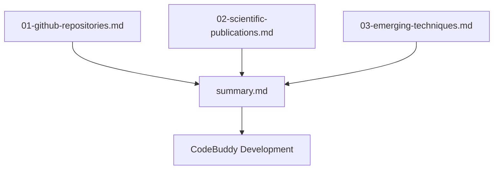

# deep_research — ai-coding-assistant-improvements

The `deep_research/ai-coding-assistant-improvements` module serves as a comprehensive knowledge base, compiling critical research and analysis to guide the strategic development and enhancement of the CodeBuddy AI coding assistant. Unlike typical code modules, this module does not contain executable code, classes, or functions. Instead, it is a collection of markdown documents that synthesize market trends, scientific advancements, and emerging techniques in the AI-assisted software development space.

Its primary purpose is to provide CodeBuddy developers with a well-researched foundation for understanding the competitive landscape, identifying high-impact features, and prioritizing future development efforts based on both industry adoption and scientific validation.

## Module Purpose

The core objective of this module is to:

1.  **Inform Strategic Decisions**: Provide data-driven insights for CodeBuddy's feature roadmap.
2.  **Benchmark Against Competitors**: Detail the capabilities and innovative aspects of leading AI coding assistants.
3.  **Integrate Scientific Advancements**: Summarize relevant academic research (2023-2025) to leverage proven techniques.
4.  **Identify Emerging Trends**: Highlight cutting-edge technologies and workflows that could differentiate CodeBuddy.
5.  **Prioritize Improvements**: Offer a structured list of recommended features, categorized by impact and complexity, for CodeBuddy's evolution.

## Module Structure

The `ai-coding-assistant-improvements` module is organized into several markdown files, each focusing on a distinct area of research, culminating in a comprehensive summary report.

### Key Components:

*   **`01-github-repositories.md`**:
    *   **Content**: Analyzes 11 leading open-source and commercial AI coding assistants (e.g., Aider, PR-Agent, Continue, Cursor, OpenHands, GPT-Pilot).
    *   **Focus**: Compares key features, innovative aspects, and notes the current "CodeBuddy Status" for each feature, highlighting gaps and existing parity.
    *   **Use Case**: Helps understand the competitive landscape and identify "table stakes" features.

*   **`02-scientific-publications.md`**:
    *   **Content**: Summarizes 15+ recent academic papers (2023-2025) on topics like LLM code generation, multi-agent systems, RAG, TDD, speculative decoding, and code understanding.
    *   **Focus**: Extracts "Key Insights for CodeBuddy" and "Implications for CodeBuddy" from each research area, providing scientific backing for potential improvements.
    *   **Use Case**: Informs development with research-backed techniques and best practices.

*   **`03-emerging-techniques.md`**:
    *   **Content**: Explores cutting-edge innovations such as agentic workflows, prompt caching, Model Context Protocol (MCP), AI code review, code diff generation, context window management, and hooks.
    *   **Focus**: Details the benefits, industry adoption, and "Implications for CodeBuddy" for each technique, often referencing specific tools or frameworks.
    *   **Use Case**: Identifies opportunities for differentiation and future-proofing CodeBuddy.

*   **`summary.md`**:
    *   **Content**: The executive summary of all research, consolidating findings from the other three documents.
    *   **Focus**: Presents CodeBuddy's current strengths, a prioritized list of improvements (Tier 1, 2, 3), a feature comparison matrix, an implementation roadmap, and a summary of scientific insights.
    *   **Use Case**: Serves as the primary actionable document for developers and product managers, guiding the overall development strategy.

## Key Findings and Recommendations for CodeBuddy

The research highlights several critical areas for CodeBuddy's evolution:

### Current Strengths to Leverage:

CodeBuddy already possesses a strong foundation with features like:
*   **Agentic loop with tool calling**
*   **Multi-agent coordination**
*   **Checkpoints/undo** (competitive with Native Engine)
*   **Context summarization** (unique approach)
*   **Agent modes** (e.g., `plan`, `code`, `ask`, `architect` – comparable to Aider)
*   **Voice input**
*   **MCP support**
*   **Session persistence**
*   **RAG-based tool selection**

### Priority Improvements:

The `summary.md` outlines a phased roadmap for improvements, categorized by impact and complexity:

#### Tier 1: High Impact, Low-Medium Complexity (Quick Wins)
1.  **Prompt Caching Support**: Up to 90% cost reduction and 80% latency improvement.
2.  **Auto-Lint Integration**: Higher code quality, fewer iterations by feeding lint errors back to the LLM.
3.  **Auto-Test Integration**: Research shows a **45.97% accuracy improvement** with TDD workflows.
4.  **Hook System**: Enables automation for pre/post actions (e.g., linting before commit).
5.  **Pre-Commit Code Review**: Improves code quality and prevents bugs by reviewing staged changes.

#### Tier 2: High Impact, Higher Complexity (Core Improvements)
6.  **TDD-First Mode**: A dedicated workflow to generate tests first, then code, iterating on failures.
7.  **Repository Map (tree-sitter)**: Deeper codebase understanding through AST parsing, similar to Aider.
8.  **Enhanced Context Management**: Optimizing context windows through budgeting, scoring, and compression to improve performance and reduce costs.
9.  **Asynchronous/Background Tasks**: Allows agents to work on tasks without blocking the user interface, improving productivity.
10. **Multi-LLM Selection Per Task**: Enables dynamic model selection based on task type, cost, and performance.

#### Tier 3: Innovative/Differentiating Features
11. **Parallel Agent Execution**: Leveraging techniques like Git worktrees for simultaneous agent operations (e.g., Cursor 2.0).
12. **Browser/DOM Integration**: Providing visual context and interaction for UI development.
13. **CI/CD Integration**: Deep integration with CI/CD pipelines for automated PR creation and status monitoring.
14. **Slack/Team Integration**: Connecting CodeBuddy to team communication channels for enhanced collaboration.
15. **Speculative Decoding Integration**: Potentially offering 2-4x speed improvements in generation where supported by LLM providers.

### Scientific Insights:
*   **TDD is paramount**: Research consistently shows significant accuracy gains with Test-Driven Development.
*   **Graph-based RAG**: Enhancing CodeBuddy's existing RAG with graph structures can dramatically improve code generation quality.
*   **Context Quality over Quantity**: Simply increasing context window size can degrade performance; intelligent context engineering is crucial.
*   **Security**: Iterative AI code generation can introduce vulnerabilities, necessitating security scanning in the pipeline.

## How to Use This Module

Developers contributing to CodeBuddy should consult this module for:

*   **Feature Prioritization**: Refer to `summary.md` for the recommended implementation roadmap.
*   **Design Inspiration**: Explore `01-github-repositories.md` and `03-emerging-techniques.md` to understand how competitors and cutting-edge tools implement specific features.
*   **Technical Validation**: Use `02-scientific-publications.md` to understand the research backing behind proposed techniques and their potential impact.
*   **Contextual Understanding**: Gain a holistic view of the AI coding assistant landscape before embarking on new development.

## Non-Code Module

It is important to reiterate that `deep_research/ai-coding-assistant-improvements` is a documentation module. As such:

*   **No Executable Code**: It contains no Python files, classes, functions, or scripts.
*   **No Call Graph**: There are no internal or external function calls to map.
*   **No Execution Flow**: There is no runtime behavior or sequence of operations to describe.

This module's value lies entirely in its informational content, serving as a critical resource for the strategic direction and technical implementation of the CodeBuddy project.