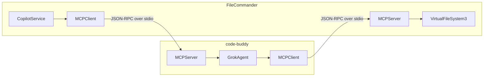

# deep_research — filecommander-integration

This document provides comprehensive documentation for the **`deep_research/filecommander-integration`** module. Unlike a traditional code module, this directory contains a collection of architectural analyses, strategic recommendations, and implementation plans. Its purpose is to guide the integration of two distinct applications: `code-buddy` (a TypeScript AI terminal agent) and `FileCommander Enhanced` (a C#/Avalonia file manager).

This documentation synthesizes the findings from the various research documents to provide developers with a clear understanding of the integration's purpose, technical foundations, proposed strategy, and implementation roadmap.

---

## 1. Introduction: The Integration Initiative

The `deep_research/filecommander-integration` module encapsulates the strategic and technical analysis for merging the capabilities of `code-buddy` and `FileCommander Enhanced`. The overarching goal is to create a "Universal AI-Powered File Intelligence Platform" that combines advanced AI agentic capabilities with comprehensive, cross-platform file management.

This integration aims to bridge the gap between terminal-based AI development workflows and a rich graphical file management experience, offering unique synergies not found in standalone tools.

### 1.1 Target Audience

This documentation is for developers who will be involved in designing, implementing, and maintaining the integration between `code-buddy` and `FileCommander Enhanced`. It assumes familiarity with both TypeScript/Node.js and C#/.NET/Avalonia ecosystems.

### 1.2 Module Contents

The `deep_research/filecommander-integration` directory contains the following key documents:

*   `architecture-analysis.md`: Detailed comparison of `code-buddy` and `FileCommander` architectures.
*   `integration-points.md`: Identification of specific interfaces and protocols for integration.
*   `synergy-analysis.md`: Analysis of mutual benefits and workflow improvements.
*   `technical-options.md`: Evaluation of five distinct technical integration approaches.
*   `strategic-recommendations.md`: High-level strategic plan, risk assessment, and resource needs.
*   `implementation-roadmap.md`: Detailed phased execution plan with milestones.
*   `final-summary.md`: Executive overview and final strategic recommendation.

---

## 2. Architectural Overview of `code-buddy` and `FileCommander Enhanced`

Understanding the core architectures of both applications is fundamental to successful integration.

### 2.1 `code-buddy` Architecture (TypeScript AI Terminal Agent)

`code-buddy` is an AI-powered terminal agent built with TypeScript, Node.js/Bun, React/Ink for UI, and the OpenAI SDK (Grok API compatible). It features an agentic loop for autonomous task execution using various tools.

**Key Components:**

*   **`GrokAgent`** (`src/agent/grok-agent.ts`): The central orchestrator managing the agentic loop, chat history, tool execution, and streaming responses.
*   **Tool System** (`src/tools/`): Provides core tools like `view_file`, `create_file`, `str_replace_editor`, `bash`, `search`, `web_search`, and `mcp__*` tools.
*   **`MCPClient`** (`src/mcp/mcp-client.ts`): Handles Model Context Protocol (MCP) communication for external tool integration via JSON-RPC over stdio.
*   **FCS Runtime** (`src/fcs/`): A full implementation of the FileCommander Script (FCS) language, including lexer, parser, and runtime, with bindings for AI (`grok` namespace) and tools (`tool` namespace).
*   **Provider System** (`src/providers/`): Abstractions for LLM providers.

**Core Architectural Pattern:** Agentic loop with tool execution and context management (RAG, compression).

### 2.2 `FileCommander Enhanced` Architecture (C#/Avalonia File Manager)

`FileCommander Enhanced` is a cross-platform file manager built with .NET 8.0 and Avalonia UI, following an MVVM pattern with ReactiveUI. Its standout feature is a Virtual File System (VFS) architecture, providing transparent access to local, archive, FTP, and cloud storage.

**Key Components:**

*   **`CopilotService`** (`Services/AI/CopilotService.cs`): Orchestrates multiple AI providers (GitHub Copilot, OpenAI, Claude, Local) with caching and debouncing.
*   **`ICopilotProvider`** (`Services/AI/ICopilotProvider.cs`): A standard interface for all AI providers, defining methods like `InitializeAsync`, `GetCompletionAsync`, and `ReportAcceptance`.
*   **`AutonomousAgentService`** (`Services/AutonomousAgentService.cs`): Handles autonomous task execution, workflow planning, and predictive editing.
*   **`VirtualFileSystem3`** (`Core/VirtualFileSystem/`): The unified interface for 13 different storage types (Local, ZIP, FTP, S3, etc.) with LRU caching.
*   **FCS Scripting** (`Scripts/FCS/`): FileCommander also has its own FCS implementation for scripting operations, including PDF handling.
*   **Plugin System**: Supports Total Commander-style plugins (WCX, WFX, WLX, WDX) and an advanced custom plugin system.

**Core Architectural Pattern:** MVVM with ReactiveUI, Strategy pattern for VFS providers, and Dependency Injection.

### 2.3 Architectural Comparison (Integration Focus)

| Aspect            | `code-buddy` (TypeScript)                               | `FileCommander` (C#)                                    | Compatibility |
| :---------------- | :------------------------------------------------------ | :------------------------------------------------------ | :------------ |
| **Scripting**     | FCS language (`src/fcs/`)                               | FCS language (`Scripts/FCS/`)                           | High          |
| **AI Providers**  | OpenAI SDK pattern, `grok` namespace                  | `ICopilotProvider` interface, `CopilotService`          | High          |
| **IPC**           | MCP (JSON-RPC over stdio)                               | Not natively implemented (can be added)                 | Medium        |
| **Tool/Agent**    | `GrokAgent`, extensible `src/tools/`                  | `AutonomousAgentService`, `ICopilotProvider`            | High          |
| **File Access**   | Local file system, `tool` namespace                   | `VirtualFileSystem3` (VFS) for all storage types        | Complementary |
| **UI**            | Terminal (Ink/React)                                    | Desktop (Avalonia)                                      | Complementary |
| **Database**      | SQLite (`src/database/`)                                | JSON configuration files                                | Low           |

The presence of FCS in both, similar AI provider patterns, and complementary file access/UI capabilities are strong indicators for feasible integration.

---

## 3. Key Integration Points

The research identified several specific interfaces and subsystems that serve as natural bridges for integration.

### 3.1 FCS Scripting Language Compatibility

Both applications implement the FCS language. This is the most direct path for shared logic and automation.

*   **`code-buddy` FCS Namespaces:** `grok`, `tool`, `agent`, `mcp`, `git`.
*   **`FileCommander` FCS Scripts:** Focus on file and PDF operations.

**Integration Opportunity:** Create a shared FCS runtime or a compatibility layer that allows scripts to seamlessly access both `code-buddy`'s AI features and `FileCommander`'s VFS operations.

### 3.2 AI/Copilot Provider System

`FileCommander`'s `ICopilotProvider` interface is a perfect abstraction point.

*   **`FileCommander` Interface:** `ICopilotProvider` defines methods like `GetCompletionAsync` and `InitializeAsync`.
*   **`code-buddy` Provider System:** Internally abstracts LLM providers.

**Integration Opportunity:** Implement a `GrokCLIProvider` (or similar) in `FileCommander` that wraps `code-buddy`'s AI capabilities. This provider would communicate with `code-buddy` to leverage its advanced agentic features.

### 3.3 Model Context Protocol (MCP)

`code-buddy` already has a robust `MCPClient` for external tool integration.

*   **`code-buddy` MCP Client:** Uses JSON-RPC 2.0 over stdio for tool listing (`tools/list`) and calling (`tools/call`). Configured via `.grok/mcp-servers.json`.

**Integration Opportunity:** Implement `FileCommander` as an **MCP Server**. This would expose `FileCommander`'s `VirtualFileSystem3` and other services (e.g., `vfs.list`, `vfs.read`, `archive.extract`, `search.files`) as tools that `code-buddy` (and other MCP clients) can invoke.

```mermaid
graph TD
    A[code-buddy (MCP Client)] -->|JSON-RPC: tools/list| B(FileCommander (MCP Server))
    B -->|JSON-RPC: {tools: [vfs.read, ...]} | A
    A -->|JSON-RPC: tools/call (vfs.read)| B
    B -->|JSON-RPC: {result: "file content"}| A
```

### 3.4 Inter-Process Communication (IPC)

Given the different technology stacks, robust IPC is crucial.

*   **Available Mechanisms:** stdin/stdout, Named Pipes, Unix Sockets, TCP/HTTP, WebSocket.
*   **Recommended:** JSON-RPC over stdio. This is already implemented in `code-buddy`'s MCP and is simple to implement in C# for `FileCommander`.

### 3.5 Data Exchange Formats

Both applications use similar data structures for tool results and context.

*   **Tool Results:** `code-buddy`'s `ToolResult` (`success`, `output`, `error`) maps well to `FileCommander`'s `Result<T>` (`IsSuccess`, `Value`, `Error`).
*   **Context:** `code-buddy`'s internal `Context` interface is nearly identical to `FileCommander`'s `CopilotContext` (e.g., `FilePath`, `Language`, `PrefixText`, `SuffixText`).

### 3.6 Shared Configuration

Aligning configuration files will improve user experience.

*   **`code-buddy` Config:** `.grok/settings.json`, `~/.grok/user-settings.json`, `.grok/mcp-servers.json`.
*   **`FileCommander` Config:** `~/.config/FileCommander/settings.json`.

**Integration Opportunity:** Define a shared configuration schema (e.g., `.grok/filecommander.json`) for integration-specific settings like executable paths, enabled features, and exposed tools.

---

## 4. Technical Integration Options

Five primary technical options were evaluated, each with distinct trade-offs.

### 4.1 Option A: `code-buddy` as External Process

*   **Concept:** `FileCommander` spawns `code-buddy` as a separate process, communicating via JSON over stdin/stdout.
*   **Pros:** Simple, clear process boundary, language agnostic.
*   **Cons:** Process startup overhead (latency), memory duplication, limited shared state.
*   **Best For:** Quick proof-of-concept, loose coupling.

### 4.2 Option B: Native `GrokProvider` in `FileCommander`

*   **Concept:** `FileCommander` implements a native C# `ICopilotProvider` that directly calls the Grok API (bypassing `code-buddy`).
*   **Pros:** Native performance, full API access, type safety.
*   **Cons:** Duplicates `code-buddy`'s logic, misses `code-buddy`'s agentic features (tools, RAG), requires online connectivity.
*   **Best For:** Simple AI completion, minimal external dependencies.

### 4.3 Option C: MCP-Based Bidirectional Communication (Recommended Medium-Term)

*   **Concept:** `FileCommander` acts as an MCP server, exposing its services as tools. `code-buddy` acts as an MCP client to use these tools. Conversely, `code-buddy` can also act as an MCP server, exposing its AI capabilities to `FileCommander` (which would implement an MCP client).
*   **Pros:** True bidirectional communication, standard protocol, clean separation, extensible.
*   **Cons:** Protocol complexity, startup coordination, error propagation.
*   **Best For:** Full feature integration, long-term architecture, ecosystem participation.



### 4.4 Option D: Shared FCS Runtime (Recommended Long-Term)

*   **Concept:** A single, unified FCS runtime (e.g., implemented in Rust and compiled to WASM) is shared by both applications, with native bindings for TypeScript and C#.
*   **Pros:** True code sharing, consistent behavior, near-native performance, cross-platform.
*   **Cons:** High development effort, WASM complexity, async bridging challenges, limited debugging.
*   **Best For:** Long-term unified platform, large script ecosystem, performance-critical scripting.

### 4.5 Option E: Plugin Architecture Integration

*   **Concept:** `FileCommander` hosts a `code-buddy`-powered WFX (File System) plugin, presenting AI operations as a virtual filesystem (e.g., `ai://ask/<prompt>`). `code-buddy` could also have a plugin to access `FileCommander`'s services.
*   **Pros:** Leverages existing plugin systems, modular, creative UI integration.
*   **Cons:** Limited integration depth, plugin API constraints, performance overhead.
*   **Best For:** Creative integrations, experimental features.

---

## 5. Strategic Recommendations and Phased Roadmap

The recommended strategy is a phased approach, balancing quick wins with long-term architectural goals.

### 5.1 Strategic Vision: "AI-Powered Universal File Intelligence"

The integrated solution aims to be the only platform combining Total Commander-style file management with AI agents, unified access to local/cloud/archive files with AI, and a cross-platform FCS scripting ecosystem.

### 5.2 Phased Integration Strategy

#### Phase 1: Proof of Concept (Weeks 1-4)

*   **Objectives:** Validate integration, demonstrate value, establish patterns.
*   **Technical Focus:**
    *   **Option A:** `code-buddy` `--json-mode` flag and `GrokCLIBridge` in `FileCommander` for external process communication.
    *   **Option B:** Native `GrokProvider` in `FileCommander` for direct Grok API calls.
    *   Shared configuration for API keys and paths.
*   **Deliverables:** Working JSON communication, `GrokCLIProvider` in `FileCommander`'s Copilot system, AI completions in `FileCommander`'s text editor, POC demo.
*   **Milestone:** Go/no-go decision at Week 4.

#### Phase 2: Core Integration (Weeks 5-12)

*   **Objectives:** Implement `FileCommander` as an MCP server, add VFS tools to `code-buddy`, establish production-quality integration.
*   **Technical Focus:**
    *   **Option C (MCP Server):** `FileCommander` implements an MCP JSON-RPC handler over stdio, exposing `vfs.list`, `vfs.read`, `vfs.write`, `archive.list`, `search.files` as MCP tools.
    *   `code-buddy` configures `FileCommander` as an MCP server in `.grok/mcp-servers.json` and uses `mcp__filecommander__*` tools.
*   **Deliverables:** MCP server skeleton in `FileCommander`, full VFS and archive tool suite via MCP, comprehensive documentation, integration tests.

#### Phase 3: Advanced Features (Weeks 13-24)

*   **Objectives:** Implement bidirectional MCP, align FCS scripting, create integrated workflows.
*   **Technical Focus:**
    *   **Option C (Bidirectional MCP):** `code-buddy` also implements an MCP server mode, exposing `grok.ask`, `grok.chat`, `grok.analyze` as MCP tools for `FileCommander` to consume. `FileCommander` implements an MCP client.
    *   **FCS Alignment:** Define FCS Language Specification v1.0, create compatibility layers, shared standard library functions.
    *   **Integrated UI:** `FileCommander` develops an AI Task Panel for visual execution, progress, and diff viewing of `code-buddy` operations.
*   **Deliverables:** Bidirectional MCP communication, aligned FCS scripting, integrated AI task panel, production-ready integration.

#### Phase 4: Production Readiness (Weeks 25-36)

*   **Objectives:** Unified FCS runtime, enterprise features, public release.
*   **Technical Focus:**
    *   **Option D (Unified FCS Runtime):** Implement FCS core in Rust, compile to WASM, and create TypeScript/C# bindings for both applications.
    *   Implement enterprise features: SSO, RBAC, audit logging, centralized configuration.
*   **Deliverables:** Unified FCS runtime package, enterprise feature set, beta program, general availability release.

### 5.3 Resource Requirements (Total 36 Weeks)

*   **Development:** $240,000 - $395,000 (scaling from 1 FTE in Phase 1 to 5.5 FTE in Phase 4).
*   **Infrastructure:** $7,500 - $16,000/year.

### 5.4 Risk Assessment Summary

*   **Technical:** Medium (mitigated by phased approach, early validation, abstraction layers).
*   **Project:** Medium (mitigated by clear milestones, MVP focus, decision gates).
*   **Market:** Low (unique value proposition).

---

## 6. Synergies and Value Proposition

The integration creates a powerful platform with capabilities far exceeding either application alone.

### 6.1 What `code-buddy` Provides to `FileCommander`

*   **Advanced AI Capabilities:** Agentic loop, RAG tool selection, thinking keywords, code intelligence (AST parsing, refactoring), context compression, iterative repair.
*   **Terminal-Based Operations:** `view_file`, `str_replace_editor`, `bash`, `git`, `search`, `find_symbols` – all enhanced with AI.
*   **MCP Ecosystem Access:** Connects `FileCommander` to external databases, APIs, and custom tool servers.
*   **Advanced Prompting System:** External Markdown prompts, auto-prompt selection, project-specific rules.

### 6.2 What `FileCommander` Provides to `code-buddy`

*   **Virtual File System Access:** `code-buddy` gains transparent access to ZIP, RAR, FTP, SFTP, WebDAV, S3, Azure, Google Drive, etc., via `vfs://` paths.
*   **Rich GUI Interface:** Visual file browsing, diff viewer for AI changes, progress visualization, interactive confirmation dialogs.
*   **Enhanced File Management Operations:** `FileOperationService` (batch copy/move/delete), `EnhancedSearchService` (cross-archive search), `SecureDeleteService`, `TransferQueueManager`, `ErrorRecoveryService`.
*   **Specialized File Handling:** PDF viewing/editing, image processing, encryption, visual Git integration.
*   **Cross-Platform Desktop Integration:** Native file dialogs, system notifications, clipboard, drag-and-drop.

### 6.3 User Workflow Improvements

*   **Developer:** AI refactoring across FTP projects, code analysis in archives, AI-generated tests for remote code.
*   **System Administrator:** AI analysis of logs across multiple servers (SFTP, cloud), automated cleanup.
*   **Content Creator:** AI-powered organization and tagging of cloud photos, batch renaming.
*   **DevOps:** AI monitoring of build artifacts, analysis of deployment logs, automated cleanup.

### 6.4 Competitive Advantage

The integrated solution creates a unique "Universal AI-Powered File Intelligence Platform" with no direct competitors, combining:
*   Advanced AI agentic capabilities.
*   Total Commander-style file management.
*   Cross-platform VFS.
*   Unified FCS scripting.
*   MCP ecosystem participation.

---

## 7. Conclusion and Next Steps

The `deep_research/filecommander-integration` module concludes that the integration of `code-buddy` and `FileCommander Enhanced` is technically feasible, strategically valuable, and incrementally deliverable. The architectural analysis reveals strong compatibility through shared FCS scripting, similar AI provider patterns, and complementary capabilities.

**Key Takeaways:**

1.  **Technical Feasibility:** Multiple viable integration paths exist, with MCP-based communication being the recommended long-term foundation.
2.  **Strategic Value:** Creates a unique market position with a powerful, AI-driven file intelligence platform.
3.  **Incremental Delivery:** The phased roadmap ensures that each stage provides standalone value and allows for risk management.

**Recommended Immediate Actions:**

1.  **Review this analysis** with all stakeholders.
2.  **Approve Phase 1 implementation** to begin with quick wins.
3.  **Allocate initial resources** (e.g., 2 developers, 50% each for 4 weeks).
4.  **Begin `GrokProvider` implementation** in `FileCommander` (Option B).
5.  **Design JSON protocol** for external process communication (Option A).

The combined platform promises to offer capabilities that neither application could achieve alone, setting a new standard for intelligent file management and development workflows.