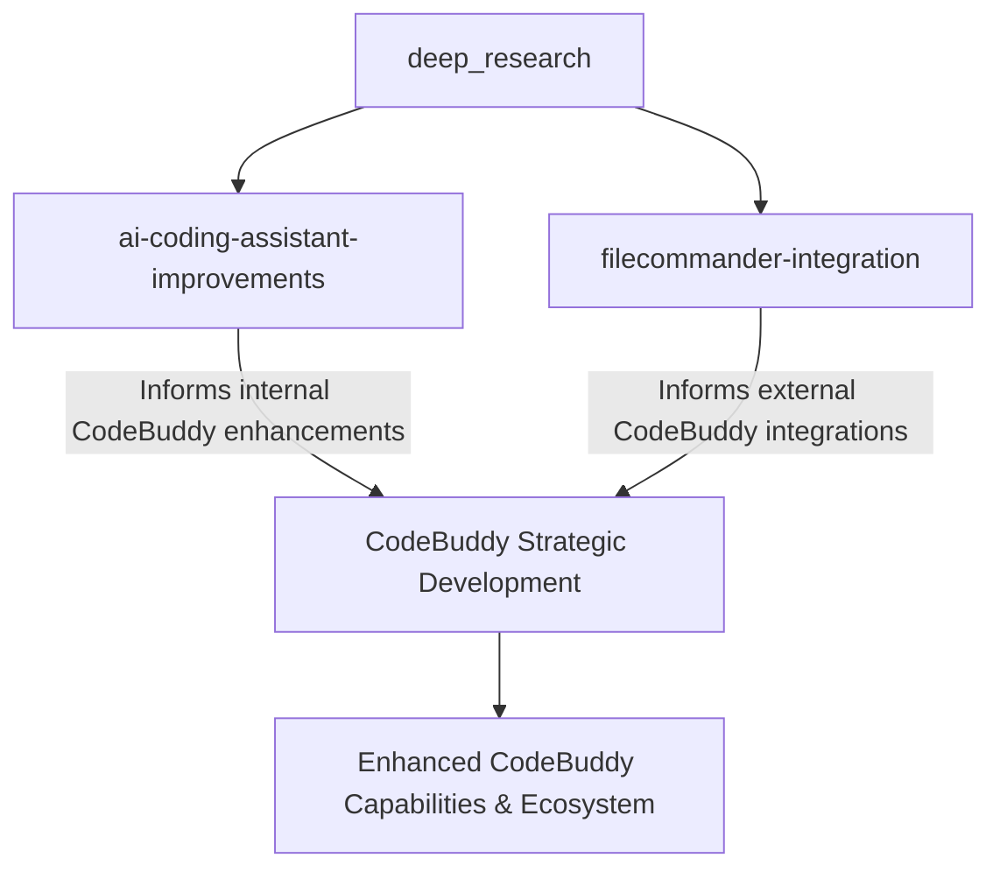

# deep_research

The `deep_research` module serves as the central repository for strategic analysis and planning documents related to the evolution of the `CodeBuddy` AI coding assistant. It comprises two key sub-modules, each addressing a distinct but complementary aspect of `CodeBuddy`'s development trajectory.

### Purpose & Collaboration

The primary purpose of `deep_research` is to provide a well-researched foundation for decision-making regarding `CodeBuddy`.

*   The [`ai-coding-assistant-improvements`](ai-coding-assistant-improvements.md) sub-module focuses on internal enhancements. It compiles research on market trends, scientific advancements, and emerging techniques to guide the development of `CodeBuddy`'s core AI capabilities. This research helps identify high-impact features and prioritize internal development efforts.
*   Concurrently, the [`filecommander-integration`](filecommander-integration.md) sub-module addresses `CodeBuddy`'s external ecosystem. It provides architectural analyses and strategic recommendations for integrating `CodeBuddy` (a TypeScript AI terminal agent) with `FileCommander Enhanced` (a C#/Avalonia file manager). This research outlines the purpose, technical foundations, and roadmap for expanding `CodeBuddy`'s utility through seamless interaction with other tools.

Together, these sub-modules ensure a holistic approach to `CodeBuddy`'s growth. Insights from `ai-coding-assistant-improvements` drive the refinement of `CodeBuddy`'s intelligence and features, while `filecommander-integration` expands its reach and operational context. This combined research informs a comprehensive strategy for `CodeBuddy`'s evolution, balancing internal innovation with external interoperability.

### Key Workflows

The information within `deep_research` supports critical strategic workflows:

1.  **Strategic Planning**: Both modules feed into the overarching strategic planning for `CodeBuddy`, ensuring development aligns with market needs and technical possibilities.
2.  **Feature Prioritization**: Research from both areas informs the prioritization of new features, whether they are core AI improvements or integration capabilities.
3.  **Ecosystem Expansion**: The `filecommander-integration` specifically drives the strategy for `CodeBuddy`'s interaction with other applications, enhancing its value proposition.

