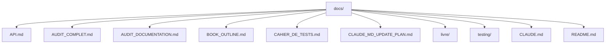

# docs — docs

The `docs` module in the Code Buddy project is not a code module in the traditional sense, but rather a **centralized repository of documentation assets**. It serves as the project's knowledge base, providing critical information for developers, contributors, and users alike. This module encompasses architectural overviews, API references, quality audits, test plans, and even a comprehensive technical book outline.

Its primary purpose is to ensure clarity, maintainability, and a deep understanding of the Code Buddy agent's complex systems, from its core AI reasoning to its security mechanisms and performance optimizations.

## Structure and Organization

The `docs/` directory is organized to provide a clear separation of concerns for different types of documentation.

*Note: `README.md` and `CLAUDE.md` are typically located at the project root but are frequently referenced and considered core documentation assets within this module's ecosystem.*

## Key Documentation Assets

Each Markdown file within the `docs/` module serves a specific purpose, contributing to a holistic understanding of the Code Buddy project.

### `docs/API.md` — Code Buddy API Reference

This document provides a comprehensive reference for interacting with Code Buddy, both programmatically and via its server interfaces.

*   **Purpose**: To serve as the definitive guide for developers integrating with Code Buddy, building custom tools, or extending its core functionality.
*   **Content Highlights**:
    *   **HTTP Server API**: Details REST endpoints (`/api/health`, `/api/chat`, `/api/tools`, `/api/sessions`, `/api/memory`) and the WebSocket API (`/ws`) for real-time streaming, including authentication methods (JWT, API Key) and server configuration.
    *   **Plugin Provider API**: Defines the `PluginProvider` interface for registering custom LLM, embedding, or search providers.
    *   **Programmatic API**: Documents key classes like `CodeBuddyAgent` (for orchestrating agentic loops), `ToolExecutor` (for managing tool execution), and available `Tools` (e.g., `BashTool`, `TextEditorTool`, `SearchTool`). It also lists supported `LLMProvider` implementations.
    *   **Types Reference**: Provides TypeScript interface definitions for core data structures like `ToolResult`, `ToolCall`, `ChatEntry`, and `LLMResponse`.
    *   **CLI Options & Environment Variables**: Lists command-line arguments and environment variables for configuring Code Buddy.
*   **Audience**: Developers, plugin authors, and system administrators.

### `docs/AUDIT_COMPLET.md` — Rapport d'Audit Complet - Code Buddy

This document presents a comprehensive audit report of the Code Buddy project, offering a high-level overview of its health and areas for improvement.

*   **Purpose**: To provide a holistic assessment of the project's technical quality, security posture, performance, and overall maturity.
*   **Content Highlights**:
    *   **Executive Summary**: A concise overview of the audit findings, including a global grade.
    *   **Audits**: Detailed sections on Architecture (metrics, modularity, top files), Code Quality (ESLint, TypeScript), Security (npm audit, implemented features, patterns), Tests (metrics, coverage, critical uncovered modules), Performance (build size, dependencies, optimizations), and Documentation (metrics, structure, quality).
    *   **Risk Analysis & Action Plan**: Identifies key risks, prioritizes corrective actions, and outlines a detailed plan for immediate, short-term, and long-term improvements.
    *   **Comparative Metrics**: Benchmarks Code Buddy against industry standards.
*   **Audience**: Project leads, architects, quality assurance teams, and stakeholders.

### `docs/AUDIT_DOCUMENTATION.md` — Audit de Documentation - Code Buddy

This report specifically focuses on the quality, completeness, and structure of the Code Buddy project's documentation itself.

*   **Purpose**: To evaluate the effectiveness of the project's documentation and identify specific areas for enhancement.
*   **Content Highlights**:
    *   **Executive Summary**: Synthesizes the documentation's strengths and weaknesses.
    *   **Detailed Analysis**: In-depth reviews of the main `README.md`, `CLAUDE.md` (highlighting over 20 missing modules), inline JSDoc/TSDoc coverage, "The Book" (`docs/livre/`), and API documentation.
    *   **Recommendations**: Provides prioritized recommendations for improving documentation, including specific content additions, tooling suggestions (e.g., TypeDoc generation), and workflow examples.
    *   **Global Score**: Assigns a numerical score to the documentation and interprets its meaning.
*   **Audience**: Technical writers, documentation contributors, and project managers overseeing documentation efforts.

### `docs/BOOK_OUTLINE.md` — Construire un Agent LLM Moderne - De la Théorie à Code Buddy

This document outlines the structure and content of a comprehensive technical book that uses Code Buddy as a practical case study for building modern LLM agents.

*   **Purpose**: To define the scope, target audience, and chapter-by-chapter content for an educational resource on LLM agent development.
*   **Content Highlights**:
    *   **Summary & Promise**: Explains the book's core message and what readers will learn.
    *   **Themes & Narrative**: Introduces "Lina" (a developer character) and "Code Buddy" as recurring narrative threads.
    *   **Detailed Chapter Outlines**: Covers seven parts:
        1.  **Foundations**: LLM internals, limitations, and the agent paradigm.
        2.  **Reasoning & Planning**: Tree-of-Thought (ToT) and Monte-Carlo Tree Search (MCTS).
        3.  **Memory, RAG & Contexte**: Modern RAG, Dependency-Aware RAG, Context Compression.
        4.  **Action et Outils**: Tool-Use, Tool-Calling, Plugins, MCP Protocol.
        5.  **Optimisation & Performance**: Cognitive (caching) and System (FrugalGPT, LLMCompiler) optimizations.
        6.  **Mémoire Longue Durée & Apprentissage**: Persistent learning and feedback loops.
        7.  **Étude de Cas: Code Buddy**: A deep dive into Code Buddy's complete architecture, modules, security, and extensibility.
*   **Audience**: Developers, architects, and researchers interested in the theoretical and practical aspects of building sophisticated LLM agents.

### `docs/CAHIER_DE_TESTS.md` — Cahier de Tests - Code Buddy

This document defines the complete testing strategy and detailed test cases for the Code Buddy project.

*   **Purpose**: To ensure the quality, reliability, and security of Code Buddy through a structured and comprehensive testing approach.
*   **Content Highlights**:
    *   **Test Strategy**: Outlines testing levels (static, unit, integration, E2E) and target code coverage for critical modules.
    *   **Test Environment**: Specifies hardware/software configurations, environment variables, and test data.
    *   **Detailed Test Cases**: Extensive unit tests for core modules (`src/agent/`, `src/tools/`, `src/security/`, `src/context/`, `src/memory/`, `src/config/`, `src/input/`, `src/integrations/`), covering various functionalities and edge cases.
    *   **Integration, Functional, Performance, Security, UI, and Regression Tests**: Defines scenarios and expected outcomes for higher-level testing.
    *   **Acceptance Criteria**: Sets thresholds for test pass rates and quality metrics for release.
    *   **Annexes**: Provides useful commands, test structure, mocks, and fixtures.
*   **Audience**: QA engineers, developers writing tests, and project managers overseeing product quality.

### `docs/CLAUDE_MD_UPDATE_PLAN.md` — Plan de Mise à Jour de CLAUDE.md

This document is an actionable plan specifically designed to address the identified gaps and improve the `CLAUDE.md` file, which serves as a core architectural overview.

*   **Purpose**: To guide the process of updating `CLAUDE.md` to accurately reflect the current state and full scope of the Code Buddy project.
*   **Content Highlights**:
    *   **Overview**: Summarizes current documentation statistics and the critical modules missing from `CLAUDE.md`.
    *   **Modules to Add**: Provides detailed descriptions and suggested Markdown snippets for over 20 modules that need to be documented (e.g., `src/browser/`, `src/checkpoints/`, `src/commands/`, `src/lsp/`, `src/plugins/`, `src/sandbox/`).
    *   **Classes & Tables to Update**: Lists important classes to be added to the "Important Classes" section and proposes expansions for existing tables (e.g., "Database System", "Slash Commands").
    *   **Proposed Diff**: Illustrates how the `CLAUDE.md` file should be modified.
*   **Audience**: Developers and technical writers responsible for maintaining and updating core architectural documentation.

### Core Referenced Documents

While not directly within the `docs/` directory in the provided context, the following documents are frequently referenced and are integral to the overall documentation ecosystem:

*   **`README.md`**: The project's primary entry point, offering a high-level overview, quick start instructions, key features, and a summary of the multi-agent architecture.
*   **`CLAUDE.md`**: A detailed architectural overview, describing key directories, important classes, design patterns, and the database system. The `CLAUDE_MD_UPDATE_PLAN.md` specifically targets improvements for this file.
*   **`docs/livre/`**: This directory (implied by `BOOK_OUTLINE.md`) contains the full content of the technical book, providing in-depth explanations and code examples.

## Relationship to the Codebase

The `docs` module is deeply intertwined with the Code Buddy codebase:

*   **Architectural Blueprint**: Documents like `CLAUDE.md` and `BOOK_OUTLINE.md` serve as the architectural blueprint, guiding developers in understanding the system's design and making consistent contributions.
*   **API Contract**: `API.md` acts as the formal contract for interacting with Code Buddy, ensuring predictable behavior for integrators and plugin developers.
*   **Quality Assurance**: `CAHIER_DE_TESTS.md` directly maps to the codebase's testing strategy, ensuring that code changes are thoroughly validated. `AUDIT_COMPLET.md` and `AUDIT_DOCUMENTATION.md` provide feedback loops for continuous improvement.
*   **Development Guidance**: The documentation provides context for complex features, security considerations, and performance optimizations, enabling developers to contribute effectively and maintain high standards.
*   **Learning Resource**: `BOOK_OUTLINE.md` and the `livre/` content transform the codebase into a practical learning tool for advanced LLM agent development.

## Contribution and Maintenance

The presence of `AUDIT_DOCUMENTATION.md` and `CLAUDE_MD_UPDATE_PLAN.md` highlights an active and self-aware approach to documentation maintenance. These documents not only assess the current state but also provide clear, prioritized action plans for continuous improvement, ensuring the documentation remains accurate, comprehensive, and valuable as the Code Buddy project evolves.