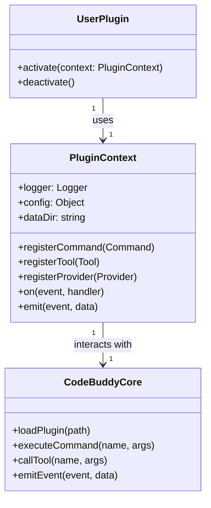

# docs — guides

The `docs/guides` module serves as the primary collection of user-facing documentation for Code Buddy. It provides comprehensive guides ranging from initial setup to advanced features and plugin development, enabling developers to effectively use and extend the application.

## Purpose

The core purpose of the `docs/guides` module is to:
*   **Onboard new users**: Provide a quick and easy way to get started with Code Buddy.
*   **Educate on advanced capabilities**: Detail powerful features like multi-agent orchestration, parallel execution, and advanced reasoning.
*   **Empower extensibility**: Guide developers through the process of creating custom plugins, tools, commands, and providers.
*   **Reference key concepts**: Document core functionalities, configuration options, and best practices.

This module does not contain executable code; instead, it provides the instructional content that explains how to interact with and contribute to the Code Buddy codebase.

## Module Structure

The `docs/guides` module is organized as a collection of Markdown files, each focusing on a specific aspect of Code Buddy. This structure allows for modular documentation, making it easier to navigate and maintain.

```text
docs/
  └── guides/
      ├── PLUGIN_DEVELOPMENT.md
      ├── advanced-features.md
      └── quick-start.md
```

## Guide Overviews

### 1. Quick Start Guide (`quick-start.md`)

This guide is designed for new users to rapidly get Code Buddy up and running. It covers:
*   **Installation**: Instructions for global `npm` installation or `npx` usage.
*   **Configuration**: Setting up API keys for Grok, Anthropic, OpenAI, and configuring local Ollama instances.
*   **Basic Usage**: Demonstrates interactive and headless modes for single prompts or session-based interactions.
*   **Slash Commands**: Introduces essential in-chat commands like `/help`, `/clear`, `/model`, `/checkpoint`, and `/export`.
*   **Security Modes**: Explains different operational modes: `suggest`, `auto-edit`, `full-auto`, and `YOLO_MODE`.
*   **MCP Servers**: Guides on adding and managing custom MCP (Multi-Agent Communication Protocol) servers.
*   **Tips & Next Steps**: Provides practical advice and pointers to further documentation.

### 2. Advanced Features (`advanced-features.md`)

This guide delves into the more sophisticated capabilities of Code Buddy, targeting users who want to leverage its full power. Key topics include:
*   **Multi-Agent Mode**: Orchestrating specialized agents (e.g., `CodeGuardian`, `DataAnalysis`).
*   **Parallel Execution**: Utilizing `git worktrees` and remote machines for concurrent task processing.
*   **Tree of Thought Reasoning**: Enabling advanced AI reasoning strategies.
*   **Custom Personas**: Managing and creating specialized AI personas.
*   **Hooks System**: Defining custom scripts to run at various lifecycle events (`pre-commit`, `post-edit`, `on-file-change`, etc.) via `.codebuddy/hooks.json`.
*   **Skills**: Installing and running reusable AI capabilities.
*   **Context Management**: Explaining Codebase RAG (`/index`, `/search`, `/map`) and how the AI automatically includes relevant context.
*   **Cost Management**: Monitoring and setting limits on AI interaction costs.
*   **Offline Mode**: Configuring Code Buddy to work with local LLMs.
*   **Collaboration**: Setting up and joining shared sessions.
*   **Debugging**: Enabling verbose logging and debug output.
*   **Configuration Files**: Details on `user-settings.json` and project-specific `.codebuddy/settings.json`.
*   **Environment Variables**: A reference for common environment variables that control Code Buddy's behavior.

### 3. Plugin Development Guide (`PLUGIN_DEVELOPMENT.md`)

This is the most in-depth guide, providing a comprehensive walkthrough for extending Code Buddy's functionality through plugins. It is crucial for developers looking to contribute new features or integrate external services.

#### Plugin Structure
Plugins reside in `.codebuddy/plugins/` and require a `manifest.json` for metadata and an `index.js` (or specified `main` file) for the plugin's code.

#### `manifest.json`
A JSON file defining the plugin's `id`, `name`, `version`, `description`, `author`, and `permissions`. Permissions are a forward-looking feature to control access to system resources like `shell`, `network`, and `filesystem`.

#### Plugin Code (`index.js`)
Plugins must export a default class that implements the `Plugin` interface, specifically the `activate` and `deactivate` methods.

```javascript
export default class MonPlugin {
  /**
   * Called when the plugin is activated.
   * @param {PluginContext} context - The API for interacting with Code Buddy.
   */
  activate(context) {
    // Initialization code
  }

  /**
   * Called when the plugin is deactivated or the application shuts down.
   */
  deactivate() {
    // Cleanup code
  }
}
```

#### Plugin API (`PluginContext`)
The `context` object passed to `activate` is the primary interface for plugins to interact with Code Buddy. It exposes several key functionalities:

*   **`context.logger`**: A scoped logger for plugin-specific output (`info`, `warn`, `error`, `debug`).
*   **`context.registerCommand(command: Command)`**: Registers a new slash command (e.g., `/bonjour`) accessible in the chat interface. Commands include a `name`, `description`, `prompt` (for LLM interaction), and optional `arguments`.
*   **`context.registerTool(tool)`**: Registers an AI tool that the LLM can invoke. Tools have a `name`, `description`, a `factory` function that returns an object with an `execute` method, `defaultPermission` (`always`, `ask`, `never`), and `readOnly` flag. The `execute` method returns a `ToolResult`.
*   **`context.config`**: Access to plugin-specific configuration (future implementation).
*   **`context.dataDir`**: Path to a dedicated directory for persistent plugin data.
*   **`context.registerProvider(provider)`**: (Advanced) Allows plugins to register custom providers for LLM, embedding, or search functionalities. Providers implement specific interfaces like `chat()`, `complete()`, `stream()` for LLMs.
*   **`context.on(event, handler)`**: Subscribes to system events (e.g., `message:received`, `tool:executed`, `session:started`).
*   **`context.emit(event, data)`**: Emits custom events that other plugins or the core application can listen to.

#### Key Interfaces
*   **`ToolResult`**: Defines the structure for the output of a tool's `execute` method, including `success`, `output`, `error`, and `metadata`.
*   **`Command`**: Defines the structure for registering a slash command, including `name`, `description`, `prompt`, and `arguments`.

#### Testing
The guide provides a basic structure for testing plugins using Jest, demonstrating how to mock the `PluginContext` to verify registrations and activations.

#### Good Practices
Emphasizes isolation, error handling, performance considerations, and consistent naming conventions for plugins.

### Plugin Interaction Model

The following diagram illustrates how a `UserPlugin` interacts with the Code Buddy core through the `PluginContext` API.



## Relationship to the Codebase

The `docs/guides` module is purely informational. It does not contain any executable code that directly interacts with other parts of the Code Buddy codebase in terms of call graphs or execution flows. Instead, these Markdown files serve as the official documentation for the features and APIs implemented within the core application.

Developers contributing to Code Buddy should ensure that any new features, APIs, or changes to existing functionalities are accurately reflected and updated within these guides. The guides are typically rendered and presented to users via a documentation generator or directly linked from the Code Buddy application's help system, providing the necessary context for users to understand and leverage the application's capabilities.