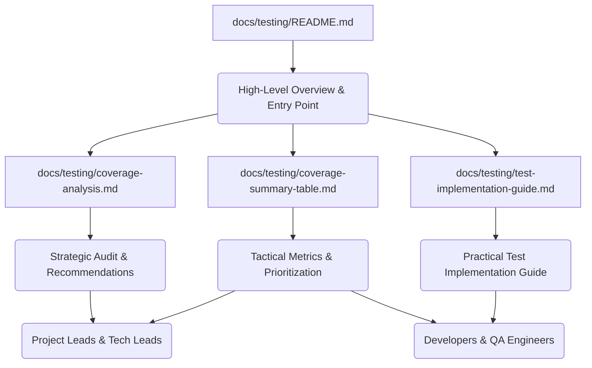

# docs — testing

The `docs/testing` module is not a traditional code module but a critical collection of markdown documents that define, track, and guide the testing strategy for the Code Buddy project. Its purpose is to provide a centralized, comprehensive resource for understanding the current state of test coverage, identifying testing priorities, and offering practical guidance for implementing new tests.

This documentation module is essential for any developer contributing to Code Buddy, as it outlines the quality standards and the roadmap for improving code reliability and maintainability.

## Module Overview

The `docs/testing` module serves as the single source of truth for all testing-related information within the Code Buddy project. It comprises several interconnected markdown files, each addressing a specific aspect of the testing landscape.

**Purpose:**
*   **Transparency:** Provide a clear, up-to-date view of the project's test coverage.
*   **Guidance:** Offer practical instructions and best practices for writing effective tests.
*   **Prioritization:** Highlight critical areas of the codebase that require immediate testing attention.
*   **Strategy:** Outline a roadmap and objectives for achieving target test coverage goals.
*   **Quality Assurance:** Define standards and processes for maintaining code quality through testing.

## Key Components

The `docs/testing` module is structured into four primary documents, each catering to different needs and audiences:

### 1. `docs/testing/README.md`

This is the entry point for all testing documentation. It provides a high-level summary of the project's testing status, key metrics, and immediate priorities. It acts as a navigation hub, directing readers to more detailed reports and guides.

**Key Contents:**
*   **Global Metrics:** Current coverage percentages for lines, statements, functions, and branches.
*   **Critical Priorities:** A list of the top 5 modules identified as most critical to test first, such as `src/agent/grok-agent.ts` and `src/commands/slash-commands.ts`.
*   **Roadmap:** A phased plan with objectives and estimated effort to achieve target coverage.
*   **Quick Start:** Essential commands for running tests (`npm test`, `npm run test:coverage`) and viewing reports.
*   **Contribution Guidelines:** Standards for writing tests and submitting pull requests (e.g., maintaining >70% coverage for modified files).

**Primary Audience:** All team members, especially new contributors and those seeking a quick overview.

### 2. `docs/testing/coverage-analysis.md`

This document provides a detailed audit report of the project's test coverage. It delves into the specifics of coverage by module, identifies critical gaps, and offers strategic recommendations.

**Key Contents:**
*   **Executive Summary:** In-depth analysis of global coverage and project statistics (e.g., ratio of test files to source files).
*   **Module-Level Analysis:** Lists modules with good coverage (>70%), critical modules with 0% coverage (e.g., `src/agent/multi-agent/multi-agent-system.ts`, `src/tools/bash.ts`), and partially tested modules.
*   **Types of Tests:** Breakdown of existing unit, integration, and E2E tests, highlighting strengths and weaknesses.
*   **Prioritized Recommendations:** Actionable steps for immediate, medium-term, and long-term improvements, including adopting TDD and improving Jest configuration.
*   **Metrics of Success:** Defines KPIs and objectives for tracking progress across different phases.

**Primary Audience:** Project Leads, Tech Leads, and Senior Developers responsible for strategic planning and overall quality.

### 3. `docs/testing/coverage-summary-table.md`

This document offers a more tactical, data-driven overview of test coverage, presented in tables and charts. It's designed for quick reference and helps in sprint planning and resource allocation.

**Key Contents:**
*   **Coverage by Category:** A table summarizing average coverage for different functional areas (e.g., "Agent Core," "Commands," "Tools").
*   **Coverage Distribution:** A visual representation (ASCII graph) of how many modules fall into different coverage levels (Excellent, Good, Medium, Low, Critical).
*   **Top 10 Modules:** Lists both the best-tested and most critically under-tested modules, including their line counts and impact.
*   **Effort Estimation:** Calculates the estimated time and resources required to reach target coverage goals (e.g., 70% global coverage).
*   **Sprint Prioritization:** Suggests a breakdown of testing efforts across sprints.

**Primary Audience:** Developers, QA Engineers, and anyone involved in sprint planning and task prioritization.

### 4. `docs/testing/test-implementation-guide.md`

This is a practical, hands-on guide for developers on how to write tests for Code Buddy. It provides concrete examples, templates, and best practices to ensure consistency and quality in testing efforts.

**Key Contents:**
*   **Test Templates:** Boilerplate code for common test types:
    *   **Unit Tests:** Using `describe`, `it`, `beforeEach`, `afterEach`, `expect`.
    *   **Mocks:** Demonstrates `jest.mock` for isolating dependencies.
    *   **Asynchronous Tests:** Examples using `async/await` and `rejects.toThrow`.
    *   **EventEmitter Tests:** How to test event-driven logic.
*   **Specific Examples for Critical Modules:** Detailed test examples for high-priority files like `src/agent/grok-agent.ts`, `src/commands/slash-commands.ts`, `src/tools/bash.ts`, and `src/agent/multi-agent/multi-agent-system.ts`. These examples showcase how to test agentic loops, command handlers, security aspects of shell execution, and multi-agent coordination.
*   **Best Practices:** Guidelines for naming conventions, test organization (e.g., `tests/unit`, `tests/integration`, `tests/e2e`), and using fixtures/helpers.
*   **Recommended Jest Configuration:** A `jest.config.js` example with `coverageThreshold` settings and other essential configurations.
*   **New Test Checklist:** A step-by-step guide for developers to follow when writing new tests, from planning to review.
*   **Useful Tools:** Commands for running, watching, debugging, and generating coverage reports.

**Primary Audience:** Developers actively writing or modifying tests.

## Current State and Strategic Imperatives

As of the last audit (2025-12-09), the Code Buddy project has a **critical overall test coverage of 19.28%**. This indicates a significant technical debt and a high risk of regressions and undetected bugs.

**Key Challenges:**
*   **Low Branch Coverage (11.35%):** Suggests that many conditional paths and error handling logic are not being tested.
*   **Untested Critical Modules:** Core functionalities like the `CodeBuddyAgent` (`src/agent/grok-agent.ts`), `SlashCommandHandler` (`src/commands/slash-commands.ts`), `MultiAgentSystem` (`src/agent/multi-agent/multi-agent-system.ts`), `RepairEngine` (`src/agent/repair/repair-engine.ts`), and the `BashTool` (`src/tools/bash.ts`) have either very low or 0% coverage, posing significant stability and security risks.
*   **Insufficient Test-to-Source Ratio:** With 57 test files for 272 source files, the project falls far short of the target 1:1 ratio.

**Strategic Imperatives (from `coverage-analysis.md` and `README.md`):**
1.  **Prioritize Critical Modules:** Focus immediate efforts on the top 5 modules identified, aiming for at least 50% coverage in Phase 1.
2.  **Improve Branch Coverage:** Increase branch coverage from 11.35% to 30% in Phase 1.
3.  **Implement Regression Tests:** Establish a robust suite of E2E and security regression tests.
4.  **Adopt TDD:** Encourage Test-Driven Development for all new code, targeting 80% coverage for new features.
5.  **Enforce Quality Gates:** Integrate CI/CD checks to block merges if coverage falls below defined thresholds (e.g., 70%).

## Developer Workflow and Contribution

Developers are expected to actively contribute to improving the test coverage. The `docs/testing` module provides the necessary resources to facilitate this:

1.  **Understand the Landscape:** Start with `docs/testing/README.md` for an overview, then consult `docs/testing/coverage-summary-table.md` to identify areas needing attention, especially for modules you are working on.
2.  **Identify Gaps:** Use `docs/testing/coverage-analysis.md` to understand the strategic importance and specific gaps in critical modules.
3.  **Write Tests:** Refer to `docs/testing/test-implementation-guide.md` for templates, examples, and best practices. When writing tests for `CodeBuddyAgent`, `SlashCommandHandler`, `BashTool`, or `MultiAgentSystem`, leverage the provided examples to ensure consistency and thoroughness.
4.  **Run and Verify:**
    *   Execute all tests: `npm test`
    *   Check coverage: `npm run test:coverage` and open `coverage/lcov-report/index.html`.
    *   Ensure new or modified code meets the **70% minimum coverage** standard for lines, branches, functions, and statements.
5.  **Pre-PR Validation:** Before submitting a Pull Request, run `npm run validate` to ensure all linting, type-checking, and tests pass.
6.  **Adhere to Standards:** Ensure tests are well-named, organized, and avoid `it.skip` or `describe.skip`.

## Call Graph & Execution Flow

This module consists solely of documentation files (markdown). As such, it does not contain any executable code, internal calls, outgoing calls, incoming calls, or detectable execution flows. Its "execution" is through human consumption and application of its guidelines to the Code Buddy codebase.