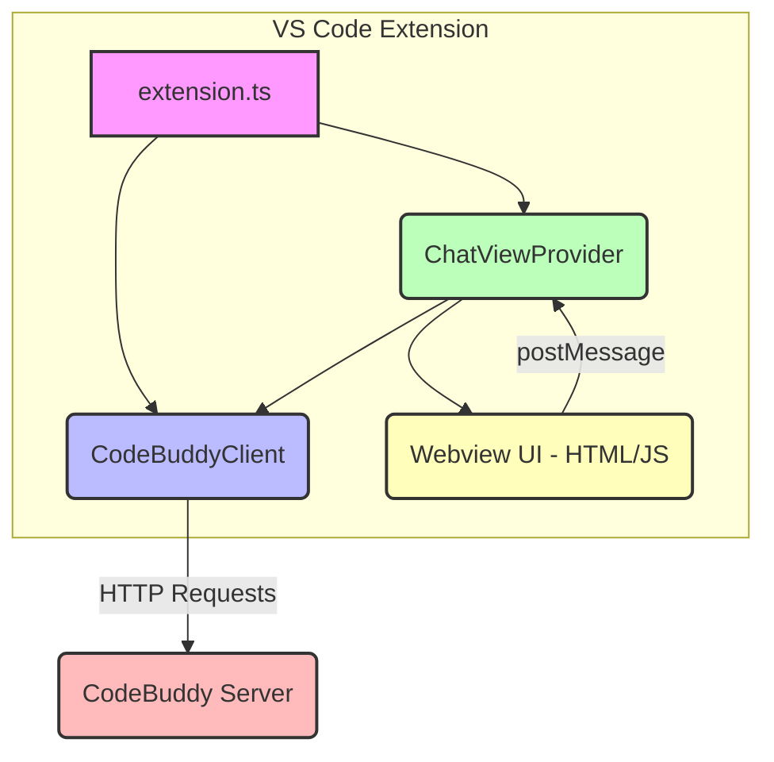

# extensions

This document provides a technical overview of the `extensions/vscode` module, which implements the Code Buddy VS Code extension. It details the module's purpose, architecture, key components, and interaction flows, aiming to equip developers with the necessary understanding to contribute effectively.

## Module Overview

The `extensions/vscode` module provides a VS Code extension that integrates the Code Buddy AI assistant directly into the editor. It enables developers to interact with a running Code Buddy HTTP server for AI-assisted coding tasks such as chat, code explanation, and file reviews.

**Key Features:**

*   **Chat Panel:** A dedicated sidebar webview for conversational AI interaction.
*   **Ask About Selection:** A command to send selected code and a user-defined question to the AI.
*   **Review File:** A command to send the entire active file's content for an AI review.
*   **Server Status:** A status bar item indicating the connection status to the Code Buddy server.
*   **Configurable Server URL:** Allows users to specify the Code Buddy server's address.

**Prerequisites:**

*   A running Code Buddy HTTP server (e.g., started via `buddy server start`).
*   The Code Buddy CLI (for server management, though not directly used by the extension itself).

## Architecture and Key Components

The VS Code extension is structured around three primary TypeScript files, each with distinct responsibilities, and a `types.ts` file for shared interfaces.

### 1. `extension.ts` (Extension Entry Point)

This file contains the `activate` and `deactivate` functions, which are the lifecycle hooks for the VS Code extension. It orchestrates the initialization of other components and registers all VS Code-specific contributions.

**Key Responsibilities:**

*   **Initialization:** Creates instances of `CodeBuddyClient` and `ChatViewProvider`.
*   **Webview Registration:** Registers the `ChatViewProvider` as the handler for the `codebuddy.chatView` webview.
*   **Command Registration:** Registers VS Code commands:
    *   `codebuddy.openChat`: Focuses the chat webview.
    *   `codebuddy.askAboutSelection`: Prompts the user for a question about selected code, formats it, and sends it to the chat provider.
    *   `codebuddy.reviewFile`: Formats the active file's content for review and sends it to the chat provider.
*   **Status Bar Management:** Creates and updates a `vscode.StatusBarItem` to display the connection status to the Code Buddy server.
*   **Configuration Handling:** Listens for changes to `codebuddy.serverUrl` and updates the `CodeBuddyClient` accordingly.
*   **Connection Status Updates:** The `updateConnectionStatus` function periodically (or on config change) checks the server's health using `client.isConnected()` and updates the status bar item.

### 2. `api-client.ts` (CodeBuddyClient)

The `CodeBuddyClient` class is responsible for all network communication with the Code Buddy HTTP server. It abstracts away the details of making HTTP requests and handles session management.

**Key Methods:**

*   `constructor(baseUrl: string)`: Initializes the client with the server's base URL.
*   `setBaseUrl(url: string)`: Updates the server URL, useful for configuration changes.
*   `getBaseUrl(): string`: Returns the currently configured server URL.
*   `chat(message: string): Promise<string>`: Sends a chat message to the server. It automatically includes and updates the `sessionId` for conversational context.
*   `getStatus(): Promise<HealthStatus>`: Fetches the server's health status.
*   `getMetrics(): Promise<ServerMetrics>`: Fetches server performance metrics.
*   `executeCommand(command: string, args?: Record<string, unknown>): Promise<CommandResponse>`: Sends a command to the server (currently implemented by sending a specially formatted chat message).
*   `isConnected(): Promise<boolean>`: Checks if the client can successfully connect to the server and retrieve a healthy status.
*   `resetSession(): void`: Clears the current `sessionId`, effectively starting a new conversation.
*   `private fetch(path: string, init?: RequestInit): Promise<Response>`: A private helper method that wraps `window.fetch`, adding a 30-second timeout and robust error handling for network issues (e.g., `ECONNREFUSED`, `AbortError`).

### 3. `chat-provider.ts` (ChatViewProvider)

This class implements `vscode.WebviewViewProvider` and manages the Code Buddy chat panel within the VS Code sidebar. It handles the rendering of the webview UI and the bidirectional communication between the extension's TypeScript code and the webview's JavaScript.

**Key Responsibilities:**

*   **Webview Lifecycle:** The `resolveWebviewView` method is called by VS Code when the webview is created or restored. It configures the webview's options, sets its HTML content, and registers a message listener.
*   **HTML Content Generation:** `getHtmlContent()` provides the full HTML, CSS, and JavaScript for the chat interface. This embedded JavaScript handles UI rendering, user input, and communication back to the extension.
*   **Message Handling (Webview to Extension):** The `webview.onDidReceiveMessage` listener processes messages sent from the webview's JavaScript. It dispatches actions based on `message.type`:
    *   `sendMessage`: Calls `handleSendMessage`, which in turn uses `client.chat()`.
    *   `clearChat`: Calls `client.resetSession()`.
    *   `getStatus`: Calls `handleGetStatus`, which uses `client.getStatus()`.
*   **Message Handling (Extension to Webview):** The `postMessage` helper sends messages to the webview's JavaScript, triggering UI updates (e.g., displaying AI responses, error messages, or loading indicators).
*   **`sendMessage(text: string): Promise<void>`:** A public method allowing other parts of the extension (like the commands in `extension.ts`) to programmatically send messages to the AI and display the response in the chat panel.

### 4. `types.ts` (Shared Interfaces)

This file defines TypeScript interfaces used across the module for consistent data structures:

*   `ChatMessage`, `ChatRequest`, `ChatResponse`: For communication with the Code Buddy server's chat endpoint.
*   `HealthStatus`, `ServerMetrics`: For server health and metrics endpoints.
*   `CommandRequest`, `CommandResponse`: For server command execution.
*   `WebviewMessage`, `WebviewResponse`: For structured communication between the extension's TypeScript code and the webview's embedded JavaScript.

## Execution Flows

### Extension Activation

1.  VS Code calls `activate(context: vscode.ExtensionContext)` in `extension.ts` on `onStartupFinished`.
2.  A `CodeBuddyClient` instance is created, configured with `codebuddy.serverUrl`.
3.  A `ChatViewProvider` instance is created, receiving the `extensionUri` and the `CodeBuddyClient`.
4.  The `ChatViewProvider` is registered with `vscode.window.registerWebviewViewProvider`.
5.  VS Code commands (`codebuddy.openChat`, `codebuddy.askAboutSelection`, `codebuddy.reviewFile`) are registered.
6.  A `vscode.StatusBarItem` is created and shown.
7.  If `codebuddy.autoConnect` is true, `updateConnectionStatus()` is called to check server health and update the status bar.

### Chat Panel Interaction

1.  **User Input:** A user types a message in the webview's input field and presses Enter or the Send button.
2.  **Webview JS:** The webview's JavaScript captures the input, calls `vscode.postMessage({ type: 'sendMessage', payload: text })`.
3.  **Extension TS:** `ChatViewProvider.resolveWebviewView`'s `webview.onDidReceiveMessage` listener receives the message.
4.  `handleSendMessage(text)` is called, which then calls `chatProvider.sendMessage(text)`.
5.  `chatProvider.sendMessage` first sends a `loading` message to the webview, then calls `client.chat(text)`.
6.  **API Client:** `CodeBuddyClient.chat` makes an HTTP POST request to `/api/chat` on the Code Buddy server, including the message and current `sessionId`.
7.  **Server Response:** The server processes the request and returns a `ChatResponse`.
8.  **API Client:** `CodeBuddyClient.chat` updates its internal `sessionId` and returns the `response` string.
9.  **Extension TS:** `chatProvider.sendMessage` receives the response and sends a `response` message to the webview (or an `error` message if the API call failed).
10. **Webview JS:** The webview's `window.addEventListener('message')` receives the `response` (or `error`) message and updates the chat UI.

### "Ask About Selection" / "Review File" Commands

1.  **User Action:** The user triggers the `codebuddy.askAboutSelection` or `codebuddy.reviewFile` command.
2.  **Extension TS:** The corresponding command handler in `extension.ts` is executed.
3.  It retrieves the active editor's content or selection.
4.  It constructs a detailed prompt message, embedding the code and the user's question (for "Ask About Selection").
5.  It calls `vscode.commands.executeCommand('codebuddy.chatView.focus')` to ensure the chat panel is visible.
6.  It then calls `chatProvider.sendMessage(message)` to send the constructed prompt to the AI.
7.  The flow then proceeds identically to steps 5-10 of the "Chat Panel Interaction" above.

### Server Status Updates

1.  **Trigger:** `updateConnectionStatus()` is called on extension activation, configuration changes, or potentially periodically.
2.  **API Client:** `updateConnectionStatus` calls `client.isConnected()`.
3.  `CodeBuddyClient.isConnected()` attempts to call `client.getStatus()`.
4.  `CodeBuddyClient.getStatus()` makes an HTTP GET request to `/api/health`.
5.  **Status Bar Update:** Based on the success or failure of `client.isConnected()`, `updateConnectionStatus` updates the `statusBarItem.text`, `statusBarItem.tooltip`, and `statusBarItem.backgroundColor` to reflect the connection status.