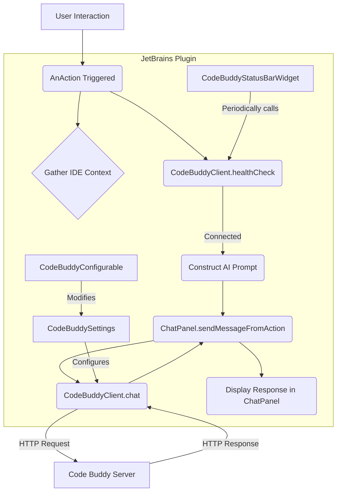

# jetbrains-plugin

This document provides a technical overview of the `jetbrains-plugin` module, detailing its architecture, key components, and operational flow within the JetBrains IDE environment.

## Code Buddy JetBrains Plugin

The `jetbrains-plugin` module implements the client-side integration for the Code Buddy AI assistant within JetBrains IDEs. Its primary purpose is to provide a seamless interface for developers to interact with an external Code Buddy server, leveraging AI capabilities for tasks like code explanation, review, test generation, and error fixing directly within their development workflow.

### Architecture Overview

The plugin follows a standard JetBrains plugin architecture, extending various platform extension points to integrate its functionality. It consists of several core components:

1.  **Actions**: User-triggered commands (e.g., "Explain Code", "Fix Error") that gather context from the IDE.
2.  **UI Components**: A dedicated tool window (`ChatPanel`) for AI interaction and a status bar widget for connection status.
3.  **API Client**: A singleton (`CodeBuddyClient`) responsible for all communication with the external Code Buddy server.
4.  **Settings**: Persistent storage and a UI for configuring the server connection and AI model.

The general flow for an AI interaction initiated by a user action is:

1.  User triggers an `AnAction`.
2.  The action gathers relevant code context (selected text, file content, cursor position).
3.  A health check is performed against the Code Buddy server via `CodeBuddyClient`.
4.  If connected, a prompt message is constructed and sent to the `ChatPanel`.
5.  The `ChatPanel` then uses `CodeBuddyClient` to send the message to the server.
6.  The server's AI response is received and displayed in the `ChatPanel`.

### Key Components

#### 1. Plugin Entry Point (`jetbrains-plugin/src/main/resources/META-INF/plugin.xml`)

This XML file is the manifest for the plugin, declaring its capabilities and how it integrates with the JetBrains platform.

*   **`id`**, **`name`**, **`vendor`**, **`description`**: Basic plugin metadata.
*   **`<depends>`**: Specifies `com.intellij.modules.platform`, indicating a dependency on the core IntelliJ Platform.
*   **`<extensions>`**:
    *   **`toolWindow`**: Registers the "Code Buddy" tool window, managed by `ChatToolWindowFactory`. It's a secondary tool window anchored to the right.
    *   **`statusBarWidgetFactory`**: Registers `CodeBuddyStatusBarWidgetFactory` to display connection status in the IDE's status bar.
    *   **`applicationConfigurable`**: Integrates `CodeBuddyConfigurable` into the IDE's settings under the "Tools" section, allowing users to configure plugin settings.
    *   **`applicationService`**: Declares `CodeBuddySettings` as an application-level service, ensuring a single instance for managing persistent settings.
    *   **`notificationGroup`**: Defines a notification group for plugin-related messages.
*   **`<actions>`**:
    *   **`CodeBuddy.Menu`**: A top-level menu group under "Tools" containing various AI actions.
    *   **`CodeBuddy.EditorPopup`**: A context menu group that appears when right-clicking in the editor, providing quick access to relevant actions.
    *   Individual `<action>` tags define specific commands like `AskQuestionAction`, `ExplainCodeAction`, `ReviewFileAction`, `GenerateTestsAction`, and `FixErrorAction`, linking them to their respective Kotlin classes and providing metadata (text, description, icon, keyboard shortcuts).

#### 2. User Actions (`com.codebuddy.plugin.actions.*`)

These classes extend `com.intellij.openapi.actionSystem.AnAction` and provide the entry points for user-initiated AI interactions.

*   **`AskQuestionAction`**: Prompts the user for a question via `Messages.showInputDialog` and sends it to the AI.
*   **`ExplainCodeAction`**: Explains the currently selected code in the editor.
*   **`FixErrorAction`**: Gathers code context around the cursor (and optionally selected error text) to ask the AI for a fix. It intelligently extracts line numbers, file names, and language.
*   **`GenerateTestsAction`**: Generates unit tests for the selected code, attempting to guess the appropriate test framework based on the file extension.
*   **`ReviewFileAction`**: Sends the content of the current file (truncated for very large files) to the AI for a code review.

**Common Action Flow:**
All actions share a similar `actionPerformed` logic:
1.  Retrieve `Project` and `Editor` (if applicable) from `AnActionEvent`.
2.  Perform a `CodeBuddyClient.healthCheck()` on a pooled thread to ensure server connectivity.
3.  If the server is disconnected, display a warning using `Messages.showWarningDialog`.
4.  If connected, construct a detailed prompt message based on the action's purpose and gathered context.
5.  Open the "Code Buddy" tool window (`ToolWindowManager.getInstance(project).getToolWindow("Code Buddy")?.show`) and send the constructed message to the active `ChatPanel` instance via `ChatPanel.getActiveInstance()?.sendMessageFromAction(message)`.
6.  The `update` method controls when an action is enabled and visible based on project context, editor selection, etc.

#### 3. Core Communication (`com.codebuddy.plugin.api.CodeBuddyClient`)

This class is the sole interface for interacting with the external Code Buddy server.

*   **`CodeBuddyClient`**: A singleton (`companion object { getInstance() }`) that manages HTTP communication.
    *   Uses `okhttp3` for making network requests and `com.google.gson` for JSON serialization/deserialization.
    *   Configures `OkHttpClient` with timeouts for robust network operations.
    *   Retrieves `serverUrl` and `apiKey` from `CodeBuddySettings`.
*   **`chat(message: String, context: String? = null)`**:
    *   Constructs a JSON request body including the `message`, optional `context`, and the configured `model`.
    *   Sends a POST request to `$serverUrl/api/chat`.
    *   Includes an `Authorization` header with the API key if configured.
    *   Parses the JSON response into a `ChatResponse` data class, handling potential server errors or connection failures.
*   **`healthCheck()`**:
    *   Sends a GET request to `$serverUrl/api/health`.
    *   Includes an `Authorization` header if an API key is present.
    *   Returns a `HealthStatus` indicating connectivity, server version, and active model. This is crucial for providing immediate feedback to the user about server availability.

#### 4. User Interface (`com.codebuddy.plugin.ui.*`)

These classes manage the visual components of the plugin.

*   **`ChatToolWindowFactory`**:
    *   Implements `ToolWindowFactory` to create the content for the "Code Buddy" tool window.
    *   Instantiates `ChatPanel` and sets it as the `activeInstance` for global access.
    *   Performs an initial `healthCheck()` on tool window creation if `CodeBuddySettings.autoConnect` is enabled, displaying a connection status message in the chat.
*   **`ChatPanel`**:
    *   The main UI panel for displaying chat history and user input.
    *   **`messagesPane`**: A `JEditorPane` configured with an `HTMLEditorKit` and custom CSS (`StyleSheet`) to render chat messages with basic styling (user, assistant, error roles, code blocks).
    *   **`inputArea`**: A `JBTextArea` for user input, supporting `Shift+Enter` for newlines and `Enter` to send.
    *   **`sendButton`**: Triggers `sendMessage()`.
    *   **`sendMessage()`**: Called when the user sends a message from the input area. Disables input, appends the user message, calls `CodeBuddyClient.chat()` on a pooled thread, and then re-enables input and displays the AI response or error.
    *   **`sendMessageFromAction(message: String)`**: An entry point for `AnAction` classes to send pre-formatted messages to the AI. It follows a similar flow to `sendMessage()`.
    *   **`appendMessage(role: String, content: String)`**: Formats and appends a new message to the `messagesPane`.
    *   **`markdownToHtml(text: String)`**: A utility function to convert basic Markdown (code blocks, inline code, bold, italic, headers) into HTML for display in `messagesPane`.
    *   **`escapeHtml(text: String)`**: Escapes HTML special characters to prevent injection issues.
    *   **`companion object { getActiveInstance(), setActiveInstance() }`**: Provides a static way to access the currently active `ChatPanel` instance, which is essential for actions to communicate with the tool window.
*   **`StatusBarWidgetFactory` / `CodeBuddyStatusBarWidget`**:
    *   **`CodeBuddyStatusBarWidgetFactory`**: Registers the status bar widget.
    *   **`CodeBuddyStatusBarWidget`**: Implements `StatusBarWidget` to display the connection status to the Code Buddy server.
        *   **`startPolling()`**: Initiates a scheduled task (`scheduler.scheduleWithFixedDelay`) to periodically call `checkConnection()`.
        *   **`checkConnection()`**: Calls `CodeBuddyClient.healthCheck()` on a pooled thread, updates the `connected` and `modelName` state, and refreshes the widget's display (`statusBar?.updateWidget(ID())`).
        *   **`getText()`**: Returns "CB: Connected" (with model name if available) or "CB: Disconnected".
        *   **`getTooltipText()`**: Provides detailed connection information on hover.

#### 5. Configuration and Persistence (`com.codebuddy.plugin.settings.*`)

These classes handle the plugin's settings, allowing users to configure the Code Buddy server details.

*   **`CodeBuddySettings`**:
    *   Implements `PersistentStateComponent<CodeBuddySettings.State>` and is declared as an `ApplicationService`. This means its state is persisted across IDE restarts at the application level.
    *   **`@State`**: Specifies the name (`CodeBuddySettings`) and storage location (`CodeBuddyPlugin.xml`) for the settings.
    *   **`data class State`**: Defines the data structure for the persistent settings: `serverUrl`, `apiKey`, `model`, and `autoConnect`.
    *   Provides `getInstance()` for easy access to the singleton settings service.
    *   Exposes read-only properties (`serverUrl`, `apiKey`, etc.) for convenience.
*   **`CodeBuddyConfigurable`**:
    *   Implements `Configurable` to provide a UI for editing `CodeBuddySettings` in the IDE's preferences.
    *   **`createComponent()`**: Builds the Swing UI using `FormBuilder`, including `JBTextField` for URL and model, `JBPasswordField` for API key, and `JBCheckBox` for auto-connect.
    *   **`isModified()`**: Checks if the current UI values differ from the persisted settings.
    *   **`apply()`**: Saves the current UI values to `CodeBuddySettings.state`.
    *   **`reset()`**: Loads the persisted settings into the UI fields.
    *   **`disposeUIResources()`**: Cleans up UI components when the settings panel is closed.

### Development Guidelines

#### Adding New Actions

1.  Create a new Kotlin class extending `AnAction` in `com.codebuddy.plugin.actions`.
2.  Implement `actionPerformed(e: AnActionEvent)` to gather context, perform a `healthCheck()`, construct a prompt, and call `ChatPanel.getActiveInstance()?.sendMessageFromAction(message)`.
3.  Implement `update(e: AnActionEvent)` to control when the action is enabled/visible.
4.  Register the action in `plugin.xml` within an appropriate `<group>` (e.g., `CodeBuddy.Menu` or `CodeBuddy.EditorPopup`).

#### UI Styling

The `ChatPanel` uses `HTMLEditorKit` and a `StyleSheet` to render messages. To modify the appearance of chat messages:

*   Edit the CSS rules within `ChatPanel.init { ... style.addRule(...) }`.
*   The current roles are `.user`, `.assistant`, and `.error`.
*   Markdown rendering is handled by `markdownToHtml()`. If more advanced Markdown features are needed, consider integrating a dedicated Markdown-to-HTML library.

#### Error Handling

*   Network errors and server-side errors from `CodeBuddyClient` are caught and returned in `ChatResponse.error` or `HealthStatus.connected = false`.
*   These errors are then displayed in the `ChatPanel` with the `.error` style or as `Messages.showWarningDialog` for critical connection issues.
*   Ensure all calls to `CodeBuddyClient` are wrapped in `ApplicationManager.getApplication().executeOnPooledThread { ... }` to prevent blocking the UI thread.

#### Threading Model

JetBrains IDEs are sensitive to UI blocking. Adhere to the following:

*   **Long-running operations (network requests, heavy computations)**: Must be executed on a background thread using `ApplicationManager.getApplication().executeOnPooledThread { ... }`.
*   **UI updates**: Must be performed on the Event Dispatch Thread (EDT) using `ApplicationManager.getApplication().invokeLater { ... }` or `javax.swing.SwingUtilities.invokeLater { ... }`.
*   The `CodeBuddyClient` methods (`chat`, `healthCheck`) are blocking, so they *must* be called from a background thread. The actions and UI components correctly follow this pattern.