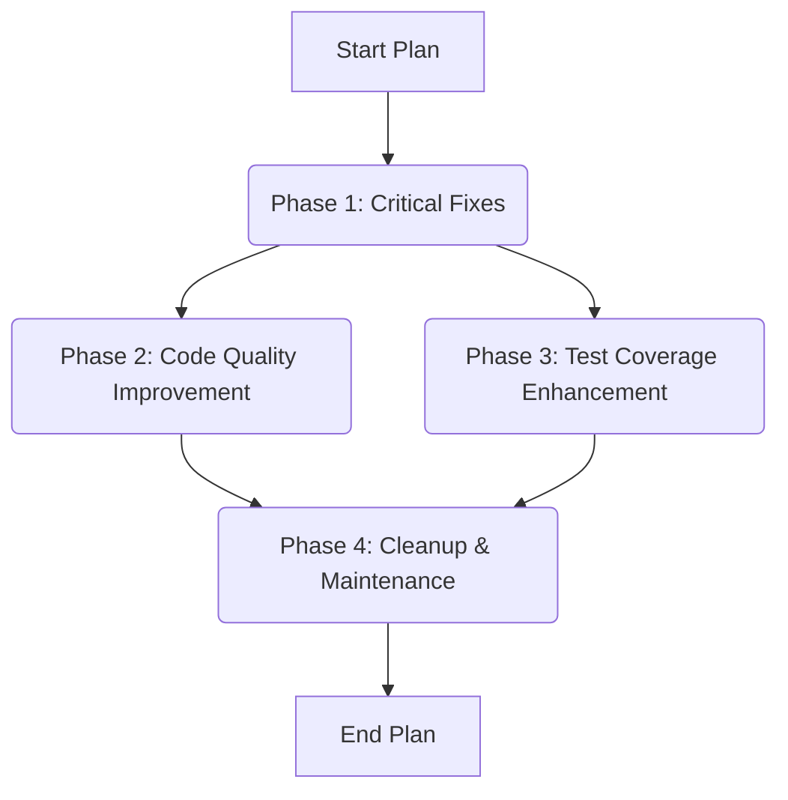

# Root — ACTION-PLAN-2025-12-09.md

This document, `ACTION-PLAN-2025-12-09.md`, serves as a strategic roadmap for improving the `code-buddy` codebase. It is a comprehensive plan outlining a multi-phase approach to address critical issues, enhance code quality, significantly increase test coverage, and perform general maintenance.

Unlike typical code modules, this Markdown file is not executable. Instead, it acts as a meta-document, guiding developers through a series of structured tasks to modify and improve the project's source code. Its "execution" is entirely manual, driven by developers following the outlined steps to systematically enhance the project's stability, maintainability, and robustness.

## Execution Context

As a static Markdown document, `ACTION-PLAN-2025-12-09.md` does not contain any executable code. Consequently, it has no internal, outgoing, or incoming calls, and no direct execution flows within the application's runtime. Its purpose is purely prescriptive, detailing actions to be taken on other parts of the codebase.

## Phased Action Plan Overview

The plan is structured into four distinct phases, each with specific objectives, actions, and verification steps. The phases are designed to be tackled sequentially for critical fixes, with some parallelization possible for quality improvements and test coverage, culminating in a final cleanup.

### Phase 1: Critical Fixes (Urgent - 1-2 days)

This phase focuses on resolving immediate, blocking TypeScript errors to ensure the project compiles and type-checks correctly.

#### Objectives
*   Eliminate all TypeScript compilation and type-checking errors.
*   Ensure the project builds successfully.

#### Key Actions & Affected Components

1.  **Export `ToolResult` Type**:
    *   **File**: `/home/patrice/claude/code-buddy/src/tools/index.ts`
    *   **Action**: Add `export type { ToolResult } from '../types/index.js';` to ensure the `ToolResult` type is correctly exposed for use by other modules.
2.  **Correct `better-sqlite3` Dynamic Imports**:
    *   **Files**:
        *   `/home/patrice/claude/code-buddy/src/tools/sql-tool.ts`
        *   `/home/patrice/claude/code-buddy/src/tools/env-tool.ts`
        *   `/home/patrice/claude/code-buddy/src/tools/fetch-tool.ts`
        *   `/home/patrice/claude/code-buddy/src/tools/notebook-tool.ts`
    *   **Action**: Update the dynamic import syntax for `better-sqlite3` to correctly access its default export. The plan suggests using `const { default: Database } = await import('better-sqlite3');` or `const DatabaseModule = await import('better-sqlite3'); const Database = DatabaseModule.default;`.

#### Verification
*   Run `npm run typecheck` (must pass without errors).
*   Run `npm run build` (must compile without errors).

### Phase 2: Code Quality Improvement (1 week)

This phase aims to enhance the overall quality and maintainability of the codebase by reducing complexity, standardizing naming conventions, and improving type strictness.

#### Objectives
*   Reduce cyclomatic complexity in identified functions to improve readability and testability.
*   Standardize React component file and class names to PascalCase.
*   Replace `any` type annotations with strict, explicit types.

#### Key Actions & Affected Components

1.  **Refactor High Cyclomatic Complexity Functions**:
    *   **`parseDiffWithLineNumbers`**:
        *   **File**: `/home/patrice/claude/code-buddy/src/ui/components/diff-renderer.tsx`
        *   **Action**: Decompose this function (current complexity 37) into smaller, focused sub-functions such as `splitDiffSections`, `parseHunks`, `processLines`, and `formatParsedDiff`. Each new function should aim for a cyclomatic complexity below 10.
    *   **`hasCycle`**:
        *   **File**: `/home/patrice/claude/code-buddy/src/services/plan-generator.ts`
        *   **Action**: Extract sub-logic related to Depth-First Search (DFS), node colorization, and cycle detection into separate, manageable functions.
    *   **`handleSpecialKey`**:
        *   **File**: `/home/patrice/claude/code-buddy/src/hooks/use-input-handler.ts`
        *   **Action**: Refactor the extensive `if/else if` structure (current complexity 25) into a `Map`-based handler system (`KEY_HANDLERS`). Each special key (e.g., 'up', 'down', 'tab') should have its own dedicated handler function (e.g., `handleUpKey`, `handleDownKey`).

2.  **Rename React Components to PascalCase**:
    *   **Files**: All `.tsx` files in `src/ui/components/` (e.g., `fuzzy-picker.tsx`, `chat-interface.tsx`, `diff-renderer.tsx`).
    *   **Action**: Rename component files from `kebab-case.tsx` to `PascalCase.tsx`. A provided shell script automates both the file renaming (`git mv`) and the necessary updates to import paths (`sed`) across the codebase.

3.  **Replace `any` with Strict Types**:
    *   **`handleResult`**:
        *   **File**: `src/agent/multi-agent/base-agent.ts`
        *   **Action**: Define and use a `ToolCallResult` interface (e.g., `{ success: boolean; output?: string; error?: string; data?: unknown; }`) to replace `any` in function parameters.
    *   **`commands`**:
        *   **File**: `src/hooks/use-input-handler.ts`
        *   **Action**: Define a `CommandHandler` type (e.g., `(args: string[]) => Promise<void>`) and use `Record<string, CommandHandler>` to strictly type the `commands` object.

### Phase 3: Test Coverage Enhancement (2-3 weeks)

This phase aims to significantly increase the project's overall test coverage from its current 19% to over 70%, with a strong focus on critical and currently untested modules.

#### Objectives
*   Achieve >80% test coverage for critical `agent/` and `security/` modules.
*   Achieve >70% test coverage for `tools/` and `utils/` modules.
*   Achieve >50% test coverage for `ui/` modules.
*   Increase overall project test coverage to 70%+.

#### Key Actions & Affected Components

1.  **Prioritize Critical Modules (Currently 0% Coverage)**:
    *   **Security & Agent Modules**:
        *   `src/agent/architect-mode.ts`
        *   `src/agent/thinking-keywords.ts`
        *   `src/security/approval-modes.ts`
        *   **Action**: Develop comprehensive unit tests for these modules. The plan provides an example for `ThinkingKeywordsManager` (`tests/agent/thinking-keywords.test.ts`), demonstrating tests for `detectKeyword` and `applyBudget`.
    *   **Multimodal Tools (13 tools at 0% coverage)**:
        *   Example: `src/tools/audio-tool.ts`
        *   **Action**: Create tests for each of these tools. An example for `AudioTool` (`tests/tools/audio-tool.test.ts`) shows how to test tool properties and error handling for `execute`.

#### Metrics & Monitoring
*   Run `npm run test:coverage` to generate coverage reports.
*   View detailed HTML reports by opening `coverage/lcov-report/index.html`.
*   Monitor progress against the specified coverage objectives for different module categories.

### Phase 4: Cleanup & Maintenance (1 week)

This final phase focuses on general code hygiene, standardizing error logging, and improving promise error handling across the codebase.

#### Objectives
*   Eliminate unused variables and imports.
*   Standardize error logging using the project's `logger` utility.
*   Ensure all Promises have appropriate error handling (`.catch()`).

#### Key Actions & Affected Components

1.  **Clean Up Unused Variables/Imports**:
    *   **Action**: Run `npm run lint:fix` for automatic corrections. Manually verify remaining issues with `npm run lint | grep "no-unused-vars"`.
2.  **Replace `console.error` with `logger.error`**:
    *   **Action**: Systematically replace all instances of `console.error()` with `logger.error()` (importing `logger` from `../utils/logger.js` where needed). A `find` and `sed` script is provided for this mass replacement.
3.  **Add `.catch()` to Promises**:
    *   **Action**: Identify Promises lacking `.catch()` blocks using `grep -rn "\.then(" src/ --include="*.ts" | grep -v "\.catch("`. Add appropriate error handling, typically logging the error using `logger.error()`.

## Validation Checklist

The following checklist summarizes the criteria for successful completion of each phase:

### Phase 1 (Critique)
- [ ] `npm run typecheck` passes without error
- [ ] `npm run build` compiles without error
- [ ] `npm test` passes all tests

### Phase 2 (Qualité)
- [ ] Complexité max < 15 (ESLint complexity rule)
- [ ] Composants React en PascalCase
- [ ] Moins de 20 usages de `any`
- [ ] `npm run lint` < 50 warnings

### Phase 3 (Tests)
- [ ] Couverture globale > 70%
- [ ] Couverture branches > 50%
- [ ] Couverture modules critiques > 80%

### Phase 4 (Maintenance)
- [ ] 0 variables inutilisées
- [ ] 0 `console.error`
- [ ] Toutes promesses avec `.catch()`

## Estimated Timeline

| Phase | Duration | Priority |
| :------ | :------- | :--------- |
| Phase 1 | 1-2 days | CRITICAL |
| Phase 2 | 1 week | IMPORTANT |
| Phase 3 | 2-3 weeks | IMPORTANT |
| Phase 4 | 1 week | MINOR |
| **TOTAL** | **4-5 weeks** | |

**Recommendation**: Begin with Phase 1 immediately. Phases 2 and 3 can then be tackled in parallel to optimize the overall timeline.

## Contribution Guidelines

Developers contributing to this plan should adhere to the following guidelines:

*   **Follow Phase Order**: Phase 1 is a prerequisite for subsequent phases. Phases 2 and 3 can be worked on concurrently after Phase 1 is complete. Phase 4 is typically a final cleanup step.
*   **Refer to Specifics**: Each action item explicitly mentions affected files, functions, and provides code examples or shell commands. Developers should consult these details directly.
*   **Verify Each Step**: Utilize the provided verification commands (`npm run typecheck`, `npm run build`, `npm run test:coverage`, `npm run lint`) to confirm the successful completion of tasks within each phase.
*   **Create Branches**: For significant refactoring, new feature development (e.g., adding tests), or complex bug fixes, create dedicated feature branches to manage changes effectively.
*   **Document Progress**: Update the checklist in the original `ACTION-PLAN-2025-12-09.md` document or a related project tracking system as tasks are completed.