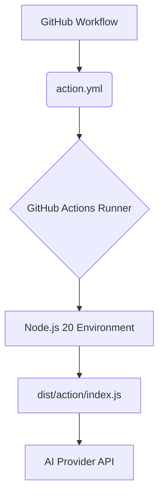

# Root — action.yml

The `action.yml` file serves as the manifest for the **Code Buddy AI** GitHub Action. It defines the action's metadata, configurable inputs, and the entry point for its execution. This file is the primary interface for users interacting with the action within their GitHub workflows.

## Overview

The `action.yml` module declares the "Code Buddy AI" GitHub Action, a tool designed to integrate AI-powered capabilities into development workflows. It allows users to leverage AI for tasks such as code review, issue triage, and implementation assistance directly within their repositories.

This file does not contain executable code itself but rather configures how GitHub Actions should run the underlying JavaScript application.

## Purpose

The core purpose of `action.yml` is to:

1.  **Identify the Action**: Provide a human-readable name and description for the action.
2.  **Define Inputs**: Specify the parameters that users can provide to customize the action's behavior.
3.  **Specify Execution Environment**: Declare the runtime environment and the main script to execute.
4.  **Branding**: Set the visual identity for the action in the GitHub Marketplace.

## Key Components

### Name and Description

```yaml
name: 'Code Buddy AI'
description: 'AI-powered code review, issue triage, and implementation'
```
These fields provide the public name and a brief summary of the action, visible in GitHub workflows and the GitHub Marketplace.

### Inputs

The `inputs` section defines the configuration parameters that users can pass to the action. Each input has a `description`, specifies if it's `required`, and can have a `default` value.

*   **`anthropic_api_key`**
    *   **Description**: API key for the AI provider (e.g., Anthropic).
    *   **Required**: `true`
    *   **Purpose**: Essential for authenticating with the AI service.
*   **`model`**
    *   **Description**: Specifies the AI model to use for tasks.
    *   **Required**: `false`
    *   **Default**: `'grok-3-mini'`
    *   **Purpose**: Allows users to select a specific AI model, enabling flexibility and future-proofing for different model capabilities or costs.
*   **`max_turns`**
    *   **Description**: Maximum number of agent turns (interactions) the AI agent can perform.
    *   **Required**: `false`
    *   **Default**: `'10'`
    *   **Purpose**: Controls the depth and potential cost of AI interactions, preventing infinite loops or excessive resource usage.
*   **`mode`**
    *   **Description**: Defines the primary operation mode for the AI: `review`, `triage`, or `implement`.
    *   **Required**: `false`
    *   **Default**: `'review'`
    *   **Purpose**: Directs the AI's behavior towards a specific task, allowing the action to be versatile.

### Execution Configuration

```yaml
runs:
  using: 'node20'
  main: 'dist/action/index.js'
```
This section dictates how the action is executed:

*   **`using: 'node20'`**: Specifies that the action should be run using the Node.js 20 runtime environment. This ensures compatibility and access to modern JavaScript features.
*   **`main: 'dist/action/index.js'`**: Points to the main JavaScript file that contains the action's core logic. This file is the actual entry point for the application when the GitHub Action is triggered.

### Branding

```yaml
branding:
  icon: 'cpu'
  color: 'blue'
```
These fields define the visual appearance of the action in the GitHub Marketplace and workflow editor, using a specified icon and color.

## Execution Flow

When the "Code Buddy AI" action is invoked in a GitHub workflow, the GitHub Actions runner uses the information in `action.yml` to set up the execution environment and launch the main script.



1.  A GitHub workflow step references the "Code Buddy AI" action.
2.  The GitHub Actions runner reads `action.yml` to understand the action's requirements and entry point.
3.  It provisions a `node20` environment.
4.  It executes the `dist/action/index.js` script within that environment, passing the configured `inputs` as environment variables.
5.  The `index.js` script then performs the AI-powered tasks, typically by making calls to an external AI Provider API using the provided `anthropic_api_key`.

## Connection to the Codebase

The `action.yml` file is the **root entry point** for the entire "Code Buddy AI" application when deployed as a GitHub Action. It acts as the public interface and configuration layer.

All the core business logic, AI orchestration, and interaction with GitHub APIs are implemented within the JavaScript files that are compiled into `dist/action/index.js`. Developers contributing to this project will primarily work on the source code that generates `dist/action/index.js`, but understanding `action.yml` is crucial for:

*   **Defining the Action's API**: Any new configurable behavior must be exposed as an `input` here.
*   **Runtime Environment**: Ensuring the JavaScript code is compatible with `node20`.
*   **Deployment**: This file is essential for GitHub to recognize and run the action.

In essence, `action.yml` is the contract between the GitHub Actions platform and the underlying "Code Buddy AI" application.