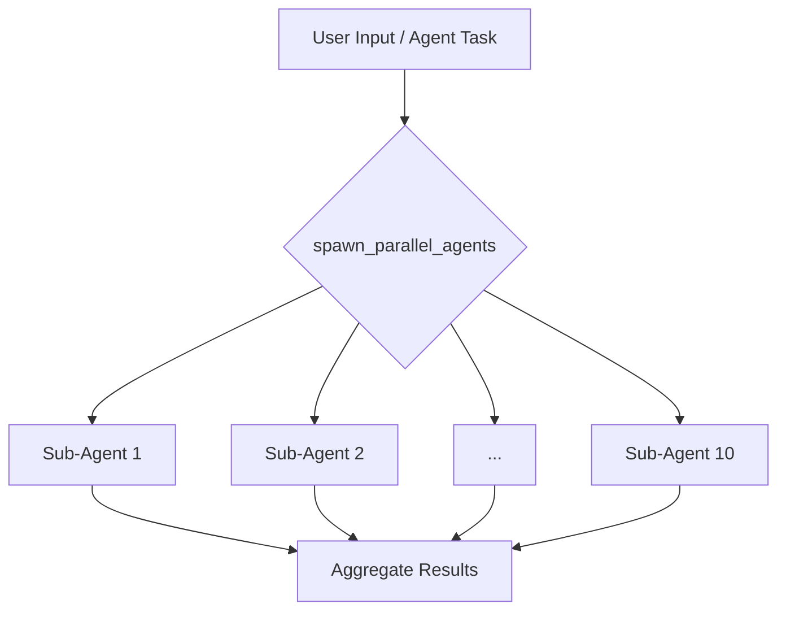

# Root — AUDIT-2026-02-27.md

This document describes the `AUDIT-2026-02-27.md` file, which serves as a comprehensive mission report rather than an executable code module. It details a significant audit and series of improvements performed on the Code Buddy project by an autonomous Gemini CLI Agent.

## Module Overview: AUDIT-2026-02-27.md

The `AUDIT-2026-02-27.md` file is the official "Rapport de Fin de Mission" (End of Mission Report) for an extensive audit and refactoring effort on the Code Buddy codebase. Dated February 27, 2026, it summarizes critical actions taken to enhance code quality, security, and introduce new, powerful AI-driven functionalities.

**Purpose:**
This report is crucial for developers as it outlines the current state of the Code Buddy project *after* a major overhaul. It details:
1.  **Resolved Technical Debt:** Key issues that have been fixed.
2.  **Security Posture:** Improvements made to the project's security.
3.  **New Capabilities:** Core features and tools now available for use and further development.
4.  **Future Roadmap:** Recommended next steps for the project.

**Nature of the Module:**
It's important to note that `AUDIT-2026-02-27.md` is a **static documentation artifact**. It does not contain executable code, nor does it have any direct internal, outgoing, or incoming calls, or execution flows within the codebase. Its value lies in its informational content, guiding developers on the project's evolution and current architecture.

## Key Improvements and New Features

The report categorizes the changes into three main areas: Code Quality, Security, and New Functionalities.

### 1. Code Health & Maintainability

This section details efforts to reduce technical debt and improve the overall health of the codebase.

*   **ESLint Zero Errors:** All 54 blocking ESLint errors (e.g., invalid regex, unsafe `Function` types, undefined variables) have been manually resolved. This significantly improves code reliability and consistency.
*   **Vitest Migration:** The testing framework has been migrated from Jest to Vitest, resulting in a 3x speed improvement for test execution. A compatibility bridge for `jest.fn()` has been implemented to ease the transition.
*   **Code Cleanup:** Approximately 4000 lines of dead code were removed from `src/agent/_archived/`, streamlining the codebase.
*   **Circular Dependency Resolution:** Six major circular dependencies within the channel system were resolved through refactoring, primarily consolidating core logic into `core.ts`. This enhances modularity and reduces coupling.

### 2. Security Enhancements

Security was a primary focus, with several critical vulnerabilities addressed.

*   **`npm audit fix`:** Execution of `npm audit fix` resolved 11 out of 12 identified vulnerabilities, significantly improving the project's dependency security.
*   **Stricter Linting Rules:** The ESLint rules `no-unused-vars` and `no-explicit-any` have been elevated to **Error** level for all new code. This enforces better coding practices, preventing common sources of bugs and maintainability issues.

### 3. Core Functionality & AI Capabilities

Several new, powerful features have been introduced, bringing Code Buddy's capabilities in line with advanced AI tools.

#### 3.1. Persistent Memory Manager

*   **Class:** `PersistentMemoryManager`
*   **Storage:** Markdown-formatted memory is stored in `.codebuddy/CODEBUDDY_MEMORY.md`.
*   **Tools:** New agent tools `remember`, `recall`, and `forget` allow agents to manage long-term context.
*   **Integration:** Memory content is automatically injected into the system prompt, providing agents with persistent context across interactions.

#### 3.2. Parallel Agent Execution

*   **Tool:** `spawn_parallel_agents`
*   **Capability:** Allows launching up to 10 sub-agents concurrently for massive parallel tasks.
*   **Command:** Integrated with the `/parallel` command for user-initiated parallel execution.

#### 3.3. Deterministic Pipelines & Workflows

*   **Component:** `PipelineCompositor`
*   **Functionality:** Updated to enable chaining agents together for complex, multi-step workflows.
*   **Templates:** Standardized pipeline templates are now available in `.codebuddy/pipelines/`:
    *   `feature-dev.yaml`
    *   `bug-fix.yaml`
    *   `deep-research.yaml`
*   **Command:** Integrated with the `/pipeline` command for executing these predefined workflows.

## Impact on Development Workflow

Developers should be aware of the following changes to their workflow:

*   **Testing:** All new tests should be written using **Vitest**. Existing Jest tests will run via the compatibility layer, but new development should favor Vitest's native features.
*   **Linting:** The ESLint configuration is now stricter. Expect `no-unused-vars` and `no-explicit-any` to be reported as errors, requiring immediate fixes.
*   **Code Structure:** The resolution of circular dependencies and the cleanup of `src/agent/_archived/` should result in a more navigable and maintainable codebase.
*   **New Capabilities:** When designing new agent behaviors or user interactions, consider leveraging the `PersistentMemoryManager` for long-term context, `spawn_parallel_agents` for concurrent tasks, and the `PipelineCompositor` for structured, multi-agent workflows.

## Recommended Next Steps

The report also outlines critical next steps for the project:

1.  **`xlsx` Replacement:** The last remaining security vulnerability is tied to the `xlsx` package. Migration to an alternative like `exceljs` is strongly advised.
2.  **Monorepo Expansion:** To facilitate broader adoption (e.g., in a VSCode extension), isolating `@codebuddy/core` into a separate npm workspace is recommended now that circular dependencies are resolved.
3.  **Warning Resorption:** Approximately 1900 warnings (primarily unused variables in tests) remain. An automated script to prefix these with `_` or similar cleanup is suggested.

This report signifies a major milestone for Code Buddy, making it a more robust, secure, and functionally rich platform for AI-driven development.