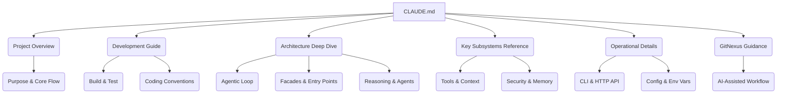

# Root — CLAUDE.md

The `CLAUDE.md` file is not a traditional code module that executes logic or defines APIs. Instead, it serves as the primary, comprehensive documentation artifact for the entire Code Buddy project. Its purpose is to provide a detailed, developer-focused, and AI-consumable guide to the codebase, architecture, and operational aspects of the system.

## Module: `CLAUDE.md`

### Purpose and Role

`CLAUDE.md` acts as a central knowledge base, specifically tailored to assist AI models (natively) and human developers in understanding, navigating, and contributing to the Code Buddy project. It consolidates critical information that would otherwise be scattered across various internal documents or require extensive code exploration.

Its key roles include:
*   **AI Guidance**: Providing structured information and explicit instructions (e.g., "Always Do", "Never Do" sections for GitNexus) to AI agents for effective code interaction, impact analysis, and refactoring.
*   **Developer Onboarding**: Offering a quick yet deep dive into the project's philosophy, architecture, and development practices for new contributors.
*   **Reference Manual**: Serving as a living reference for commands, configurations, architectural decisions, and subsystem overviews.
*   **Consistency Enforcement**: Documenting coding conventions, environment variables, and special operational modes to ensure consistent development.

### Content Structure Overview

The `CLAUDE.md` document is meticulously organized into several high-level sections, each addressing a distinct aspect of the Code Buddy project. This structure facilitates both linear reading and quick lookups for specific information.

### Key Information Categories

The document covers a vast array of topics, categorized as follows:

1.  **Development & Testing**:
    *   **Build & Development Commands**: Essential `npm` scripts for setup, development, and building.
    *   **Testing**: Detailed guidance on running tests with Vitest, including specific gotchas for various modules (e.g., `BashTool`, `DeviceNodeManager`, channel adapters).
    *   **Coding Conventions**: Strict TypeScript, formatting, commit message standards, and ESM import specifics.

2.  **Core Architecture**:
    *   **Architecture Overview**: High-level explanation of the agentic loop, facade architecture (`CodeBuddyAgent` delegation), and key entry points (`src/index.ts`, `src/agent/codebuddy-agent.ts`, `src/ui/components/ChatInterface.tsx`).
    *   **Key Architecture Decisions**: In-depth explanations of lazy loading, model-aware limits, RAG tool selection, context compression (`ContextManagerV2`), middleware pipeline, confirmation service, and checkpoints.
    *   **Reasoning Engines**: Details on `Extended Thinking` and the `Tree-of-Thought + MCTS` systems, including their modes, components, and streaming capabilities.
    *   **OpenManus Architecture**: Description of the OpenManus-compatible agent framework, including the `AgentStateMachine`, `PlanningFlow`, and `A2A Protocol`.

3.  **Agentic Systems & Tools**:
    *   **Specialized Agents**: Overview of built-in agents (Code Guardian, Security Review, SQL, etc.) managed by `AgentRegistry`.
    *   **Tool Implementation Pattern**: Guidelines for creating new tools, including the `ToolResult` interface and registration process.
    *   **Tool-Specific Deep Dives**: Detailed explanations of complex tools and systems like `Edit Tool` (multi-strategy matching, omission detection), `apply_patch` format, `Multi-Agent 5-Tool Surface`, `Code Exec` sandbox, and `BM25 Tool Search`.

4.  **Configuration & Environment**:
    *   **Config Files**: Pointers to critical configuration files (`model-tools.ts`, `constants.ts`, `toml-config.ts`, `advanced-config.ts`).
    *   **Environment Variables**: A comprehensive table of environment variables and their descriptions.
    *   **Special Modes**: Explanations of `YOLO Mode`, `Agent Modes`, `Permission Modes`, `Security Modes`, and `Write Policy`.

5.  **Operational Interfaces**:
    *   **CLI Commands Reference**: A list of top-level `buddy` commands for core operations, development, agents, data management, and infrastructure.
    *   **Slash Commands**: Commands available within an interactive chat session (e.g., `/think`, `/batch`, `/persona`).
    *   **HTTP Server**: Key endpoints for the REST API and WebSocket Gateway, including authentication and rate-limiting details.

6.  **AI-Specific Guidance (GitNexus)**:
    *   **Code Intelligence**: A dedicated section providing explicit instructions for AI agents on how to use GitNexus tools (`gitnexus_impact`, `gitnexus_detect_changes`, `gitnexus_rename`, etc.) for safe and effective code modifications.
    *   **Impact Analysis**: Guidelines on interpreting risk levels and mandatory actions before editing.
    *   **Debugging & Refactoring**: Prescriptive steps for using GitNexus tools during these workflows.
    *   **Index Freshness**: Instructions for keeping the GitNexus index up-to-date.

### Relationship to the Codebase

`CLAUDE.md` does not contain executable code. It is a static Markdown file that *describes* the executable code. Its existence is crucial for the maintainability and extensibility of the Code Buddy project, especially given its complexity and the intention for AI-assisted development. It serves as the authoritative source of truth for many architectural and operational details that are implicitly implemented in the TypeScript files.

### Contributing to `CLAUDE.md`

As the primary documentation for the project, `CLAUDE.md` must be kept accurate and up-to-date. Developers contributing to the Code Buddy project should:
*   **Update on Change**: Any significant architectural change, new feature, tool, command, or configuration option should be reflected in the relevant section of `CLAUDE.md`.
*   **Maintain Clarity**: Ensure explanations are clear, concise, and developer-focused.
*   **Verify Accuracy**: Regularly review sections related to their work to ensure they align with the current codebase.
*   **Adhere to Structure**: Maintain the existing heading structure and formatting to preserve readability and AI parseability.
*   **GitNexus Section**: Pay particular attention to updating the GitNexus guidance if new tools or workflows are introduced that affect how AI agents should interact with the code graph.