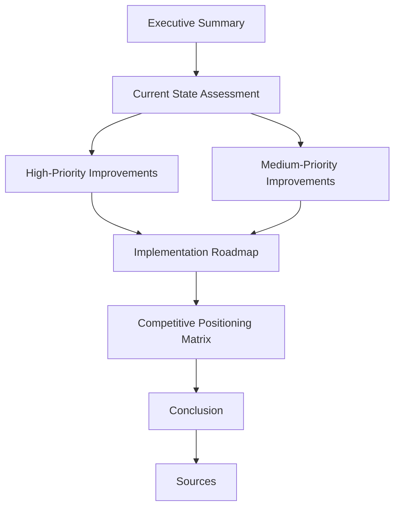

# Root — COMPETITOR_AUDIT.md

This document, `COMPETITOR_AUDIT.md`, serves as a strategic analysis and roadmap for the `code-buddy` project. Unlike typical code modules, this file is a **report** that drives development decisions rather than containing executable code itself. It provides a comprehensive competitive landscape analysis, identifies key feature gaps, and proposes concrete improvements with implementation guidance.

## 1. Purpose and Scope

The primary purpose of `COMPETITOR_AUDIT.md` is to:

*   **Benchmark `code-buddy`**: Compare its current feature set against leading AI CLI tools (Native Engine, Aider, Gemini CLI, Cursor, Warp).
*   **Identify Gaps**: Pinpoint areas where `code-buddy` lacks functionality or could significantly improve its competitive standing.
*   **Propose Solutions**: Detail specific feature enhancements, including proposed API designs, class structures, and dependencies.
*   **Prioritize Development**: Categorize improvements by priority (High/Medium) and suggest an implementation roadmap.
*   **Inform Strategy**: Provide a data-driven basis for future `code-buddy` development, ensuring it remains competitive and user-centric.

The scope of this audit covers core agentic capabilities, developer workflow integrations, user experience enhancements, and underlying architectural considerations.

## 2. Document Structure

The audit is structured to provide a clear narrative from current state assessment to future recommendations and a development roadmap.

### 2.1. Executive Summary

Provides a high-level overview of the audit's findings, highlighting the number of high and medium-priority improvements identified.

### 2.2. Current State Assessment

Lists `code-buddy`'s existing strengths, detailing features already implemented that are competitive in the market. This includes:

*   Streaming responses
*   MCP (Model Context Protocol) support
*   Checkpoint/rollback
*   Security sandbox
*   Agent modes (`/code`, `/plan`, `/ask`)
*   Custom instructions (`.grok/GROK.md`)
*   Web search (DuckDuckGo integration)
*   Session persistence
*   Todo tracking
*   Token counting
*   Diff preview

### 2.3. High-Priority Improvements

This section details 15 critical improvements, each with:
*   **Priority**: (🔴 High)
*   **Effort**: (Low, Medium, High)
*   **Impact**: (Major, High, Medium)
*   **Source**: The competitor inspiring the feature.
*   **Implementation**: Proposed code patterns, class names, interfaces, and file locations.

Key proposed components and patterns include:

*   **Hooks System**:
    *   `interface Hook`: Defines event types (`PreToolUse`, `PostToolUse`, `Notification`, `Stop`), `command`, and optional `pattern`.
    *   `class HookManager`: Manages and executes hooks, taking an `event` and `HookContext`.
    *   Configuration: `.grok/hooks.json`
*   **Multi-Edit Tool**:
    *   `interface MultiEdit`: Defines an array of edits, each with `file_path`, `old_str`, `new_str`.
    *   Integration into `src/tools/multi-edit.ts` and `tools.ts` as a `multi_edit` tool.
*   **Architect Mode**:
    *   `class ArchitectMode`: Orchestrates a two-stage process using `architectModel` and `editorModel`.
    *   Methods: `getArchitectProposal`, `implementDesign`.
    *   User command: `/architect`.
*   **Interactive Terminal (PTY) Support**:
    *   `class InteractiveBashTool`: Utilizes `node-pty` for interactive shell execution.
    *   Method: `executeInteractive`.
    *   Dependency: `node-pty`.
*   **Custom Slash Commands**:
    *   `class CustomCommandLoader`: Loads markdown files from `.grok/commands` as command templates.
    *   Method: `loadCommand`.
*   **Subagents System**:
    *   `interface SubagentConfig`: Defines `name`, `description`, `systemPrompt`, `tools`, and optional `model`.
    *   `class SubagentManager`: Spawns isolated agents based on configuration.
    *   Method: `spawn`.
*   **Git Integration with Auto-Commits**:
    *   `class GitTool`: Provides `autoCommit` functionality, including `generateCommitMessage`.
    *   Configuration: `autoCommit` setting.
*   **Voice Input Support**:
    *   `class VoiceInput`: Integrates with transcription services (e.g., Deepgram, OpenAI Whisper).
    *   Method: `startListening`.
    *   User command: `/voice`.
    *   Dependency: `@deepgram/sdk`.
*   **Image Drag & Drop / Multimodal Context**:
    *   Enhancements to `src/tools/image-tool.ts` (e.g., `EnhancedImageTool`).
    *   Methods: `detectAndProcessImages`, `processClipboard`.
*   **Universal Input with @ Mentions**:
    *   `class ContextMentionParser`: Parses `@file`, `@url`, `@image`, `@git` mentions.
    *   Method: `expandMentions`.
*   **Enhanced Session Resume**:
    *   New CLI options for `src/index.ts`: `--resume`, `--continue`, `--session <id>`.
*   **Parallel Tool Execution**:
    *   Proposed `executeToolsParallel` method in `grok-agent.ts` to identify and run independent tool calls concurrently.
*   **Configurable Autonomy Levels**:
    *   `type AutonomyLevel`: `suggest`, `confirm`, `auto`, `full`.
    *   `class AutonomyManager`: Manages confirmation logic based on the current `level`.
    *   Method: `shouldConfirm`.
    *   User command: `/autonomy <level>`.
*   **Codebase Mapping**:
    *   `interface CodebaseMap`: Defines structure for `files`, `symbols`, `dependencies`.
    *   `class CodebaseMapper`: Builds and queries the codebase map using `tree-sitter`.
    *   Methods: `buildMap`, `getRelevantContext`.
    *   Dependencies: `tree-sitter`.
*   **Improved Context Window Management**:
    *   `class ContextManager`: Manages context within token limits.
    *   Methods: `compressContext`, `smartTruncate`.

### 2.4. Medium-Priority Improvements

Lists 12 additional features that, while important, are considered less urgent than the high-priority items. These include IDE integration, multiple model support, streaming diff previews, and a plugin system.

### 2.5. Implementation Roadmap

Outlines a phased approach for implementing the identified improvements, categorizing them into "Quick Wins," "Core Features," "Advanced Features," and "Nice-to-haves." This provides a timeline and sequencing for development efforts.

### 2.6. Competitive Positioning Matrix

A table comparing `code-buddy`'s current feature set against competitors, highlighting where `code-buddy` stands relative to others on key functionalities.

### 2.7. Conclusion

Summarizes the main takeaways from the audit, emphasizing `code-buddy`'s strengths and the primary areas for improvement (Developer Workflow Integration, Multi-file Operations, Advanced Agent Capabilities, User Experience).

### 2.8. Sources

Lists external resources and competitor documentation used for the audit.

## 3. How it Connects to the Codebase

This `COMPETITOR_AUDIT.md` file does not contain executable code. Instead, it acts as a **blueprint and strategic document** that directly influences the development of `code-buddy`'s codebase.

*   **Feature Specification**: The "High-Priority Improvements" section provides detailed specifications for new features, including proposed class names (`HookManager`, `ArchitectMode`, `GitTool`), interfaces (`Hook`, `MultiEdit`, `SubagentConfig`), and file locations (`src/hooks/hook-manager.ts`, `src/tools/multi-edit.ts`). Developers will refer to these proposals when implementing the features.
*   **Dependency Management**: The audit explicitly calls out new dependencies like `node-pty` and `@deepgram/sdk`, guiding updates to `package.json`.
*   **CLI Enhancements**: Proposed CLI options (`--resume`, `--continue`, `--session`) and user commands (`/architect`, `/voice`, `/autonomy`) directly inform changes to `src/index.ts` and the command parsing logic.
*   **Architectural Guidance**: Concepts like "Subagents System," "Architect Mode," and "Codebase Mapping" suggest significant architectural additions and refactorings within `src/agent/` and `src/context/`.
*   **Configuration**: The audit specifies new configuration files (e.g., `.grok/hooks.json`, `.grok/commands/`) that will need to be implemented and managed by the application.

In essence, this document is the **"what" and "how"** for many upcoming `code-buddy` features, guiding developers in their implementation efforts.

## 4. Call Graph & Execution Flows

As `COMPETITOR_AUDIT.md` is a static documentation file and not an executable code module, it does not have any internal calls, outgoing calls, incoming calls, or execution flows in the traditional sense. Its "execution" is conceptual, influencing the development process rather than being part of the runtime.