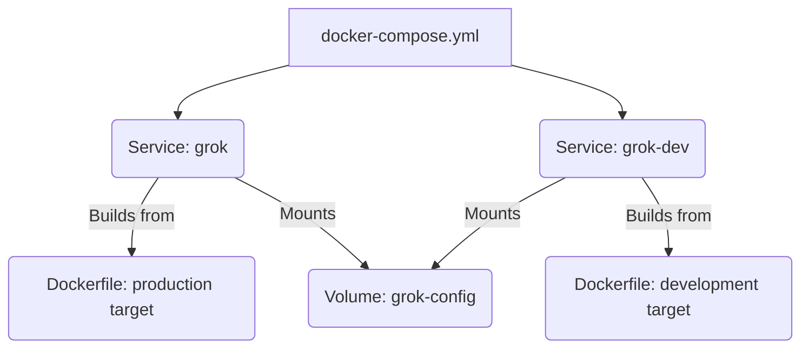

# Root — docker-compose.yml

This document details the `docker-compose.yml` file, which serves as the primary orchestration tool for developing and running the Grok CLI application within Docker containers.

## `docker-compose.yml` Overview

The `docker-compose.yml` file defines and configures the multi-container Docker application for the Grok CLI. Its main purpose is to:

1.  **Standardize Development Environments**: Ensure all developers work with the same dependencies and environment setup.
2.  **Simplify Production Deployment**: Provide a consistent way to build and run the CLI in a production-like container.
3.  **Manage Dependencies**: Define how the application's services interact and share resources like volumes.

This file acts as the blueprint for building the Docker images and running the containers that host the Grok CLI.

## Key Components

The `docker-compose.yml` file defines two primary services: `grok` for production-like execution and `grok-dev` for development, along with a named volume for persistent configuration.



### Services

#### `grok` Service (Production Environment)

This service is designed for running the Grok CLI in a production-ready or testing environment. It builds the application using the optimized `production` target from the project's `Dockerfile`.

*   **`build`**:
    *   `context: .`: The build context is the current directory, meaning the `Dockerfile` in the project root will be used.
    *   `target: production`: Specifies that Docker should build only up to the `production` stage defined in the `Dockerfile`. This typically results in a smaller, optimized image without development dependencies.
*   **`image: code-buddy:latest`**: Tags the resulting image as `code-buddy:latest`.
*   **`environment`**:
    *   `GROK_API_KEY=${GROK_API_KEY}`: Passes the `GROK_API_KEY` from the host's environment variables into the container. This is crucial for authenticating with the Grok API.
    *   `GROK_MODEL=${GROK_MODEL:-grok-3-latest}`: Passes the `GROK_MODEL` variable. If not set on the host, it defaults to `grok-3-latest`.
*   **`volumes`**:
    *   `- .:/workspace:rw`: Mounts the current project directory (`.`) into the container at `/workspace` with read-write permissions. This allows the CLI to access the project files it might need to operate on.
    *   `- grok-config:/home/grok/.grok`: Mounts the named Docker volume `grok-config` to `/home/grok/.grok` inside the container. This directory is typically used by the Grok CLI to store persistent settings or cache, ensuring they survive container restarts.
*   **`working_dir: /workspace`**: Sets the default working directory inside the container to `/workspace`.
*   **`stdin_open: true` & `tty: true`**: These settings are essential for interactive CLI applications, allowing input and output to be handled correctly.

**Usage Example**:
To run the Grok CLI with a prompt:
```bash
GROK_API_KEY="your_api_key" docker-compose run --rm grok "explain this code"
```

#### `grok-dev` Service (Development Environment)

This service is tailored for active development, providing a live-reloading environment. It uses the `development` target from the `Dockerfile`, which typically includes development tools and dependencies.

*   **`build`**:
    *   `context: .`: Uses the project root as the build context.
    *   `target: development`: Builds the `development` stage of the `Dockerfile`, which usually includes `node_modules` and other development-specific tools.
*   **`image: code-buddy:dev`**: Tags the resulting image as `code-buddy:dev`.
*   **`environment`**: Same API key and model configuration as the `grok` service.
*   **`volumes`**:
    *   `- .:/app:rw`: Mounts the current project directory into `/app` inside the container. This is where the source code resides for development.
    *   `- /app/node_modules`: This is a crucial volume declaration for Node.js development. It creates an anonymous volume over the `node_modules` directory *inside* the container. This prevents the host's `node_modules` (if any) from overwriting the container's `node_modules` (which are built during the `development` stage). It also ensures that any `node_modules` installed *within* the container are not accidentally mounted back to the host, which can cause permission issues or platform incompatibilities.
    *   `- grok-config:/home/node/.grok`: Mounts the shared `grok-config` volume for persistent settings, similar to the `grok` service, but mapped to the `node` user's home directory.
*   **`working_dir: /app`**: Sets the default working directory to `/app`.
*   **`stdin_open: true` & `tty: true`**: Enables interactive terminal capabilities.
*   **`command: npm run dev:node`**: Overrides the default command to start the Node.js development server or watch process defined by `npm run dev:node`. This typically enables live reloading or continuous compilation.

**Usage Example**:
To start the development server:
```bash
GROK_API_KEY="your_api_key" docker-compose run --rm grok-dev
```
Or, to build and run the dev container in detached mode:
```bash
GROK_API_KEY="your_api_key" docker-compose up -d grok-dev
```

### Volumes

#### `grok-config`

This is a named Docker volume defined at the root level of the `docker-compose.yml`.

*   **Purpose**: To provide persistent storage for the Grok CLI's configuration and settings. By mounting this volume, any changes made to the `.grok` directory inside the container (e.g., user preferences, cached data) will persist even if the container is removed and recreated. This ensures a consistent user experience across different runs or development sessions.

## Connection to the Codebase

The `docker-compose.yml` file is intrinsically linked to the rest of the codebase through the `build: context: .` directive. This means that the `Dockerfile` located in the project root is used to build the Docker images for both `grok` and `grok-dev` services.

*   The `Dockerfile` defines the base image, installs dependencies, copies application code, and sets up the environment.
*   The `docker-compose.yml` then orchestrates *how* those images are built (e.g., `production` vs. `development` targets) and *how* the resulting containers are run (e.g., mounted volumes, environment variables, default commands).

This setup ensures that the application's runtime environment is consistent and reproducible, whether for local development or potential deployment. Developers can rely on `docker-compose` to quickly spin up a fully configured environment without manually installing dependencies or configuring paths.