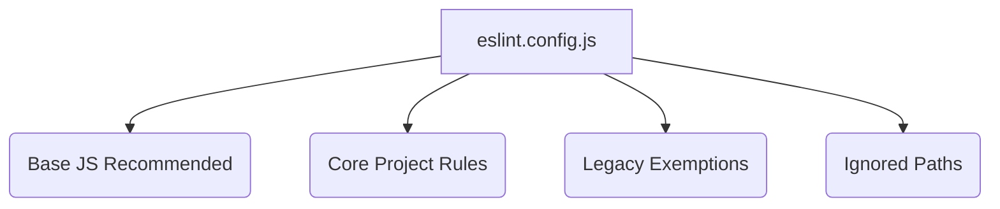

# Root — eslint.config.js

## Module: `eslint.config.js`

This module defines the ESLint configuration for the entire project, leveraging the new "flat config" format introduced in ESLint v9. It specifies how JavaScript and TypeScript files should be linted, including parser settings, global variables, plugins, and specific rule definitions.

### Purpose

The primary purpose of `eslint.config.js` is to enforce consistent code style, identify potential errors, and maintain code quality across the codebase. It acts as the central source of truth for static analysis, ensuring that all developers adhere to the project's coding standards.

### Overview of ESLint Flat Configuration

ESLint's flat configuration system (`eslint.config.js`) uses an array of configuration objects. Each object can define `files`, `languageOptions`, `plugins`, `rules`, and `ignores` properties. Configurations are applied in order, with later configurations overriding earlier ones for matching files.

This module exports a default array containing four distinct configuration objects, each serving a specific role:



### Configuration Breakdown

#### 1. Base JavaScript Recommendations

```javascript
js.configs.recommended
```

This is the foundational configuration object. It imports and applies the recommended rules from `@eslint/js`, which includes a set of best practices and common error prevention rules for standard JavaScript. This ensures that a baseline of quality is established before project-specific rules are applied.

#### 2. Core Project Rules (TypeScript & JavaScript)

This is the most comprehensive configuration block, defining the core linting rules for the majority of the project's source files.

*   **File Scope**:
    ```javascript
    files: ['**/*.ts', '**/*.tsx', '**/*.js', '**/*.jsx', '**/*.mjs', '**/*.cjs']
    ```
    This configuration applies to all TypeScript (`.ts`, `.tsx`) and JavaScript (`.js`, `.jsx`, `.mjs`, `.cjs`) files within the project.

*   **Language Options**:
    ```javascript
    languageOptions: {
      parser: typescriptParser,
      ecmaVersion: 2020,
      sourceType: 'module',
      globals: { /* ... */ },
    }
    ```
    *   `parser: typescriptParser`: Specifies `@typescript-eslint/parser` as the parser. This is crucial for correctly parsing TypeScript syntax and enabling TypeScript-specific rules, even for JavaScript files, allowing for a unified parsing experience.
    *   `ecmaVersion: 2020`: Sets the ECMAScript version to 2020, enabling support for modern JavaScript features.
    *   `sourceType: 'module'`: Configures ESLint to parse files as ECMAScript modules, which is standard for modern JavaScript and TypeScript projects.
    *   `globals`: Defines a comprehensive list of global variables (e.g., `console`, `process`, `Buffer`, `fetch`) that are considered `readonly`. This prevents ESLint from reporting `no-undef` errors for these commonly used global objects in Node.js and browser environments.

*   **Plugins**:
    ```javascript
    plugins: {
      '@typescript-eslint': typescriptEslint,
    }
    ```
    Registers the `@typescript-eslint` plugin, making its rules available for use. This plugin provides a rich set of rules specifically designed for TypeScript code.

*   **Specific Rules**:
    ```javascript
    rules: {
      ...typescriptEslint.configs.recommended.rules,
      '@typescript-eslint/no-unused-vars': ['error', { /* ... */ }],
      '@typescript-eslint/no-explicit-any': 'error',
      '@typescript-eslint/no-require-imports': 'off',
      'no-undef': 'off',
      'no-case-declarations': 'off',
    }
    ```
    *   `...typescriptEslint.configs.recommended.rules`: Includes all recommended rules from the `@typescript-eslint` plugin.
    *   `@typescript-eslint/no-unused-vars`: Configured as an `error` to prevent unused variables, with exceptions for variables prefixed with `_` (e.g., `_arg`, `_err`).
    *   `@typescript-eslint/no-explicit-any`: Set to `error` to disallow the use of `any` type, promoting stronger type safety.
    *   `@typescript-eslint/no-require-imports`: Turned `off` to allow `require()` statements, which might be necessary for certain Node.js contexts or legacy code.
    *   `no-undef`: Turned `off` because TypeScript's compiler handles undefined variables more robustly, making this ESLint rule redundant and potentially conflicting.
    *   `no-case-declarations`: Turned `off` to allow lexical declarations (e.g., `let`, `const`, `function`) directly within `case` blocks of `switch` statements.

#### 3. Legacy Exemptions (Technical Debt)

This configuration block provides temporary relaxations for specific parts of the codebase, acknowledging existing technical debt.

*   **File Scope**:
    ```javascript
    files: [
      'src/**/*.ts', 'src/**/*.tsx',
      'tests/**/*.ts', 'tests/**/*.tsx',
      'scripts/**/*.js', 'scripts/**/*.mjs', 'scripts/**/*.cjs',
    ]
    ```
    This block specifically targets files within `src/`, `tests/`, and `scripts/` directories.

*   **Relaxed Rules**:
    ```javascript
    rules: {
      '@typescript-eslint/no-unused-vars': ['warn', { /* ... */ }],
      '@typescript-eslint/no-explicit-any': 'warn',
      '@typescript-eslint/no-unsafe-function-type': 'warn',
      'require-yield': 'warn',
    }
    ```
    For the specified files, several rules that are typically `error` in the core configuration are downgraded to `warn`. This allows the project to pass CI checks while indicating areas that need refactoring.
    *   `@typescript-eslint/no-unused-vars`: Downgraded to `warn`.
    *   `@typescript-eslint/no-explicit-any`: Downgraded to `warn`.
    *   `@typescript-eslint/no-unsafe-function-type`: Set to `warn` to allow unsafe function types in these areas.
    *   `require-yield`: Set to `warn` for generator functions that might not explicitly `yield`.

    **TODO**: The comment explicitly states that these exemptions should be progressively removed as technical debt is resolved. Developers are encouraged to address these warnings and remove directories from this list over time.

#### 4. Ignored Paths

```javascript
ignores: [
  'node_modules/**',
  'dist/**',
  'build/**',
  // ... many other paths
]
```
This final configuration object specifies a list of files and directories that ESLint should completely ignore during linting. This typically includes build artifacts, dependency directories, temporary files, and specific configuration files that are not meant to be linted. This prevents ESLint from wasting resources on irrelevant files and avoids reporting errors in generated or third-party code.

### How Configuration is Applied

ESLint processes the configuration objects in the `export default` array sequentially.
1.  The `js.configs.recommended` rules are applied first.
2.  Then, the "Core Project Rules" are applied. For any file matching its `files` pattern, its `languageOptions`, `plugins`, and `rules` will take effect, potentially overriding rules set by `js.configs.recommended`.
3.  Next, the "Legacy Exemptions" are applied. For files matching *both* the "Core Project Rules" and "Legacy Exemptions" patterns, the rules defined in the "Legacy Exemptions" block will override any conflicting rules from previous blocks (e.g., changing an `error` to a `warn`).
4.  Finally, the `ignores` list is processed, ensuring that any files or directories specified there are completely excluded from linting, regardless of previous configurations.

### Contributing and Maintenance

Developers contributing to the codebase should be aware of the rules defined in `eslint.config.js`.

*   **Adding New Rules**: New rules can be added to the "Core Project Rules" block. Ensure they align with project standards and are discussed with the team if they introduce significant changes.
*   **Modifying Existing Rules**: Adjustments to existing rules (e.g., changing `error` to `warn` or vice-versa, or adding options) should be made in the relevant configuration block.
*   **Resolving Technical Debt**: When code in a directory listed under "Legacy Exemptions" is refactored to meet the stricter core rules, that directory should be removed from the `files` array in the "Legacy Exemptions" block. This helps to progressively improve code quality.
*   **Ignoring Files**: If new build artifacts or temporary directories are introduced, they should be added to the `ignores` list to prevent unnecessary linting.