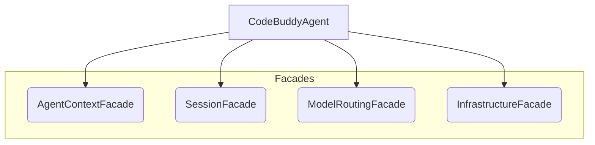

# Root — GEMINI.md

This document provides an overview of the **Code Buddy** project, serving as the primary entry point for understanding its architecture, core components, and development guidelines. It synthesizes the information presented in the project's root `GEMINI.md` file, which acts as the foundational documentation for the entire system.

## 1. Project Overview

**Code Buddy** (`@phuetz/code-buddy`) is an open-source, multi-provider AI coding agent designed for the terminal. It functions as a versatile development tool and personal assistant, capable of generating code, executing commands, and communicating across various channels.

### 1.1. Heritage and Architectural Influences

Code Buddy is a modern, TypeScript-native evolution of the **Native Engine** architecture. It inherits key features such as robust concurrency control (Lane Queue), security policies, multi-channel messaging, and a self-authoring `SKILL.md` system.

It further integrates concepts from **Open Manus / Manus AI**, including:
*   **CodeAct**: Dynamic script execution within a Docker sandbox.
*   **Persistent Planning**: Task management via `PLAN.md`.
*   **AskHuman**: Mid-task clarification by pausing execution for user input.
*   **Knowledge Injection**: Contextual information from Markdown files.
*   **Wide Research**: Parallel sub-agent workers for decomposed topic research and synthesized results.

### 1.2. Supported AI Providers

The system supports a wide range of AI providers, including:
*   Grok (xAI)
*   Claude (Anthropic)
*   ChatGPT (OpenAI)
*   Gemini (Google)
*   Local models via Ollama and LM Studio

## 2. Tech Stack

Code Buddy is built on a modern TypeScript and Node.js foundation:

*   **Language:** TypeScript
*   **Runtime:** Node.js (>=18.0.0)
*   **CLI Framework:** Commander.js
*   **UI Framework:** React with Ink (for terminal UI)
*   **API Server:** Express.js
*   **Database:** SQLite (`better-sqlite3`)
*   **Testing:** Jest
*   **Linting/Formatting:** ESLint, Prettier
*   **Package Manager:** npm (or bun)

## 3. Architecture

The project employs a **Facade Architecture** to manage complexity and promotes a modular design for extensibility.

### 3.1. Core Components and Facades

The `CodeBuddyAgent` (`src/agent/codebuddy-agent.ts`) serves as the central orchestrator, managing the conversation loop, tool execution, and interactions with AI providers. It leverages several facades to delegate and encapsulate specific functionalities:



*   **`CodeBuddyAgent`**: The primary control flow for agent operations.
*   **`AgentContextFacade`**: Manages the context window, token counting, and memory retrieval.
*   **`SessionFacade`**: Handles session persistence and checkpoints.
*   **`ModelRoutingFacade`**: Selects the appropriate AI model and tracks associated costs.
*   **`InfrastructureFacade`**: Manages the Model Context Protocol (MCP), sandboxing, hooks, and plugins.

### 3.2. Autonomy Layer

This layer provides advanced capabilities for agent self-management and complex task execution:

*   **`TaskPlanner`**: Decomposes complex user requests into Directed Acyclic Graph (DAG) execution plans.
*   **`SupervisorAgent`**: Coordinates multi-agent workflows, supporting sequential, parallel, race, and all-completion strategies.
*   **`SelfHealing`**: Implements automatic error recovery, including checkpoint rollback.
*   **`WideResearchOrchestrator`**: Spawns parallel worker agents for broad topic research and aggregates their findings via an LLM.
*   **`KnowledgeManager`**: Injects scoped Markdown knowledge into every agent session.

### 3.3. Context Engineering Layer

This layer implements sophisticated patterns for optimizing LLM context, managing information flow, and enhancing security:

*   **`TodoTracker` (`src/agent/todo-tracker.ts`)**: Maintains `todo.md` and appends pending tasks to the end of every LLM context turn, leveraging attention bias to prevent goal drift.
*   **`RestorableCompressor` (`src/context/restorable-compression.ts`)**: Extracts file/URL identifiers from dropped messages, allowing the `restore_context` tool to retrieve full content on demand.
*   **`PrecompactionFlusher` (`src/context/precompaction-flush.ts`)**: A silent `NO_REPLY` background turn that saves durable facts to `MEMORY.md` before context compaction, suppressed if the response is short.
*   **`ObservationVariator`**: Rotates through three tool-result presentation templates per turn to prevent repetitive output (an anti-repetition pattern from Manus AI).
*   **`ResponseConstraintStack`**: Controls `tool_choice` (auto/required/specified) without removing tools from the list, preserving KV-cache hit rates.
*   **`PromptCacheBreakpoints`**: Splits the system prompt into a stable prefix and dynamic suffix, injecting `cache_control: {type: "ephemeral"}` for Anthropic models to achieve significant token cost savings.
*   **`StreamingChunker`**: Provides per-channel output chunking with configurable `StreamingMode` (char/line/sentence/paragraph/full) and format.
*   **`SSRFGuard`**: Blocks private IPv4 and all IPv6 transition-address bypass vectors on all outbound fetches to prevent Server-Side Request Forgery.
*   **`SandboxMode`**: Offers three OS-sandbox tiers (`read-only`, `workspace-write`, `danger-full-access`) with automatic Git workspace root detection.
*   **`ExecPolicy.evaluateArgv()`**: Uses token-array prefix rule matching (longest-prefix-wins) for safer command authorization than traditional regex.

### 3.4. Other Top-Level Components

*   **UI (`src/ui/`)**: React components utilizing Ink for rendering the terminal interface.
*   **Server (`src/server/`)**: An Express application providing a REST API and WebSocket interface.

## 4. Key Directories and Modules

The project's codebase is organized into logical directories, each encapsulating specific functionalities:

*   **`src/agent/`**: Core agent logic, planning, and reasoning.
    *   `wide-research.ts`: Orchestrates parallel sub-agent workers for Wide Research.
    *   `repo-profiler.ts`: Analyzes repository structure for system prompt injection.
*   **`src/channels/`**: Implementations for various messaging channels (e.g., `telegram/`, `pro/`).
*   **`src/cli/`**: CLI-specific logic and command handling.
*   **`src/commands/`**: Implementations of specific CLI commands.
    *   `pairing.ts`: `buddy pairing` for DM pairing management.
    *   `knowledge.ts`: `buddy knowledge` for knowledge base CRUD operations.
    *   `research/`: `buddy research` for Wide Research CLI frontend.
    *   `dev/`: Developer introspection commands.
    *   `run-cli/`: `buddy run` for scripted/non-interactive agent invocations.
    *   `todos.ts`: `buddy todo` CLI for managing `todo.md`.
*   **`src/context/`**: Context management, RAG, and token optimization.
    *   `restorable-compression.ts`: Handles identifier extraction and content restoration.
    *   `precompaction-flush.ts`: Implements the `NO_REPLY` pattern for durable fact saving.
*   **`src/daemon/`**: Background service management and process lifecycle.
*   **`src/knowledge/`**: Knowledge Module for loading and managing Markdown knowledge files.
    *   `knowledge-manager.ts`: Singleton for YAML frontmatter parsing, `buildContextBlock()`, search/add/remove.
*   **`src/mcp/`**: Model Context Protocol integration.
*   **`src/memory/`**: Memory systems (persistent, prospective, episodic).
*   **`src/observability/`**: Run tracking and analytics.
    *   `run-store.ts`: SQLite-backed run history.
    *   `run-viewer.ts`: CLI and API views for run analytics.
*   **`src/plugins/`**: Plugin system architecture.
*   **`src/providers/`**: Integrations with various AI providers.
*   **`src/security/`**: Security features, tool policies, bash allowlists, and write policy.
    *   `write-policy.ts`: Fine-grained file write allow/deny rules.
*   **`src/skills/`**: Skills library and management.
*   **`src/tools/`**: Implementations of agent tools.
    *   `run-script-tool.ts`: **CodeAct** execution engine (Python/TS in Docker sandbox).
    *   `plan-tool.ts`: **Persistent Planning** (`PLAN.md` management).
    *   `ask-human-tool.ts`: Pauses execution for user input.
    *   `create-skill-tool.ts`: Agent self-authors `SKILL.md` files.
    *   `registry/knowledge-tools.ts`: ITool adapters for knowledge management.
    *   `registry/attention-tools.ts`: ITool adapters for `todo_update` and `restore_context`.
*   **`src/ui/`**: Ink-based UI components.
*   **`tests/`**: Unit and integration tests (Jest).

## 5. Setup & Development

### 5.1. Installation

```bash
npm install
# or
bun install
```

### 5.2. Running in Development

```bash
# Run with Bun (fastest)
npm run dev

# Run with Node (tsx)
npm run dev:node

# Run specific command
npm run dev -- --help
```

### 5.3. Building

```bash
npm run build
```

### 5.4. Testing

```bash
# Run all tests
npm test

# Run tests in watch mode
npm run test:watch

# Run tests with coverage
npm run test:coverage
```

### 5.5. Linting & Formatting

```bash
# Lint code
npm run lint

# Fix linting issues
npm run lint:fix

# Check formatting
npm run format:check

# Fix formatting
npm run format
```

## 6. Conventions

Adhering to these conventions ensures code quality, maintainability, and consistency:

*   **TypeScript:** All new code must be written in TypeScript with strict type checking.
*   **Lazy Loading:** Heavy modules (especially UI and Agent components) should be lazy-loaded in `src/index.ts` to optimize startup performance.
*   **Modular Design:** Use facades and services to encapsulate logic. Avoid monolithic classes.
*   **Testing:** Write unit tests for all new features using Jest. Aim for high coverage.
*   **Error Handling:** Use the `CodeBuddyError` class and standard error handling patterns.
*   **Logging:** Use the centralized `logger` utility (`src/utils/logger.ts`) instead of `console.log`.
*   **Security:** Always validate inputs and use the `ToolPolicy` and `BashAllowlist` for potentially dangerous operations.

## 7. Configuration

Key configuration files and directories:

*   **`package.json`**: Project dependencies and scripts.
*   **`tsconfig.json`**: TypeScript compiler configuration.
*   **`.codebuddy/`**: Local configuration, memory, and skills storage.
*   **`.env`**: Environment variables (e.g., API keys).

---

**Note on Call Graph & Execution Flows:**
As `GEMINI.md` is a documentation file, it does not contain executable code and therefore has no direct internal calls, outgoing calls, incoming calls, or execution flows. The information within this document describes the architectural patterns and execution flows of the *actual Code Buddy codebase*.