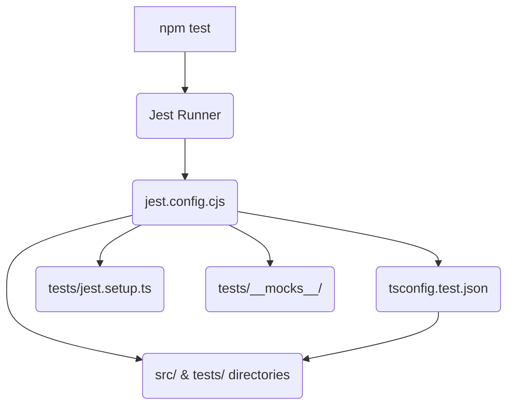

# Root — jest.config.cjs

This document provides a comprehensive overview of the `jest.config.cjs` module, which serves as the central configuration file for the project's Jest testing framework.

## Jest Configuration Overview

The `jest.config.cjs` file defines how Jest discovers, transforms, and executes tests within the codebase. As a static configuration file, it does not contain executable logic itself, but rather exports an object that Jest consumes upon startup. It's crucial for maintaining a consistent and efficient testing environment.

### Purpose

The primary purpose of `jest.config.cjs` is to:
*   Specify the testing environment (Node.js).
*   Define where Jest should look for source code and test files.
*   Configure TypeScript compilation for tests using `ts-jest`.
*   Manage module resolution, including path aliases and mocking for specific modules.
*   Control test execution behavior, such as timeouts and global setup.
*   Configure code coverage reporting.

### How it Works

When `npm test` (or `jest` directly) is executed, Jest automatically loads this file from the project root. It then uses the exported configuration object to set up its internal environment, including:
1.  **File Discovery**: Locating test files based on `roots` and `testMatch`.
2.  **Transformation**: Using `ts-jest` to compile TypeScript test files into JavaScript.
3.  **Module Resolution**: Mapping import paths and providing mocks as defined in `moduleNameMapper`.
4.  **Environment Setup**: Initializing the Node.js test environment and running global setup scripts.

## Key Configuration Components

This section details the significant configuration options defined in `jest.config.cjs`.

### 1. Test Environment and Discovery

*   **`preset: 'ts-jest'`**:
    Specifies `ts-jest` as the preset, which automatically configures Jest to work with TypeScript, including transforming `.ts` files.
*   **`testEnvironment: 'node'`**:
    Indicates that tests should run in a Node.js environment. This is suitable for backend logic, utility functions, and API tests that do not require a browser DOM.
*   **`roots: ['<rootDir>/src', '<rootDir>/tests']`**:
    Defines the directories where Jest should look for files. This ensures Jest only scans relevant parts of the project, improving performance.
    *   `<rootDir>/src`: Contains the application's source code.
    *   `<rootDir>/tests`: Dedicated directory for test-specific utilities, mocks, and potentially integration tests.
*   **`testMatch: ['**/__tests__/**/*.ts', '**/?(*.)+(spec|test).ts']`**:
    Patterns used to identify test files within the `roots` directories.
    *   `**/__tests__/**/*.ts`: Matches files inside `__tests__` subdirectories (e.g., `src/module/__tests__/my.test.ts`).
    *   `**/?(*.)+(spec|test).ts`: Matches files ending with `.spec.ts` or `.test.ts` (e.g., `src/module/my.spec.ts`).
*   **`testPathIgnorePatterns: ['/node_modules/', '\\.heavy\\.test\\.ts', '/_archived/']`**:
    An array of regular expressions that match file paths Jest should ignore.
    *   `/node_modules/`: Standard exclusion for installed packages.
    *   `\\.heavy\\.test\\.ts`: Excludes tests marked as "heavy" by convention. These tests can be run explicitly using `npm test -- --testPathPattern=heavy`.
    *   `/_archived/`: Excludes any files or directories under `_archived/`, preventing old or deprecated tests from running.

### 2. TypeScript Integration

*   **`transform`**:
    Configures how Jest transforms files before running tests.
    *   `'^.+\\.tsx?$': ['ts-jest', { ... }]`: Applies `ts-jest` to all `.ts` and `.tsx` files.
        *   **`tsconfig: 'tsconfig.test.json'`**: Specifies a dedicated TypeScript configuration file for tests. This allows for different compiler options (e.g., stricter checks, different target) during testing compared to the main build.
        *   **`diagnostics.exclude: ['**/screenshot-annotator.ts', '**/Native Engine-commands.ts']`**:
            Excludes specific files from `ts-jest`'s type-checking diagnostics. This is used to suppress known TypeScript errors that might arise from specific module interop patterns (e.g., dynamic `import()` of ESM-only modules like `sharp.default` in `screenshot-annotator.ts`) that are not fully compatible with `ts-jest`'s default type definitions or compilation targets.

### 3. Module Resolution and Mocking

*   **`moduleNameMapper`**:
    Maps module paths to allow Jest to resolve imports correctly, especially for path aliases and ESM-only modules.
    *   **`'^(\\.{1,2}/.*)\\.js$': '$1'`**:
        This mapping helps Jest resolve relative imports that might end with `.js` in the compiled output but refer to TypeScript files. It effectively strips the `.js` extension for resolution purposes.
    *   **`'^string-width$': '<rootDir>/tests/__mocks__/string-width.js'`**:
    *   **`'^strip-ansi$': '<rootDir>/tests/__mocks__/strip-ansi.js'`**:
        Mocks specific ESM-only modules (`string-width`, `strip-ansi`) that Jest might struggle to handle directly in a CommonJS test environment. These mocks provide simplified or compatible implementations located in the `tests/__mocks__` directory.
    *   **Path Aliases**:
        A series of mappings for TypeScript path aliases (e.g., `@agent`, `@tools`, `@utils`, etc.). These must mirror the `paths` configuration in `tsconfig.json` (and `tsconfig.test.json`) to ensure consistent module resolution between the TypeScript compiler and Jest.
        *   `'^@agent/(.*)$': '<rootDir>/src/agent/$1'`
        *   `'^@tools/(.*)$': '<rootDir>/src/tools/$1'`
        *   `'^@utils/(.*)$': '<rootDir>/src/utils/$1'`
        *   `'^@config/(.*)$': '<rootDir>/src/config/$1'`
        *   `'^@channels/(.*)$': '<rootDir>/src/channels/$1'`
        *   `'^@server/(.*)$': '<rootDir>/src/server/$1'`
        *   `'^@persistence/(.*)$': '<rootDir>/src/persistence/$1'`
        *   `'^@security/(.*)$': '<rootDir>/src/security/$1'`
        *   `'^@daemon/(.*)$': '<rootDir>/src/daemon/$1'`
        *   `'^@analytics/(.*)$': '<rootDir>/src/analytics/$1'`

### 4. Code Coverage

*   **`collectCoverageFrom`**:
    Specifies which files Jest should include when collecting code coverage statistics.
    *   `'src/**/*.ts'`: Includes all TypeScript files in the `src` directory.
    *   `'!src/**/*.d.ts'`: Excludes TypeScript declaration files.
    *   `'!src/index.ts'`: Excludes the main entry point, which often contains minimal logic not requiring direct test coverage.
    *   `'!src/ui/**/*.tsx'`: Excludes UI-related TypeScript React files, assuming UI tests might be handled by a different framework or coverage strategy.
*   **`coverageDirectory: 'coverage'`**:
    Sets the output directory for coverage reports.
*   **`coverageReporters: ['text', 'lcov', 'html']`**:
    Configures the formats for coverage reports:
    *   `text`: Prints a summary to the console.
    *   `lcov`: Generates an LCOV report, commonly used by CI/CD tools.
    *   `html`: Creates a browsable HTML report.

### 5. Test Execution Behavior

*   **`moduleFileExtensions: ['ts', 'tsx', 'js', 'jsx', 'json', 'node']`**:
    An array of file extensions Jest should look for when resolving modules.
*   **`verbose: true`**:
    Enables verbose output during test runs, providing more detailed information about individual tests and suites.
*   **`testTimeout: 10000`**:
    Sets the default timeout for individual tests (in milliseconds). Tests exceeding this duration will fail.
*   **`setupFilesAfterEnv: ['<rootDir>/tests/jest.setup.ts']`**:
    Specifies a list of modules that are run once before each test file in the suite. `jest.setup.ts` is used for global test setup, such as configuring test utilities, extending Jest matchers, or setting up environment variables.
*   **`forceExit: true`**:
    Forces Jest to exit after all tests are complete. This is useful to prevent tests from hanging due to open handles or asynchronous operations that are not properly cleaned up.
*   **`detectOpenHandles: false`**:
    When set to `true`, Jest attempts to detect and report any open handles (e.g., timers, network connections) that prevent it from exiting cleanly. It's typically set to `false` for regular runs but can be enabled for debugging resource leaks.

## Integration Points

`jest.config.cjs` acts as the central orchestrator for the testing setup, connecting several key parts of the project:

*   **`tsconfig.test.json`**: This file is explicitly referenced by the `transform` configuration. It provides TypeScript compiler options specifically tailored for the test environment, potentially differing from the main `tsconfig.json`.
*   **`tests/jest.setup.ts`**: This file is executed via `setupFilesAfterEnv` before each test suite. It's the place for global test setup, such as initializing mock services, extending Jest matchers, or setting up environment variables.
*   **`src/` and `tests/` directories**: These are the primary locations where Jest looks for source code and test files, as defined by the `roots` configuration.
*   **`tests/__mocks__/`**: This directory holds manual mocks for modules that Jest cannot handle natively (e.g., ESM-only modules) or for modules where a simplified test-specific implementation is desired.

## How to Contribute and Modify

When making changes to the testing setup, consider the following:

*   **Adding new test file patterns**: If you introduce a new convention for test file naming or location, update `testMatch` and `roots` accordingly.
*   **New path aliases**: If `tsconfig.json` is updated with new `paths`, ensure `moduleNameMapper` in `jest.config.cjs` is also updated to reflect these aliases for Jest.
*   **Troubleshooting TypeScript errors in tests**: If `ts-jest` reports unexpected type errors, first check `tsconfig.test.json`. If specific files consistently cause issues due to complex module interop, consider adding them to `diagnostics.exclude` with a clear comment explaining why.
*   **Debugging hanging tests**: Enable `detectOpenHandles: true` temporarily to identify resources that are not being cleaned up, which might be causing Jest to hang.
*   **Optimizing test runs**: Review `testPathIgnorePatterns` to ensure unnecessary tests (e.g., very slow integration tests) are not run by default. Consider creating separate Jest configurations for different test types if needed.