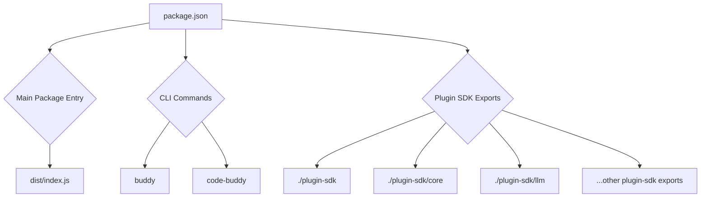

# Root — package.json

The `package.json` file serves as the central manifest for the `@phuetz/code-buddy` project, defining its metadata, dependencies, build scripts, and how it's packaged and consumed. It's the foundational configuration for any developer working on or using the project, dictating everything from how to run tests to how the plugin SDK is exposed.

## 1. Project Identity and Metadata

These fields provide essential information about the project:

*   **`name`**: `@phuetz/code-buddy` - The unique identifier for the package.
*   **`version`**: `0.5.0` - The current version of the package, following semantic versioning.
*   **`description`**: A concise summary of the project: "Open-source multi-provider AI coding agent for the terminal. Supports Grok, Claude, ChatGPT, Gemini, Ollama and LM Studio with 52+ tools, multi-channel messaging, skills system, and Enterprise-grade architecture."
*   **`author`**: Patrice Huetz - Contact information for the primary author.
*   **`repository`**, **`bugs`**, **`homepage`**: Links to the project's GitHub repository, issue tracker, and main page, facilitating contributions and support.
*   **`license`**: `MIT` - Specifies the open-source license under which the project is distributed.
*   **`keywords`**: A comprehensive list of terms (`cli`, `agent`, `ai`, `llm`, `multi-provider`, etc.) that help discoverability and describe the project's domain.

## 2. Module Configuration and Entry Points

This section defines how the `code-buddy` package is structured and consumed, both as a CLI tool and as a library with a plugin SDK.

*   **`type`**: `module` - Indicates that the project uses ES modules, enabling `import`/`export` syntax.
*   **`main`**: `dist/index.js` - Specifies the primary entry point for Node.js environments when the package is `require()`d.
*   **`exports`**: This crucial field defines the various entry points for consumers using ES module `import` statements. It allows for granular control over what parts of the package are exposed.
    *   `.`: The main entry point for the package (`dist/index.js` and its types `dist/index.d.ts`).
    *   `./plugin-sdk`: The main entry point for the plugin SDK (`dist/plugin-sdk/index.js`).
    *   `./plugin-sdk/core`, `./plugin-sdk/llm`, `./plugin-sdk/channel`, `./plugin-sdk/tool`, `./plugin-sdk/testing`: Specific sub-modules of the plugin SDK, allowing developers to import only the necessary components (e.g., `import { Tool } from '@phuetz/code-buddy/plugin-sdk/tool';`).
*   **`bin`**: Defines the command-line interface (CLI) entry points.
    *   `buddy`: An alias for `dist/index.js`.
    *   `code-buddy`: The primary command, also pointing to `dist/index.js`.

## 3. Development and Operational Scripts (`scripts`)

The `scripts` section defines a comprehensive set of commands for building, testing, linting, running, and maintaining the project. These scripts are the backbone of the development workflow.

### Build & Clean
*   **`prebuild`**: `tsx scripts/fetch-models-snapshot.ts || true` - Runs before the main `build` script. This script likely fetches and caches model configurations, ensuring they are available for the build process. The `|| true` prevents the build from failing if this script encounters a non-critical error.
*   **`build`**: `tsc` - Compiles TypeScript source files into JavaScript and declaration files.
*   **`build:bun`**: `bun run tsc` - An alternative build command specifically for Bun runtime.
*   **`build:watch`**: `tsc --watch` - Compiles TypeScript files incrementally on changes, useful during development.
*   **`clean`**: `rm -rf dist coverage .nyc_output *.tsbuildinfo` - Removes generated build artifacts, test coverage reports, and TypeScript build info files.

### Development & Start
*   **`dev`**: `bun run src/index.ts` - Runs the application directly from source using Bun.
*   **`dev:node`**: `tsx src/index.ts` - Runs the application directly from source using `tsx` (TypeScript execution environment for Node.js).
*   **`start`**: `node dist/index.js` - Runs the compiled application using Node.js.
*   **`start:bun`**: `bun run dist/index.js` - Runs the compiled application using Bun.

### Testing
*   **`test`**: `vitest run` - Executes all tests using Vitest.
*   **`test:watch`**: `vitest` - Runs tests in watch mode, re-running on file changes.
*   **`test:coverage`**: `vitest run --coverage` - Runs tests and generates a code coverage report.

### Linting & Formatting
*   **`lint`**: `eslint . --ext .js,.jsx,.ts,.tsx` - Checks code for style and potential errors using ESLint.
*   **`lint:fix`**: `eslint . --ext .js,.jsx,.ts,.tsx --fix` - Automatically fixes linting issues where possible.
*   **`format`**: `prettier --write "src/**/*.{ts,tsx,js,jsx,json,md}"` - Formats code files using Prettier.
*   **`format:check`**: `prettier --check "src/**/*.{ts,tsx,js,jsx,json,md}"` - Checks if files are formatted correctly without making changes.

### Type Checking & Validation
*   **`typecheck`**: `tsc --noEmit` - Performs a type check without emitting any JavaScript files.
*   **`typecheck:watch`**: `tsc --noEmit --watch` - Continuously type checks files on changes.
*   **`check:circular`**: `npx tsx scripts/check-circular-deps.ts` - Runs a custom script to detect circular dependencies, which can indicate architectural issues.
*   **`validate`**: `npm run lint && npm run typecheck && npm test` - A composite script to run all quality checks (lint, typecheck, test).

### Documentation & Benchmarking
*   **`docs`**: `typedoc` - Generates API documentation using TypeDoc.
*   **`docs:watch`**: `typedoc --watch` - Generates documentation incrementally on changes.
*   **`bench`**: `npm run bench:startup && npm run bench:tools` - Runs all benchmarks.
*   **`bench:startup`**: `npx tsx benchmarks/startup.bench.ts` - Benchmarks the application's startup performance.
*   **`bench:tools`**: `npx tsx benchmarks/tools.bench.ts` - Benchmarks the performance of various tools.
*   **`perf`**, **`perf:verbose`**: Scripts to run the application with performance timing enabled, useful for profiling.

## 4. Dependencies

The project categorizes its dependencies into three types:

### `dependencies` (Core Runtime)
These are essential packages required for the `code-buddy` application to run. Notable examples include:
*   `@modelcontextprotocol/sdk`: Integration with the Model Context Protocol.
*   `@phuetz/ai-providers`: A local dependency (likely a monorepo package) for AI provider integrations.
*   `commander`: For parsing command-line arguments.
*   `ink`, `react`: For building the terminal UI.
*   `openai`: For interacting with OpenAI models.
*   `zod`: For schema validation.
*   `better-sqlite3`: For local data storage.
*   `chalk`, `cli-highlight`, `marked`, `marked-terminal`, `terminal-image`: For rich terminal output.

### `optionalDependencies` (Feature-Specific / Provider Integrations)
These dependencies are not strictly required for the core application to function but enable specific features or integrations. This allows users to install only what they need, reducing the overall package size for basic usage. Examples include:
*   `@anthropic-ai/sdk`, `@google/generative-ai`: SDKs for other LLM providers.
*   `node-llama-cpp`, `@mlc-ai/web-llm`: For local LLM inference.
*   `playwright`, `playwright-core`: For browser automation and web scraping.
*   `@nut-tree-fork/nut-js`: For desktop automation.
*   `@picovoice/porcupine-node`: For voice wake word detection.
*   `@xenova/transformers`: For local transformer model inference.
*   `pdf-parse`, `xlsx`, `adm-zip`, `tar`, `jszip`: For handling various file formats.

### `devDependencies` (Development & Build Tools)
These packages are used during development, testing, and building, but are not needed at runtime in a production environment.
*   `typescript`: The TypeScript compiler.
*   `vitest`, `@vitest/coverage-v8`, `happy-dom`: For testing and test coverage.
*   `eslint`, `@typescript-eslint/eslint-plugin`, `@typescript-eslint/parser`: For linting.
*   `prettier`: For code formatting.
*   `tsx`: For running TypeScript files directly.
*   `typedoc`: For generating API documentation.
*   `madge`: For analyzing module dependencies, used by `check-circular-deps.ts`.

## 5. File Inclusion and Engine Constraints

*   **`files`**: Specifies which files and directories should be included when the package is published to npm. This ensures only necessary assets (`dist`, `README.md`, `LICENSE`, `.codebuddy/skills/bundled`) are part of the distributed package.
*   **`engines`**: `{"node": ">=18.0.0"}` - Declares the minimum Node.js version required to run the application.

## 6. Overrides

*   **`overrides`**: This section allows overriding specific dependency versions within the dependency tree. This is useful for fixing security vulnerabilities or resolving dependency conflicts without waiting for upstream updates. Here, `hono`, `jimp`, and `qs` versions are explicitly controlled.

By understanding the `package.json`, developers can quickly grasp the project's architecture, how to set up their development environment, run various tasks, and how the `code-buddy` application and its plugin SDK are exposed to the wider ecosystem.