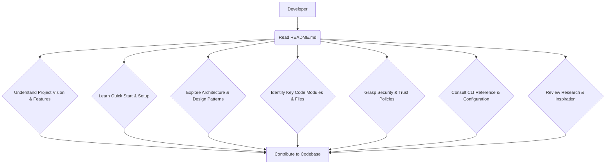

# Root — README.md

The `README.md` file serves as the primary entry point and comprehensive overview for the Code Buddy project. While not a traditional code module with executable logic, it is a critical piece of documentation that defines the project's scope, architecture, features, and operational guidelines. For developers, it acts as the foundational knowledge base required to understand, use, and contribute to the codebase.

## Module Overview: `README.md`

The `README.md` is the project's "front door," providing a high-level yet detailed explanation of Code Buddy's capabilities, how to get started, and its underlying design principles. It is meticulously structured to cater to both new users seeking a quick start and experienced developers looking for deep insights into its architecture and extensibility.

Its purpose is to:
*   **Introduce Code Buddy:** Define what the project is and its core value proposition.
*   **Guide Setup & Usage:** Provide clear instructions for installation, configuration, and initial interaction.
*   **Detail Features:** Document the extensive set of functionalities, tools, and integrations.
*   **Explain Architecture:** Outline the key architectural components and design patterns.
*   **Ensure Security & Trust:** Describe the robust security measures and policies.
*   **Facilitate Contribution:** Offer insights into the development workflow and testing.
*   **Reference Research:** Link the project's design decisions to academic papers and influential open-source projects.

## Key Information for Developers

For a developer looking to understand and contribute to Code Buddy, the `README.md` is indispensable. It provides the context necessary to navigate the codebase effectively.

### 1. Project Vision and Core Capabilities

The `README.md` immediately establishes Code Buddy as a "multi-AI terminal agent" functioning as both a **development tool** and a **personal assistant**. Developers should grasp this dual nature, as it influences the design of various subsystems, from code generation and execution to multi-channel communication and background operations.

**Key Highlights** section enumerates core strengths:
*   **15 AI providers** with failover and circuit breakers.
*   **50+ tools** with RAG selection and parallel execution.
*   **190+ slash commands** for diverse workflows.
*   **Multi-channel messaging** (23+ channels).
*   **IDE integration** (VS Code, JetBrains, LSP).
*   **YOLO mode** with 12 guardrails for autonomous operation.
*   **Daemon mode** for 24/7 background tasks.
*   **Multi-agent orchestration** with self-healing.
*   **Advanced reasoning** (Tree-of-Thought + MCTS).
*   **Robust security features** (Guardian Agent, sandboxing, secrets vault).
*   **Sophisticated context engineering** techniques.
*   **Comprehensive Git workflow** integration.
*   **Code intelligence** features (LSP, bug finder, OpenAPI generator).

Understanding these highlights provides a mental map of the project's breadth and complexity, guiding where to look in the source code for specific functionalities.

### 2. Getting Started and Development Setup

The "Quick Start" section is crucial for setting up a development environment. It details:
*   **Prerequisites:** Node.js (>=18.0.0), `ripgrep`, Docker.
*   **Installation:** `npm install -g @phuetz/code-buddy`.
*   **First Run:** Basic commands like `buddy`, `buddy --prompt`, `buddy --yolo`, and how to configure API keys (e.g., `export GROK_API_KEY`).
*   **Headless Mode:** Essential for CI/CD integration and scripting, demonstrating how to use `buddy` with `--output-format json` and `--auto-approve`.
*   **Session Management:** Commands like `buddy --continue` and `buddy --resume` for managing conversational state.
*   **Typical Project Workflow:** An interactive guide to common development tasks, including `buddy --setup`, `buddy onboard`, `buddy doctor`, and switching models or agents.

For contributors, this section ensures they can quickly get the project running and understand the basic CLI interactions before diving into code.

### 3. Core Architectural Components and Features

The `README.md` provides a high-level architectural breakdown, often referencing specific source code paths or conceptual modules.

#### 3.1. Development Tool (`Agentic Coding`, `Code Intelligence`, `Open Manus Features`)

This section details how Code Buddy functions as a coding agent:
*   **Built-in Tools:** A comprehensive table categorizes tools like `view_file`, `bash`, `web_search`, `apply_patch`, `plan`, `spawn_agent`, `create_skill`, and `task_verify`. Developers should note the **RAG-based tool selection** for efficiency.
*   **Code Intelligence:** Explains the **Web Search (5-Provider Fallback Chain)** and **Context management** techniques (multi-stage compaction, hybrid search).
*   **Open Manus Features (CodeAct):** This is a critical architectural pattern. It describes the phased implementation of sandboxed code execution (`RunScriptTool`), persistent state (`PLAN.md`, `.codebuddy/workspace`), parallel research (`WideResearchOrchestrator`), and advanced context engineering patterns (e.g., `todo.md` attention bias, `Restorable Compression`, `Pre-compaction Memory Flush`, `Lessons.md` self-improvement loop, `Decision Memory`, `Coding Style Learning`, `Importance-Weighted Compression`, `Auto-Repair Middleware`, `Quality Gate Middleware`, `Issue-to-PR Pipeline`). The `README.md` explicitly links these concepts to their inspiration (Manus AI, Native Engine) and often to specific files (e.g., `src/agent/repair/fault-localization.ts`).

#### 3.2. Personal Assistant (`Voice Conversation`, `Memory System`, `Knowledge Base`, `Skills Library`, `Proactive Notifications`, `Screen Observer`)

This section covers the human-centric features:
*   **Voice Conversation:** Details TTS providers (Edge TTS, OpenAI, etc.), in-chat commands (`/speak`, `/tts`), and wake word detection (Porcupine).
*   **Memory System:** Describes different memory subsystems (Persistent, Enhanced, Prospective, Decision, Coding Style, ICM) and how they are stored (Markdown, SQLite + embeddings). It highlights **auto-capture** and **memory lifecycle hooks**.
*   **Knowledge Base:** Explains how domain knowledge is injected from `Knowledge.md` and managed via `knowledge_search`/`knowledge_add` tools.
*   **Skills Library:** Lists 40 bundled `SKILL.md` files, emphasizing their role in providing domain-specific knowledge and workflows. The **self-authoring skills** feature (`create_skill` tool) is a key extensibility point.
*   **Proactive Notifications:** Describes how the agent can initiate communication (push notifications, rate limiting, quiet hours, multi-channel delivery).
*   **Screen Observer:** Details how the agent monitors the environment (periodic screenshots, event triggers).

#### 3.3. Multi-Channel Messaging

A dedicated section outlines support for **23+ messaging channels**, with a deep dive into **Telegram**. This highlights the `Channel` abstraction in the codebase and the specific features implemented for each (e.g., `DiscordChannel`, `WhatsAppChannel`, `SignalChannel`, `MatrixChannel`, `IRCChannel`). The **DM Pairing** mechanism is critical for understanding access control.

#### 3.4. Autonomous Agent (`Daemon Mode`, `Multi-Agent Orchestration`, `YOLO Mode`, `Cron & Scheduling`)

This section focuses on Code Buddy's ability to operate independently:
*   **Daemon Mode:** Explains 24/7 background operation, including `buddy daemon start`, PID management, auto-restart, heartbeat engine, daily session reset, and cross-platform service installation.
*   **Multi-Agent Orchestration:** Introduces the `SupervisorAgent` and its strategies (sequential, parallel, race, all), shared context, self-healing, and checkpoint rollback.
*   **YOLO Mode:** Details the full autonomy mode with its built-in guardrails, autonomy levels (`/autonomy suggest|confirm|auto|full|yolo`), and customizable allow/deny lists.
*   **Cron & Scheduling:** Describes the `Cron-Agent Bridge` for recurring tasks and webhook triggers.

#### 3.5. AI Providers

The `README.md` lists supported LLM providers (Grok, Claude, ChatGPT, Gemini, Ollama, etc.), their models, context windows, and configuration. It explains **model failover chain** and **connection profiles** (`~/.codebuddy/user-settings.json`), which are crucial for understanding how the system interacts with external AI services.

#### 3.6. Security & Trust

This is a paramount section for any developer. It details Code Buddy's commitment to safety:
*   **Tool Policy & Bash Allowlist:** Explains fine-grained control over tool usage and bash commands.
*   **Security Modes:** `suggest`, `auto-edit`, `full-auto`.
*   **Trust Folders & Agent Profiles:** Directory-level permissions and predefined configurations.
*   **OS Sandbox:** Three tiers of native OS-level isolation (`read-only`, `workspace-write`, `danger-full-access`).
*   **Exec Policy:** Codex-inspired command authorization with token-array prefix matching.
*   **SSRF Guard:** Comprehensive protection against Server-Side Request Forgery.
*   **Docker Sandbox:** Containerized execution for untrusted operations.
*   **Safety Rails:** A summary of features like Diff-First Mode, Plan-First Mode, Scoped Permissions, Audit Trail, Secret Handles, 2-Step Confirmation, Timed YOLO, and DM Pairing.

Understanding these mechanisms is vital for contributing securely and for extending the system without introducing vulnerabilities.

#### 3.7. Architecture (`Facade Architecture`, `Autonomy Layer`, `Core Flow`)

This section provides a conceptual diagram of the `CodeBuddyAgent` and its various facades (`AgentContextFacade`, `SessionFacade`, `ModelRoutingFacade`, `InfrastructureFacade`, `MessageHistoryManager`). It also outlines the `Autonomy Layer` components like `TaskPlanner`, `SupervisorAgent`, `MiddlewarePipeline`, `SelfHealing`, `ScreenObserver`, `ProactiveAgent`, `DaemonManager`, `LobsterEngine`, `NodeManager`, `SendPolicyEngine`, and `MessagePreprocessor`. These sections directly map to major directories and classes within the `src/` folder, offering a high-level view of how different parts of the system interact.

#### 3.8. API Server & Integrations

Details the `REST API` endpoints and `WebSocket Events`, which are crucial for building integrations or custom UIs. The `Gateway WebSocket Protocol` describes the low-level communication for multi-client interaction. It also covers `MCP Servers`, the `Plugin System`, `Extensions`, and `Copilot Proxy`.

### 4. Contribution and Development

The "Development" section provides practical instructions for contributors:
*   **Clone and Install:** Standard `git clone` and `npm install` steps.
*   **Development Mode:** `npm run dev`.
*   **Testing:** `npm test` and `npm run validate`.
*   **Build:** `npm run build`.
*   **Test Coverage:** Highlights the extensive test suite, indicating areas of high test coverage across various subsystems.

### 5. Research & Inspiration

This section is invaluable for understanding the intellectual foundations of Code Buddy. It lists **Scientific Papers** (e.g., Tree of Thoughts, RethinkMCTS, FrugalGPT, ChatRepair, CodeRAG) and **Inspiration Projects** (Native Engine, OpenAI Codex CLI, Native Engine, Aider, Manus AI, RTK, ICM), often linking them to specific `src/` files. This allows developers to delve into the academic and engineering rationale behind complex features like reasoning, program repair, RAG, and context management.

### 6. CLI Reference and Configuration

The `README.md` includes comprehensive `CLI Reference` for global options, session management, autonomy, tool control, agent configuration, display, setup, and various `CLI Subcommands` (e.g., `buddy dev`, `buddy daemon`, `buddy hub`, `buddy secrets`, `buddy research`, `buddy todo`, `buddy lessons`). It also lists `Environment Variables` and `Project Settings` (`.codebuddy/settings.json`) for configuration. This is the definitive guide for interacting with Code Buddy from the command line and customizing its behavior.

## Relationship to the Codebase

The `README.md` is the narrative layer that describes the executable code. It directly references:
*   **File Paths:** E.g., `src/agent/reasoning/tree-of-thought.ts`, `src/sandbox/os-sandbox.ts`, `src/memory/icm-bridge.ts`. This helps developers quickly locate the implementation of a described feature.
*   **Class/Function Names:** E.g., `ToolPolicy`, `SupervisorAgent`, `RunScriptTool`, `createSandboxForMode`.
*   **Configuration Files:** E.g., `.codebuddy/settings.json`, `~/.codebuddy/user-settings.json`, `~/.codebuddy/agents/`, `~/.codebuddy/prompts/`.
*   **External Dependencies:** Mentions `ripgrep`, `Docker`, `Playwright`, `Porcupine`, `RTK`, `ICM`.

It acts as a high-level design document, explaining *what* the code does and *why* it's structured that way, making the codebase more approachable for new contributors.

## Execution Flow and Dependencies

As `README.md` is a documentation file, it has no direct execution flow or dependencies within the codebase in the traditional sense. It is a static asset that is rendered by markdown parsers (e.g., GitHub, IDEs). Its "dependencies" are conceptual: it relies on the existence and functionality of the described code modules to be accurate and relevant.

