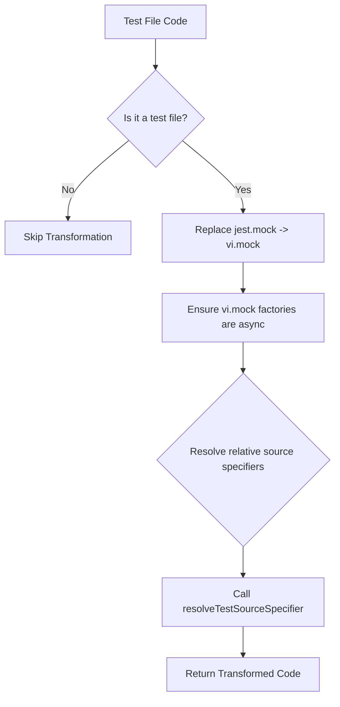

# Root — vitest.config.ts

The `vitest.config.ts` module is the central configuration file for the Vitest test runner in this project. Its primary responsibilities are to:

1.  **Configure Vitest**: Define global settings, test environment, coverage requirements, and test file patterns.
2.  **Ensure Jest Compatibility**: Provide a custom plugin to adapt common Jest syntax and module resolution patterns to Vitest, facilitating a smoother transition or coexistence.
3.  **Define Path Aliases**: Set up convenient shortcuts for importing modules from key directories.

The file exports a configuration object using `defineConfig` from `vitest/config`, which Vitest consumes when running tests.

## Jest Compatibility Plugin (`jestCompatTransform`)

This custom Vitest plugin is crucial for bridging the gap between Jest and Vitest syntax and module resolution. It's designed to automatically transform common Jest patterns into their Vitest equivalents during the test file loading process.

### How it Works

The `jestCompatTransform` function returns a plugin object that Vitest integrates into its module processing pipeline. The core logic resides within its `transform` hook:

1.  **Test File Scope**: The `transform` function first checks if the current module's `id` (path) matches the `testFilePattern` (`/[\\/](tests|src)[\\/].+\.(test|spec)\.[tj]sx?$/`). If it's not a test file, the transformation is skipped.
2.  **Syntax Replacement**: For test files, it performs several regular expression replacements to convert Jest API calls to their Vitest counterparts:
    *   `jest.mock` becomes `vi.mock`
    *   `jest.unmock` becomes `vi.unmock`
    *   `jest.doMock` becomes `vi.doMock`
    *   `vi.mock(() => ...)` is transformed to `vi.mock(async () => ...)` to ensure mock factories are asynchronous, better supporting asynchronous module loading.
3.  **Source Specifier Resolution**: This is a critical step for modules mocked or required within test files. The plugin intercepts calls to `vi.mock`, `vi.doMock`, and `require` that use relative paths. It then attempts to resolve these relative paths to their actual source file locations using the `resolveTestSourceSpecifier` helper function. This ensures that mocks correctly target the intended source files, especially when dealing with TypeScript files that might be imported without explicit extensions in tests.

## Helper: `resolveTestSourceSpecifier(importerId, specifier)`

This utility function is exclusively used by the `jestCompatTransform` plugin to resolve module specifiers within test files. Its purpose is to accurately locate the actual file path for relative imports/requires, particularly when the original specifier might omit file extensions or point to a directory.

### Logic

1.  **Initial Filtering**: It only processes relative specifiers (`.startsWith('.')`) that are likely pointing to application source code (`.includes('/src/')`).
2.  **Path Resolution**: It resolves the `specifier` relative to the `importerId` (the directory of the test file making the import).
3.  **Extension Guessing**: If the resolved path doesn't have an explicit file extension, or if it's a `.js` file, it generates a list of potential file paths by appending common extensions (`.js`, `.ts`, `.tsx`) and checking for `index` files within directories (e.g., `path/to/module.ts`, `path/to/module/index.ts`).
4.  **Existence Check**: It iterates through these `candidates` and uses `fs.existsSync` to find the first actual file on the filesystem.
5.  **Path Normalization**: If a match is found, the path is normalized (Windows backslashes are replaced with forward slashes) and returned.

This function is vital for ensuring that `vi.mock` and `require` calls in test files correctly identify the target source files, especially in a TypeScript project where imports might be written without explicit `.ts` or `.tsx` extensions.

## Test Runner Configuration (`test` object)

This section defines the core behavior and settings for the Vitest test runner.

*   **`globals: true`**: Enables Vitest's global API, allowing test functions like `describe`, `it`, `expect`, and `vi` to be used without explicit imports in test files.
*   **`environment: 'node'`**: Specifies that tests should run in a Node.js environment, which is suitable for backend logic or code not dependent on browser APIs.
*   **`setupFiles: ['./vitest.setup.ts']`**: Points to a setup file that executes once before all tests. This file is typically used for global configurations, extending `expect` matchers, or setting up test environment variables.
*   **`coverage`**: Configures how code coverage is collected and reported.
    *   `provider: 'v8'`: Uses the V8 JavaScript engine's built-in coverage capabilities for efficient reporting.
    *   `reporter`: Specifies the output formats for coverage reports (`text`, `json`, `html`, `lcov`).
    *   `exclude`: Defines glob patterns for files and directories to exclude from coverage reports (e.g., `node_modules`, `dist`, configuration files, test files themselves, type definition directories).
    *   `thresholds`: Enforces minimum coverage percentages for lines, functions, branches, and statements across the codebase, failing the test run if these are not met.
*   **`include`**: Specifies glob patterns for files that Vitest should consider as test files. This includes files in `tests/` and `src/` directories ending with `.test` or `.spec` and common extensions (`.ts`, `.tsx`).
*   **`exclude`**: Defines patterns for directories or files to explicitly ignore during test discovery (e.g., `node_modules`, `dist`, version control directories).
*   **`pool: 'forks'`**: Configures Vitest to run tests in separate worker processes (forks), which can improve test isolation and overall performance.
*   **`poolOptions.forks.execArgv: ['--max-old-space-size=8192']`**: Allocates a larger memory limit (8GB) to each forked test process. This is important for preventing out-of-memory errors in large test suites or when dealing with memory-intensive operations.

## Path Aliases (`resolve.alias`)

This section configures module resolution aliases, simplifying import paths and ensuring consistency across the codebase.

*   **`@`: `path.resolve(__dirname, './src')`**: Allows importing modules from the `src` directory using the `@` alias (e.g., `import { foo } from '@/utils/foo';` instead of `import { foo } from '../src/utils/foo';`).
*   **`@jest/globals`: `path.resolve(__dirname, './tests/support/jest-globals.ts')`**: Provides a compatibility layer for Jest's global API. This alias ensures that if any code still tries to import from `@jest/globals`, it's redirected to a local support file that likely re-exports Vitest's `vi` object or similar compatibility utilities.

## Connections to the Codebase

*   **`vitest.setup.ts`**: This file is explicitly referenced in `setupFiles` and is executed once before all tests, providing a global setup environment for the test suite.
*   **`tests/support/jest-globals.ts`**: This file is targeted by the `@jest/globals` alias, indicating its role in providing Jest compatibility utilities for tests.
*   **Source Files (`src/`)**: The `@` alias and the `resolveTestSourceSpecifier` function both directly interact with the `src/` directory, ensuring that source modules are correctly located and resolved during testing and mocking.
*   **Test Files (`tests/`, `src/`)**: The `include` and `exclude` patterns define which files are considered tests, and the `jestCompatTransform` plugin specifically targets these files for transformation.

This `vitest.config.ts` module is foundational for the project's testing infrastructure, ensuring that tests run efficiently, provide accurate coverage, and maintain compatibility with existing Jest patterns while fully leveraging Vitest's capabilities.